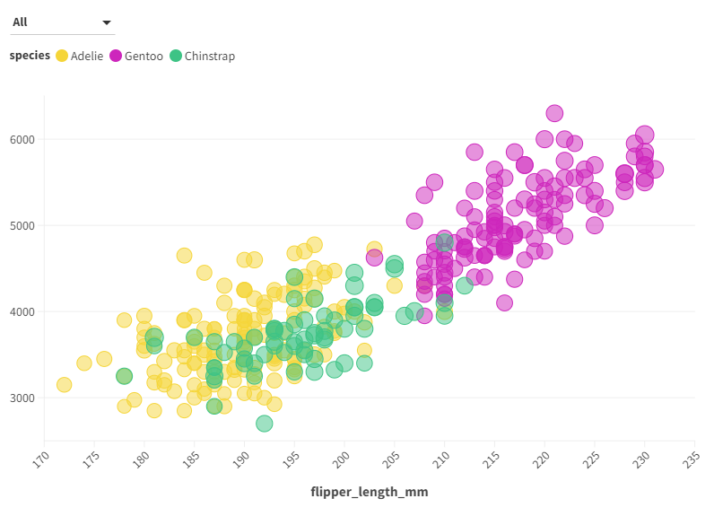
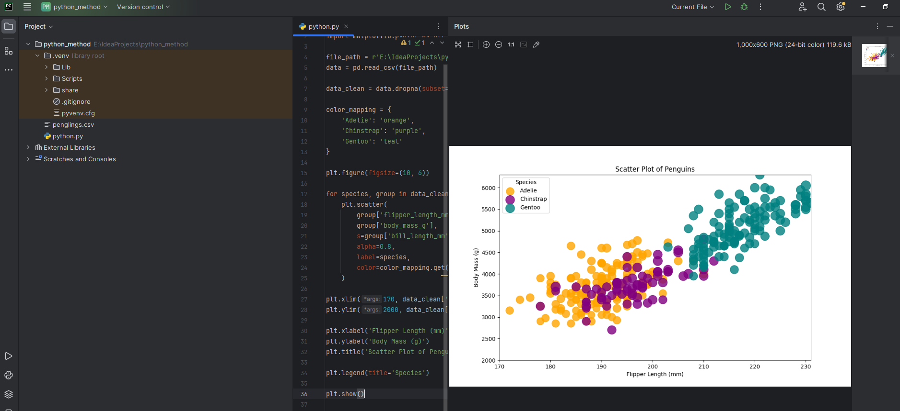
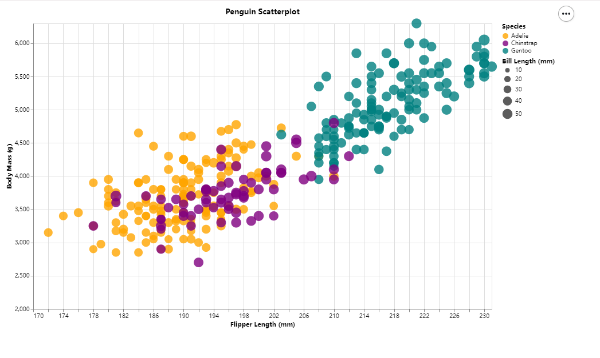

# Assignment 2 - Data Visualization, 5 Ways
# Jinjia Ou

## 1. Flourish

This is the chart I make by Flourish.
Link: https://public.flourish.studio/visualisation/16637211/
### Ease of Use:
One of the easiest aspects of using Flourish is its data integration capabilities,
which simplify the process of data entry and visualization configuration.

### Challenges:
How to add functionality to specific data is a challenge when using Flourish.
Flourish has very little guidance in the creation interface, so it takes time to explore.

### Function:
When you point to a dot on the chart, it will show the detail of the dot.
And you can also click on the legend on the top. When you click one of it,
all the dot that relative to the legend will disappear.

## 2. Python(Pandas + Matplotlib)

### Ease of Use:
Pandas makes it easy to load and manipulate data.
Matplotlib provides a simple yet powerful interface for creating a variety of plots, including scatter plots.
Loop through the data group and plot it with different colors.

### Challenges:
Some challenges with Matplotlib may include adjusting finer plot details such as ticks, labels, or achieving a specific aesthetic appearance.

### Function:
After running the code, a picture of the chart will show up.
The chart including the flipper length and body mass. Use different colors to distinguish three populations

## 3. Altair

### Ease of Use:
Altair allows the creation of complex interactive charts using a relatively simple syntax.
This code demonstrates how to easily build a scatter plot with encoded dimensions such as x, y, color, size, and tooltip.

### Challenges:
One potential challenge with Altair may be the learning curve for users unfamiliar with declarative programming paradigms.

### Function:
After run the code, this function will generate a HTML file.
In the HTML file, the chart include flipper length and body mass.
Use different colors to distinguish three populations.
It also use different side of dot to distinguish the size of the individual size.

## 4. d3.js
.png)
.png)

### Ease of Use:
D3.js excels at rendering complex interactive visualizations.
In this code, it is able to bind data to DOM elements and dynamically apply transformations and styles.
Using file input of CSV data and subsequent parsing and visualization of that data shows the flexibility of D3.js in handling external datasets.

### Challenges:
Customizing SVG elements and handling events can be difficult.

### Function:
In the HTML page, it will ask you to upload a file.
After upload, it will generate a picture.
In the picture, the chart include flipper length and body mass.
Use different colors to distinguish three populations.

## 5. DataWrapper
.png)
.png)

Link: https://datawrapper.dwcdn.net/J2UuF/1/

### Ease of Use:
One of the main advantages of DataWrapper is its simple data entry process. 
Users can easily upload CSV files or even copy and paste data directly into the tool. 
Unlike D3.js or Python libraries, DataWrapper requires no coding, making it easily accessible to non-programmers. 
Creating a scatter plot is just a matter of selecting the appropriate chart type and configuring it via the user-friendly interface.

### Challenges:
While DataWrapper offers a range of customization options, 
such as adjusting colors, labels, and axes, 
it may not provide the same level of detailed control as programming-based tools.

### Function:
When the mouse is hovering over dot, other species will be temporarily invisible, making it easier for users to view the current species. 
When you click on the label above, the selected species can be highlighted.
The chart include flipper length and body mass.
Use different colors to distinguish three populations.

# Addition Notices
## When running the Altair and Python methods, remember to replace the path to the data!!!