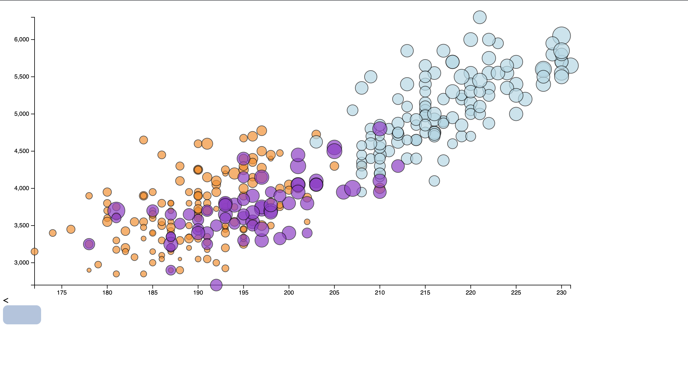
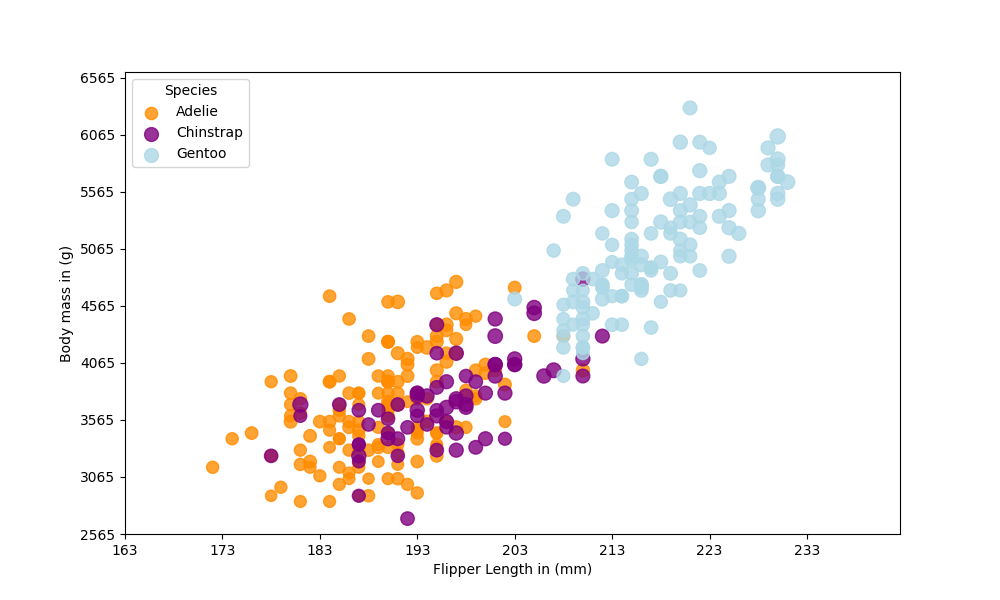
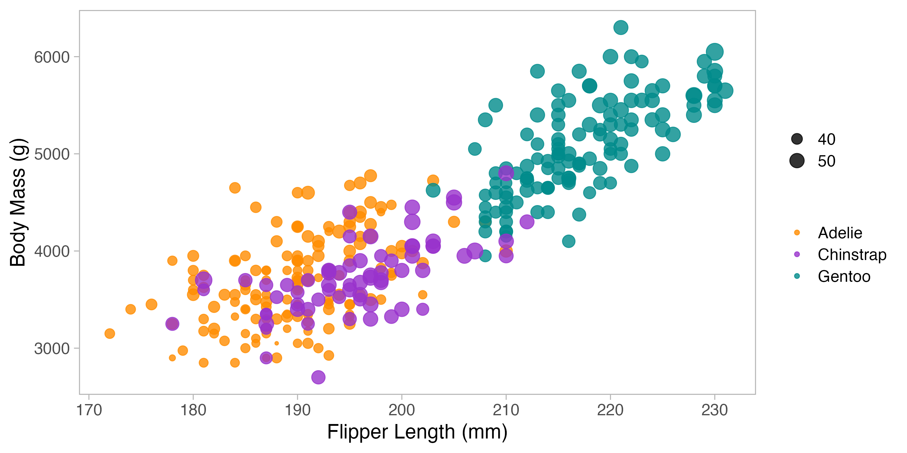
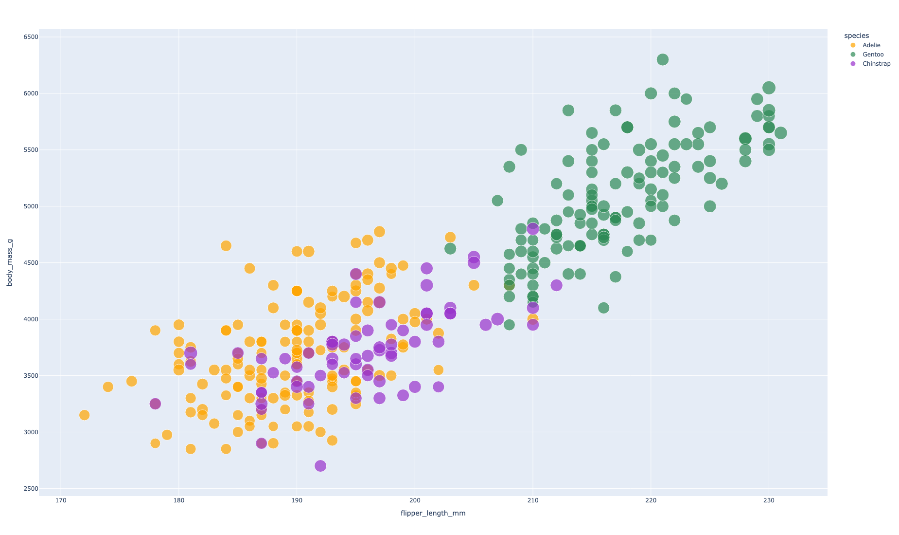

**NOTE: THE BELOW IS A SAMPLE ENTRY TO GET YOU STARTED ON YOUR README. YOU MAY DELETE THE ABOVE.**

# d3
d3.js is a powerful JavaScript library for creating complex and interactive data visualizations for web browsers.

Creating the scatter plot with d3 was both challenging but satisfying. It required understanding SVG manipulation and d3's data-binding principles. Even though it took some time to learn the 
documentation it was very satisfying to see the result

# Matplotlib

Matplotlib is a comprehensive library for creating static, animated, and interactive visualizations in Python.

Using Matplotlib was straightforward for generating a basic scatter plot. However, customizing the plot to match specific aesthetics took some effort. It was very good for quick plots

# R + ggplot2
R is a language primarily focused on statistical computing. ggplot2 is a popular library for charting in R. R Markdown is a document format that compiles to HTML or PDF and allows you to include the output of R code directly in the document.

To visualize the pengling dataset, I utilized ggplot2's `geom_point()` layer, with aesthetics functions for color and size. The syntax is intuitive, making the creation of this chart relatively easy.

# Altair

Altair is a statistical visualization library for Python, based on Vega and Vega-Lite.

Altair made data mapping and chart creation extremely user-friendly with its concise syntax. It excels at creating a wide range of visualizations quickly, which is ideal for this project.

# Plotly

Plotly is a library that enables the creation of interactive and informative visualizations. It supports chart types in both Python and JavaScript.

Creating the scatter plot with Plotly was a seamless experience due to its simple syntax and strong integration with pandas for data manipulation. The interactive capabilities that come out of the box, such as tooltips and zooming were great.

One challenge was handling non-numeric data, such as `NaN` values, which required some preprocessing of the dataset before visualization.

Plotly's interactivity and ease of use make it an excellent tool for both rapid prototyping of visualizations and the development of complex interactive dashboards.

## Technical Achievements
- Enabled interactivity in the Plotly visualization, providing a dynamic exploration of data points with tooltips and zoomable features.

### Design Achievements
- Maintained a consistent color scheme across different visualizations to standardize the representation of penguin species.
- Chose clear and legible fonts and considered the size of the plot elements to ensure the visualization is accessible and aesthetically pleasing.
