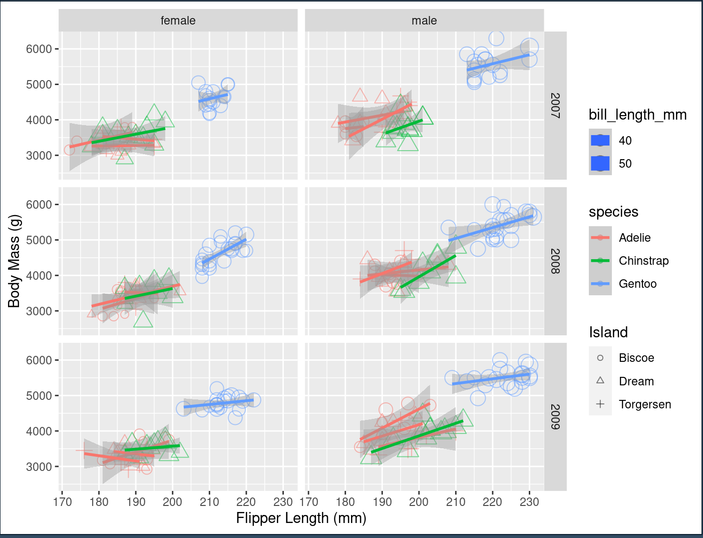

Note: all the resources used are linked in the code. Coding folders contain code for the minimum requirments and enhancements done after. 
# d3

Reflection: D3 is a great tool for complex and user interactive visualizations. However, it is a little bit hard to use since I am not fully used to the syntax. The most difficult portion was loading the data correctlty (I have code in python to start the server and then read the data from it or read data directly from the file). One hack that I found super useful is that chatGpt in combination with d3 documentation/stack overflow allows for a lot of functionality but the errors are hard to debug. 

Technical achievments: server up with special permissions to write the file correctly

Design achievments: the colors of the dots go together well.

# R - ggplot 2

Reflection:
Given the example in class and the extensive R library resources it was very easy to satisfy all the requirments and add onto them to create a more comprehensive view of the data which allowed to look at almost all of the columns provided. I think this method can be extremely useful when working with large data sets with a lot of columns. One hack that I used was to find the best way to represent the relationships between all the data columns and to make sure that the user did not get overwhelmed.

Technical Achievements: clean the data, separate based on all column values, enhance the code provided in class.

Design Achievments: separated everything based on year, included legends for all the shapes/colours, added trend lines to all the graphs.Consistent scales/shapes/colours allow for better user experience

# Python - MatplotLib

Reflection:
This tool was fairly easy to use but it was more complicated than ggplot with R as the colour variation required specific map functions. One useful application would be to large datasets where a lot of mapping is required; in my experience with python mapping is a very powerful tool for data analysis and thus Python is perfect for doing data analysis and vizualization. One hack that I implemented was to clean the data (remove NaN) before visualizing it to avoid any errors.

Technical Achievements: clean the data, separate based on all column values

Design Achievments: created two graphs, added comprehensive legens/lables, separation based on colour and shape

# Flourish

Note: there is not code associated with this portion of the assignment as I used an online editing tool to create the graph.

Reflection:
Flourish is fairly easy to use due to the UI provided and immediate feedback/preview on any changes made. However, the simplicity of this tool makes it very limited in comparisson to all the other tools used in this assignment. I think that Flourish is very convenient for someone who doesn't need to do any complicated visualizations, for someone who doesn't have a lot of technical experience, and for someone who needs to create the visualization fast. One hack that I used was Googling how to use Flourish and trying to figure out what the best resources are :)

Technical Achievements: loading the data correctly

Design Achievments: comprehensive colour scheme, trend line, shaped based on island, comprehensive information on click/hover for each point

# Matlab

Reflection:
Matlab was very easy and very difficult to use at the same time. It contains some functions similar to python that allow for complicated mapping but the syntax/poor IDE make it very difficult to find errors in the code. Moreover, MatLab and MatLab forums provide great tips for basic visualizations but I do not belive that this tool is good for any complex customizations. MatLab would be perfect to do complex data analysis followed by relatively basic visualization. One hack that I implemented figuring out what forum tips related to which version of MatLab. 

Technical Achievments: reading data into a matrix which would allow for complex processing

Design Achievemnts: Nice point color gradient
