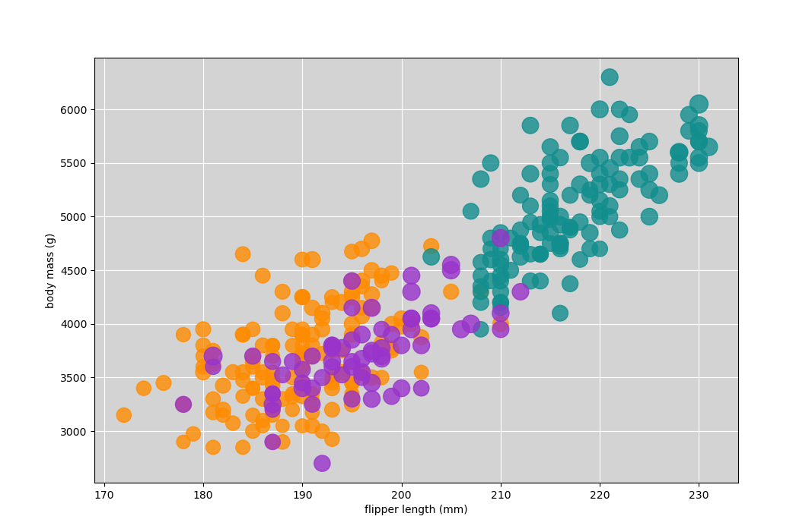
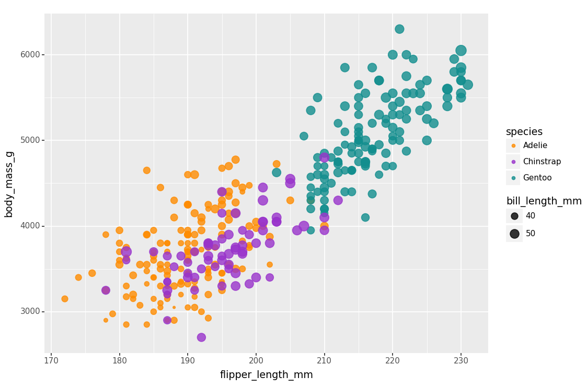

Ryan Dillon (rjdillon) - CS4804 A2

# d3

I used this resource to get started with making the scatter plot (including the svg and the axes): https://d3-graph-gallery.com/graph/custom_theme.html

However I modified it in the following ways: Ensure the axes were on the correct scale, edit text and colors to make sure that everything corresponded to the assignment's details, and overhauled the csv parsing to first convert the strings in each of the rows to numbers, and use a promise to ensure the csv file would be loaded before beginning to add the points on the plot. I also added the variation in point size according to bill length and added the style for 80% opacity. Additionally, I added a legend to show the meaning of the point size and point color.

I liked this tool because it was easy to get started after the first assignment that we completed. Additionally, it was easy to implement each element because they
just had to be appended to the svg. I did not like that to add the legend, I had to manually create the shapes/text and place them all by myself, rather than having a built in legend functionality like some of the python libraries.

# matplotlib.pyplot

# plotnine

# altair

I used this resource to get started with making a scatter plot in altair: https://altair-viz.github.io/gallery/scatter_tooltips.html

# tableau

## Technical Achievements
- I implemented tooltips for the altair and tableau visualizations, allowing the user to see additional data when mousing over each data point.
- In d3, I created a function to convert the data in each row from strings to numbers before attempting to create a visualization of the data.
- Instead of using R+ggplot, I used the python library plotnine that imitates the R syntax in the python language

### Design Achievements
- In each visualization, I implemented the same color scheme from the original r+ggplot2 graph that we were provided (I did this using a color picker on a screenshot of the graph to get the hex codes).
- Additionally, I made sure that in each graph, the background was gray (as it is in ggplot) and the tick mark lines were white and beneath the data points. Specifically when using matplotlib I had to do some research to make sure I moved the tick mark lines below the data points.
- All of the plots have legends except for the matplotlib vis. In d3, I added a legend manually to mimic the legend in the original ggplot legend. I did not add a legend to the matplotlib vis, because the legend implementation in this library puts the legend inside the graph canvas, not outside and adjacent like in the other visualizations.
