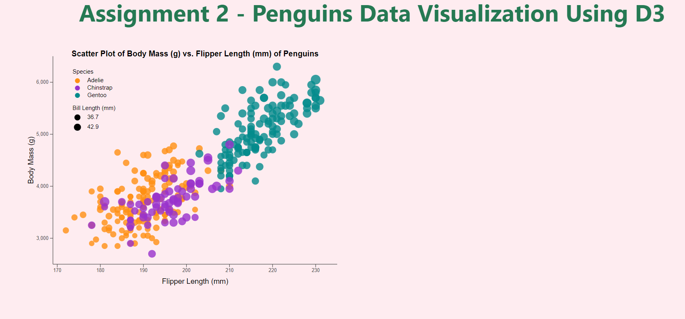
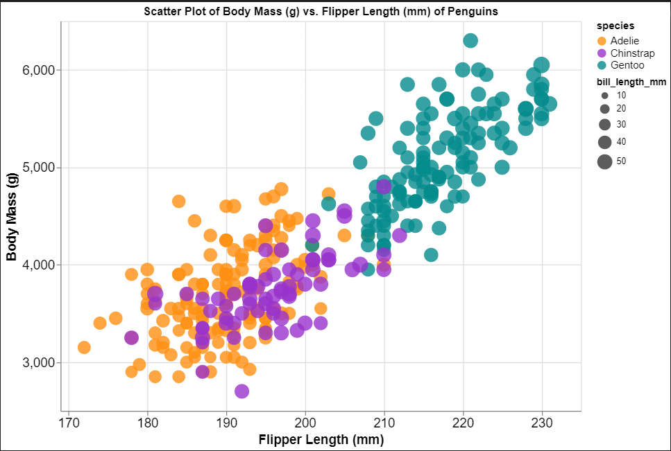
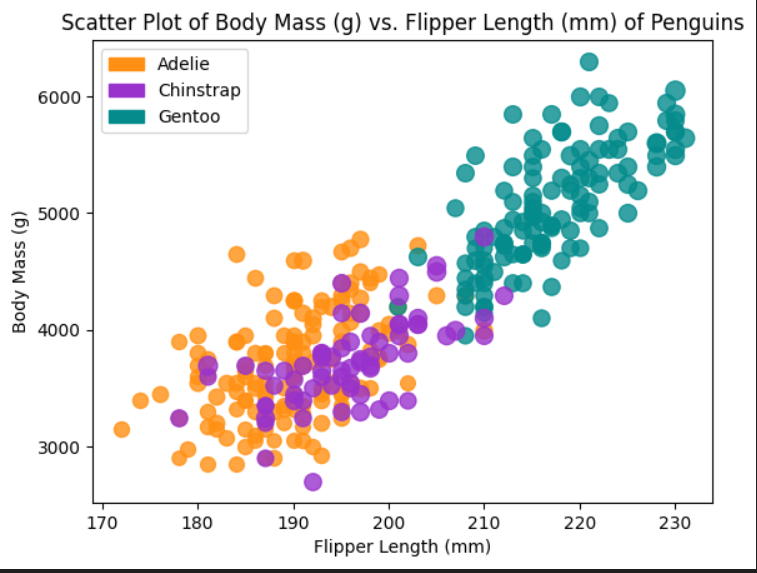
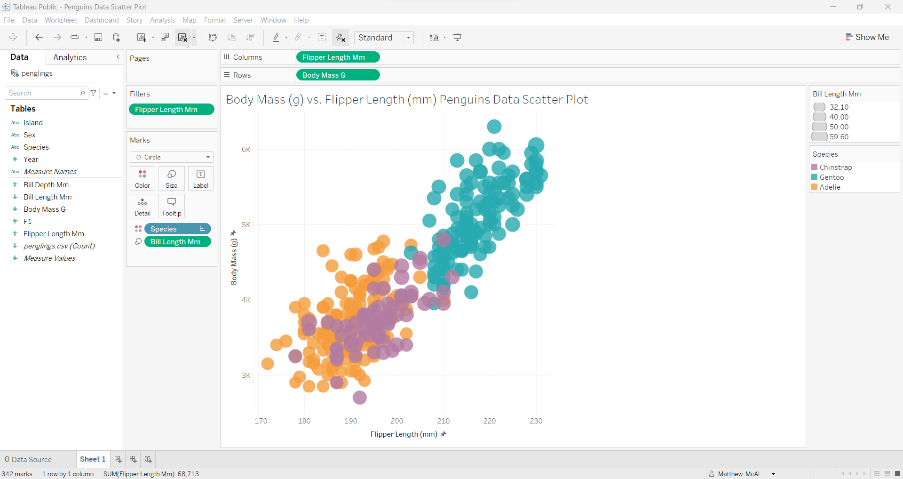
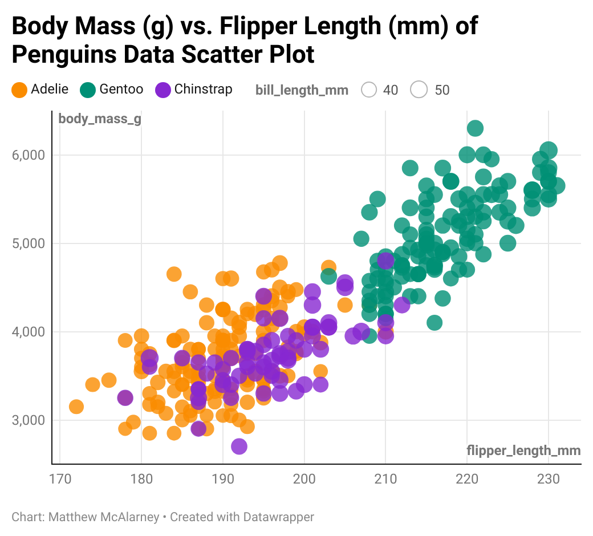

 ## Visualization Tools Commentary:

### D3

Visit my Github pages site to observe the D3 interactive features: 

I used the following resources to guide my coding experience in D3:

  Scatter plot in D3: https://sabahatiqbal.medium.com/building-a-scatter-plot-with-d3-js-66178fde56ac

  D3 enter function: https://www.educative.io/answers/what-is-d3-enter-and-exit

  Javascript Promises: https://developer.mozilla.org/en-US/docs/Web/JavaScript/Reference/Global_Objects/Promise/all

  D3 csv function: https://www.codecademy.com/resources/docs/d3/selection/csv

  Tooltips in D3: https://observablehq.com/@john-guerra/how-to-add-a-tooltip-in-d3

  Legend creation in D3:  https://d3-graph-gallery.com/graph/custom_legend.html

D3 is a web-based data visualization library that is used with JavaScript and HTML, and incorporates aspects of CSS. Using D3 to perform the replication was a rewarding experience as there were a number of technical challenges that I solved while learning how to code a scatter plot. In terms of the entire coding process, it was easy for me to understand the purpose of each block of code that contributed to building a certain part of the scatter plot. I followed a coding guide on D3 scatter plot constructon from the web, so I was able to digest the accompanying explanations of what each bit of code accomplished pretty quickly. With that being said, there were some techincal obstacles that I ran into and overcame. For example, it took me some amount of time to figure out how to properly and efficiently access the loaded csv data; I eventually figured out that I needed to utilize the csv data entirely within the D3 .then() function to display the scattered points on the axis layout. In addition, after I had plotted all the scatter points on the axis layout, there were some additional technical achievements that I worked through that were difficult to research and implement smoothly; I researched the construction of D3 legends, and although I found a few examples of code for legends on the web, it took me quite a bit of trial and error until I figured out how to implement efficient code for color and size legends that were suitable for the penguins dataset and positioning on the scatter plot. I also faced a similarly lengthy trial and error process when implementing a tooltip for the scatter plot; I researched a few different examples of D3 code for tooltips on the web, and I eventually found one approach that was suitable for the given structure of my code already in place. In terms of data manipulation and hacks, the only measure that I took to make the visual size of the dots very closely resemble the visual size of the dots on the original scatter plot was dividing the bill length of each dot by 6.0. In my tooltip, the raw bill length of the selected point is still reported to accurately reflect the csv data. After coding and ensuring my understanding of a D3 chart type, I see D3 being most useful in situations where data scientists and engineers need to customize code-based visualizations to a very detail-oriented extent. In other words, when the configuration of small aspects of a data visualization have a significant impact on the overall quality of the data representation and its accessability to users, D3 is one of the best visualization tools to use.

### Atlair

Run the Atlair Jupyter notebook to observe the interative features.

I used the following resources to guide my coding experience in Atlair:

  https://nextjournal.com/sdanisch/scales-axes-and-legends
  
  https://python.plainenglish.io/library-of-the-week-15-altair-073598250420

Atlair is a popular Python data visualization library with high-quality built-in capabilities. I found Atlair to be a very accessable data visualization library as it does not require as much code and up-front detail as D3 to accomplish the same replication. The tasks of configuring the inital plot axes, scattering the data, setting up color and size legends, and configuring user interaction features were relatively easy to find documentation for and implement in code. The one coding task that was difficult to implement was actually reversing the direction of values on the y-axis. For whatever reason, when I originally plotted the csv data with the inital axes configurations, the y-axis values were increasing from top to bottom, which significantly changed the shape of the scattered data. It took a good amount of time researching this particular issue as there were a few different proposed solutions that I came across; I settled on a hack that uses the EncodingSortField function to set the y-axis values to descending (from top to bottom). I also used the EncodingSortField function to set the x-axis values to ascending (from bottom to top). Overall, Atlair is a fantastic library that is best used when data scientists and engineers want to produce high-quality data visualizations with a minimal amount of code and easy-to-configure legends and user interaction features.

### Matplotlib

I used the following resources to guide my coding experience in Matplotlib:

  Matplotlib manual legend creation: https://www.statology.org/matplotlib-manual-legend/

Matplotlib is another popular Python data visualization library that offers basic visualization features and differs quite a bit from Atlair on a technical level. There were a few coding tasks such as configuring axes labels and ticks, scattering the data, and setting the plot title that were easy to implement. When scattering the data, in order to have the visual size of the scattered points resemble the visual size of the points on the original visualization, I had to multiple the bill length of each row in the dataframe by 2 (keep in mind that the raw bill lengths of each row in the dataframe are still equal to the bill lengths shown in the csv file). When I researched web guides on how to accomplish additional tasks such as coding legends and user interaction though, I ran into some challenges. Although I discovered a few different approaches for implementing color legends in Matplotlib, I found that I was restricted to being able to implement only one of the approaches due to the way I previously implemented a loop through the dataframe to scatter each data point one at a time. This approach that I implemented made use of Matplotlib patches to manually code the color legend instead of intuitively plotting based on the scattered data. In addition, I researched approaches for implementing a size legend in Matplotlib (which I was not able to implement) and found relatively obscure commentary and documentation on this issue. Finally, I researched user interaction capabilities in Matplotlib, and while I did find some guidance for implementing tooltips, I determined that the amount of code required to implement this type of user interaction is more involved than I anticipated. Matplotlib is a decent visualization library choice for creating basic non-interactive data visualizations. I cannot recommend this Python library for creating more intricate interactive data visualizations with detailed legends though.  

### Tableau

Link to my Tableau visualization so that interactive features can be observed:
https://public.tableau.com/app/profile/matthew.mcalarney/viz/PenguinsDataScatterPlot/Sheet1?publish=yes

I watched the following Tableau tutorial for guidance on using the software:
https://www.youtube.com/watch?v=9NsolmlJLKE

Tableau is a comprehensive data visualization software product that can be used to create interactive visualizations. Although I was able to efficiently replicate the original scatter plot with the assistance of video guidance demonstrating how to use the software, I found the user experience of Tableau to be confusing and inconvenient to a certain extent. Tableau uses columns and rows to load data into the x and y axes respectively, but it would be more obvious to direct where certain data columns from the csv file get plotted if columns and rows were just labelled as x and y axes. In addition, when I originally got all the data scattered, I found that certain species (circles) were overlapping in a different manner compared to the original visualization. Tableau's user interface did show any obvious configurations to change the overlapping pattern of the data, and so I had to research this issue. I figured out that the overlapping of different species could be changed by switching the order of species displayed in the color legend. Although this solution was easy to implement, it was not intuitive to pinpoint due to the lack of clarity in the user interface. Lastly, I found that it was not directly possible or at least very challenging to configure Tableau to change the visual sizes of the scatter points. Similar to my approaches with the three coding libraries I used, I strived to figure out how to configure the visual sizes of the scattered points to match the visual sizes shown in the original visualization. I was not able to pinpoint a clear solution, and so the visual sizes of the scattered circles in Tableau are a little bit larger than the visual sizes in the original visualization (still bear in mind that the actual bill lengths plotted in Tableau are all still equivalent to the corresponding bill lengths in the csv data). Overall, Tableau is a decent data visualization software product that can be used to create interactive visualizations, but the user experience of building a visualization lacks clarity and instructional direction.

### DataWrapper

Link to my DataWrapper replication so that interactive features can be observed:
https://www.datawrapper.de/_/UGoGK/

DataWrapper is a very interesting and alternative-esque data visualization software product that can be used to create interactive visualizations. In contrast to Tableau, the Data Wrapper user experience is fantastic; there are four different tabs that the user moves through to construct the full visualization. A user just needs to upload the data from a csv file in the first tab, perform any data imputation in the second tab, configure all aspects of the visualization in a clear, sequential order in the third tab, and then publish/embed the visualization in the fourth tab. All of the presented steps in this construction were easy to implement as they were clearly and concisely described to the user. In particular, DataWrapper offers easily configurable color and size legends, and advanced user interaction such as isolating certain data series on mouse hover and aesthetically beautiful tooltips. I see DataWrapper as an exceptional non-coding tool for data scientists and engineers in scenarios where there is the need to produce high quality data visualizations quickly with advanced user interaction features.

## Achievements:

### Technical Achievements:

  1. Species Color Legend (implemented in D3, Atlair, Matplotlib, Tableau, DataWrapper)
    a. I implemented a species color legend in the above replications to mimic the species color legend shown in the original visualization.
  
  2. Bill Length Size Legend (implemented in D3, Atlair, Tableau, DataWrapper)
    a. I implemented a bill length size legend containing two or more sample mappings of bill length to circle size in the above replications to mimic the bill length size legend shown in the original visualization.

  3. Implemented different data imputation strategies to handle NA values in csv file (implemented in D3, Atlair, Matplotlib, Tableau)
    a. In Atlair and Matplotlib, after loading the csv data, I handled NA values by replacing each NA value in the flipper length, body mass, and bill length columns with the current mean flipper length, body mass, and bill lengths respectively. I replaced all NA values in the species column with the current mode species (most frequently occurring species).
    b. In D3, during the process of loading csv data, I handled all NA values by filtering out any data row that contained an NA value in the species, flipper length, body mass, and/or bill length columns. This data imputation strategy operates under the motivation to only plot complete data in the scatter plot. No incomplete data rows are plotted in D3.
    c. In Tableau, I applied a data imputation filter for the flipper length column. This filter ensures that no incomplete data rows are represented in the Tableau replication.

  4. Implemented an interactive tooltip for every data point (implemented in D3, Atlair, Tableau, DataWrapper)
    a. I implemented an interactive tooltip in all of the above replications. When the user hovers over a data point, a tooltip pops up with information about the exact species, flipper length, body mass, and bill length pertaining to that scatter plot point. When the user hovers the mouse away from a given data point, the tooltip for that point dissapears as expected. 

  5. Implemented scatter plot zooming and panning (implemented in Atlair)
    a. As part of enabling the Atlair replication to be interactive through the .interactive() function call, Atlair also grants the user the ability to zoom into and zoom out of a specific region of the scatter plot, and also drag the background grid of the scatter plot to the left, right, up, and down (graph panning) to focus in on certain subgroups of data points.

### Design Achievements:

  1. Added a visualization title to each scatter plot (implemented in D3, Atlair, Matplotlib, Tableau, DataWrapper)
    a. I added a scatter plot title acknowledging the relationship between body mass and flipper length to each replication.

  2. Used consistent color choices for the species (implemented in D3, Atlair, Matplotlib)
    a. In each of the coding language libraries that I employed, I used the exact same color scheme for each of the species. I used the following species domain and color range in D3, Atlair, and Matplotlib:
      species_domain = ["Adelie", "Chinstrap", "Gentoo"]
      species_color_range = ["#FF9013", "#9932CC", "#048B8C"]

  3. Configured specific font families, font sizes, and font weights for visualization text (implemented in D3 and Atlair)
    a. In D3, I specified font families and font sizes for the scatter plot title, axis labels, legend text, and tooltip text. I also specified font weight for the scatter plot title and tooltip text as well.
    b. In Atlair, I specified font sizes for the scatter plot title, axis labels, and legend text.