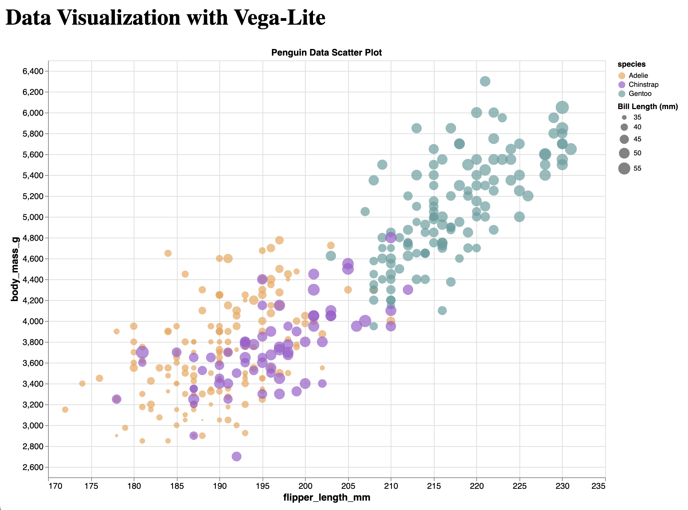
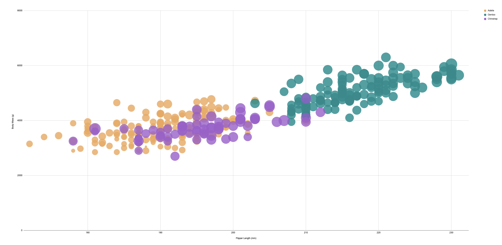

# d3

I decided to start with d3 since thats what we used for assignment one. D3 provided precise control over all of the elements. Selecting and manipulating the data was fairly straightforward. One issue I had was how the chart was positioned within the div. This caused quite a bit of confusion for me. At first I thought that I wasn't coding the axis correctly, but it turns out that I just needed to transform the whole graph so that it wouldn't render partially outside of the div. I've noticed that there is a lot of customization within d3 so I'm interested to try it out for graphs I've never created before like bubble graphs.

# Vega-lite

Vega-lite was my next choice since it was also web based and thats what I have the most experience with. I thought that the syntax for this library was a bit more conscise than d3. Since I'm familiar with javascript and the use of object notation, it made this version intuitive for me to pick up after d3. I didn't really have any difficuleties with vega-lite, the process for me was pretty straightforward. I could see this as a good option for creating quick and easy standard charts.

# ggplot2

I don't have too much experience coding with R so the most difficult part of creating the chart in this language was getting the development environment and libraries set up. I had a few hiccups there but once I got my environment set up creating the graph wasn't too much of an issue. This was the most compact syntax out of the other languages which made coding it convenient for me. I have a friend in biotechnology that uses R a lot so I can see the appeal of using R for very dense and demanding datasets like gene sequencing.

# altair

For me personally, I wasn't a huge fan of the syntax for altair. It just didn't feel as intuitive as all of the other versions that I used to create the chart. It felt a little clunky to me. The ordering of how you add the different components to the graph was not intuitive to me.

# Excel

I've definitely used excel the most out of any of these tools and was not too surprised at its limited capacities. The one glaring issue I faced is having to zoom out in my web browser and screen shot it in order to somewhat succesfully display the data. Excel has a bubble chart function but there isn't really any control over the size of the bubbles so the default makes the bubbles so large that its hard to see the individual data points. Overall excel is pretty intuitive but is for sure lacking in the features department. This tool is helpful for getting quick and easy data charts.

## Technical Achievements

### Design Achievements
