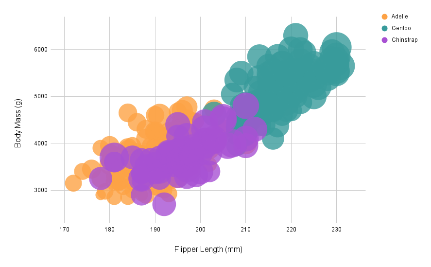

# 02-DataVis-5ways

Assignment 2 - Data Visualization, 5 Ways  
===
Randy Huang

# Google Sheets 

This was definitely one of the easier tools to use. It was very easy to import the data and create a chart. I could see this being useful for quick visualizations, but it's not very customizable. This included both the data and the chart. I worked directly in the Google Sheets data/chart interface, which I had to manipulate to get the results I wanted. The chart also doesn't have a lot of options for customization, such as the bubble size or bill legend. Although, another solution I found was to use the Google Sheets API to pull the data into a more customizable charting tool, but that would be a different tool altogether. This is definitely the way to go if you just want a lightweight chart and don't need to do any data manipulation.

# Seaborn-Matplotlib

I worked on this after sheets, and it was a lot easier to customize. Of course, involving code is a bit less intuitive, but it's a lot more powerful. I had to do some data manipulation to get the chart to look the way I wanted, but it was a lot easier to do than in Google Sheets and didn't get frustrated over the fact that I couldn't change the sizes. I could see this being useful for more complex visualizations, especially if you're already working in Python. This would be great to use for data science projects, where you're already working in Python and need to visualize your data -- very flexible for general use.

# Altair

This was a bit more difficult to use than seaborn. because I worked with seaborn before, but it was still pretty easy to use and similar to seaborn. The data manipulation was similar to seaborn, as I only need to drop the NA values. One of the difficulties was that I couldn't change the dimensions of the plot, so it's stuck in a square shape. I personally wouldn't really use it since I think it's ugly, and I think it's more clunky to use than seaborn, but of course there might be use cases that I didn't discover that makes it a popular library. 

# D3

This was the most difficult to use for this assignment, as it required a lot more code to implement the same features, not including the extra features like tooltips. This is mostly due to how each feature has to be defined, but the low levelness makes it very flexible for other use cases. In some cases it might be better to use other libraries, but if you need a lot of customization, this is the way to go. 

# Matlab

Matlab was medium difficulty to use, as it was a bit more difficult to use than seaborn, but not as difficult as d3. Lots of things were the same, such as the data manipulation, but the syntax was a bit different. I don't like Matlab syntax and the way you declare implementation, but it's good for quick visualizations if you're already working in Matlab. The visualization itself has nice interacitivity, which is a nice touch.

# Technical Achievements
**Interaction**: Some of the visualizations have interaction, such as mousing over to highlight the point and see more detail about the point selected. This is a great feature to have in a visualization, as it makes it easier to see the data without having to look at the raw data. This is especially useful for the scatter plots, as it's hard to see the data points without hovering over them. The d3 implementation was the most difficult, as I had to write the code to make the tooltip appear and disappear. 

# Design Achievements
**Consistent Styling**: Wherever I could, I used a consistent color scheme and sizes throughout the visualizations, which makes it easier to compare the visualizations. Some of the visualizations didn't have a lot of options for styling, but I did what I could to make them look similar, such as using the same fonts or gridlines. Sometimes the tool was a pain to work with, like Google Sheets, where the bubble size was just stuck being massive.

**Hover tooltip**: I included hover tooltips in d3, as Sheets had that functionality and would be a good detail to add to the other visualizations. The tooltip is styled to look better than the default, which is a small detail that makes the visualization look more professional. The hovered data point is transitioned to be also made larger and raised above the rest of the points with a shadow, which makes it easier to see which point is being hovered over and feels smooth to use.
