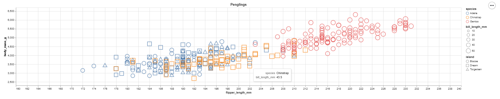
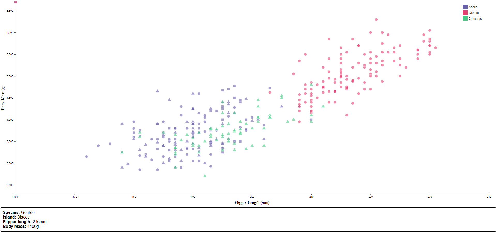
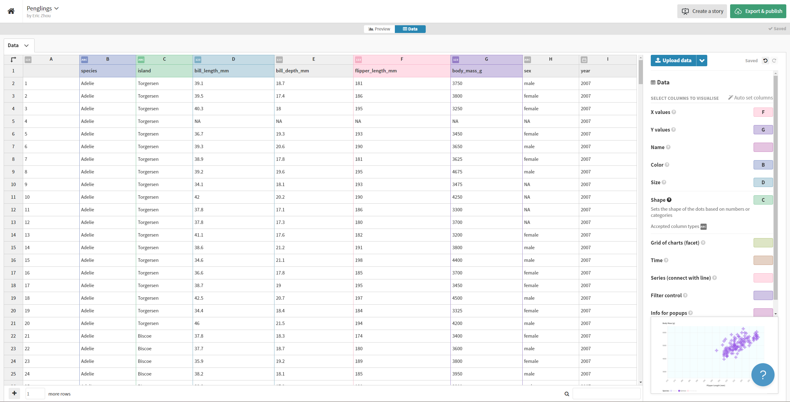
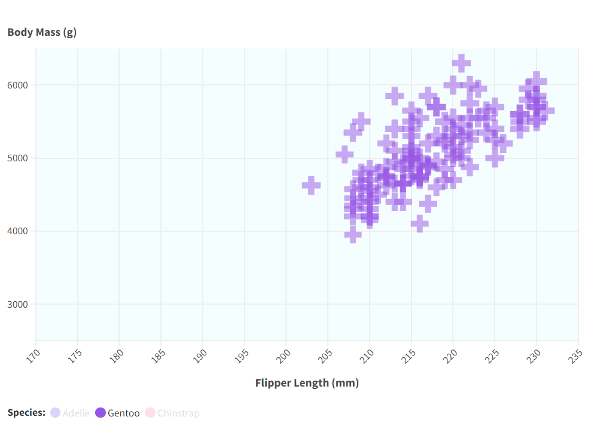
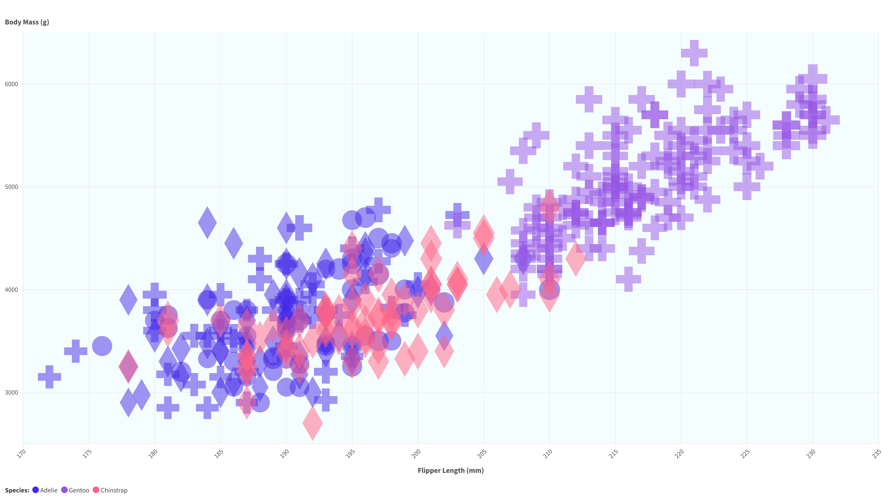

Assignment 2 - Data Visualization, 5 Ways  
2/2/24  
Eric Zhou

# 1. Matplotlib

Matplotlib is amongst one of the most popular Python libraries out there, being a comprehensive library for creating visualizations.

**Note:** Most likely have to `pip install mplcursors` for everything to fully work!

For some reason, matplotlib by itself doesn't have a straightforward way of mapping a DataFrame column to colors, as you need to create a color dictionary mapping then integrate it into the plot, so I just opted to use **seaborn**'s `scatterplot()` function; **seaborn** is essentially a wrapper library around matplotlib with some added functionality.

To additionally some interactivity to the figure, I used another library built for matplotlib called **mplcursor**, which allows for interactive data selection cursors. Here, I just used it to display the species and bill length of a pengling when you hover over the data point.

With how wildly known matplotlib is, it makes it relatively easy to quickly code up a visualization. While it took a bit more time, more complex aspects can be added in thanks to the abundance of Python libraries.

# 2. Plotly + Dash Python

Plotly.express is a library developed by Plotly that provides numerous data analytic and visualization tools, similar to matplotlib, but additionally has interactive feature support.

**Note:** Check out the `README.md` file in the `plotly` folder for how to run the Dash application!

To visualize the dataset, a simple `px.scatter()` figure object was created with the provided dataset, with all features included thanks to an extensive list of function parameters. Then, using some simple example apps from their site (https://dash.plotly.com/minimal-app), a simple application gets hosted on a local port. 

A technical achievement included in this method of visualizing the data is a slider bar that has the ability to filter entries based off of their Bill Length; the following example below has filtered the entries to only include penglings that have a bill length of between 40mm and 46mm.

Being famiiar with Python, the two new libraries used weren't too hard to figure out, and made it quite easy to create a detailed chart. The `dash` library makes it pretty easy to develop and make an interactive application (though the enterprise version appears to have more functionality). 

# 3. Altair

Another Python visualization library developed by Vega-Altair. The function `alt.Chart()` for creating a Chart object is relatively straightforward and similar with chart creation methods in other Python libraries. It seems that this library was mainly for use in IPython Notebooks, and there didn't seem to be an easy way to just get the resulting chart to display without saving it as an HTML file. Besides the displaying and saving process, everything else was pretty streamlined.

# 4. D3

**Note:** When tested locally in the `d3` folder with `python -m http.server`, it appears that the current file directory will fail to properly load the HTML file, as it only works with files inside the directory.

D3.js is a JavaScript library built for producing data visualizations and appears to be a prominant tool used in this course.

Surprisingly, it was actually not that simple to create a scatterplot, requiring a length function to be defined upon reading in the CSV file. Using the linked [D3.js Scatterplot Example](https://d3-graph-gallery.com/graph/scatter_tooltip.html), the given code was adjusted to fit with the Penglings data, as well as several improvements:
- Addition of a Legend
- Color Mapping
- Shape Mapping
- Axis Titles

Was also surprising that D3.js doesn't provide any helper functions for creating legends, seeing as how they're a pretty important aspect of data visualizations. Luckily, D3.js did have a page dedicated to Legend examples: https://d3-graph-gallery.com/graph/custom_legend.html. 

The potential does exist to really customize a data visualization, even sometihng as basic as a scatterplot; just takes a lot more effort.

# 5. Flourish

**Note:** Link to published chart: https://public.flourish.studio/visualisation/16582081/

Flourish is a online platform that has a user-friendly UI, allowing for easy uploading and manipulation of data to quickly create visualizations from a vast library of example charts. Creating the visualization was extremely easy; specific attributes of charts could be created simply by filling in which column to use:

Interactive elements can also be easily created by editing sections in the Preview tab. For example, clicking on the legend values can show/hide the respective data points.

Unfortunately, Flourish has some features locked behind their premium plan, one of them being the ability to download the chart as an HTML file. For free users, downloading an image is the only option, though the project can be published and shared at a link (mentioned at the top of the section):

# Technical Achievements
- **Matplotlib**
    - Interactivity in the graph with the help of the `mplcursor` library
- **Plotly + Dash**
    - Creating an interactive application in Python
    - Implementing a slider bar to filter entries based off of bill length
- **D3.js**
    - Interactive Tooltip implementation
    - Legend

# Design Achievements
- **Matplotlib**
    - Color mapping with the help of the `seaborn` library
- **Plotly + Dash**
    - Integrating another aspect of the Penglings data via a slider bar
- **D3.js**
    - Color and Shape mapping
