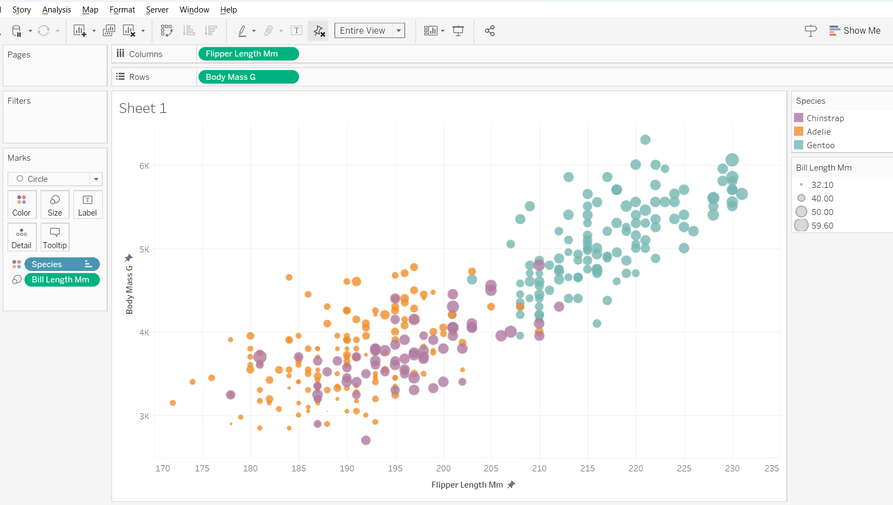
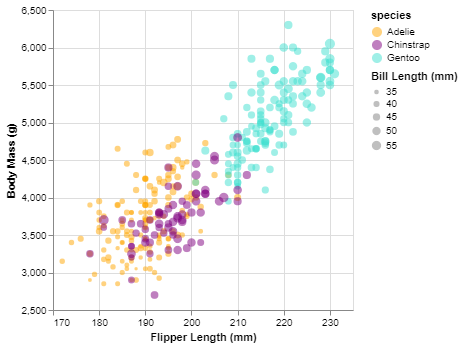
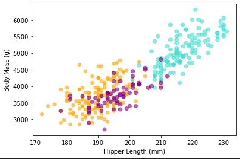
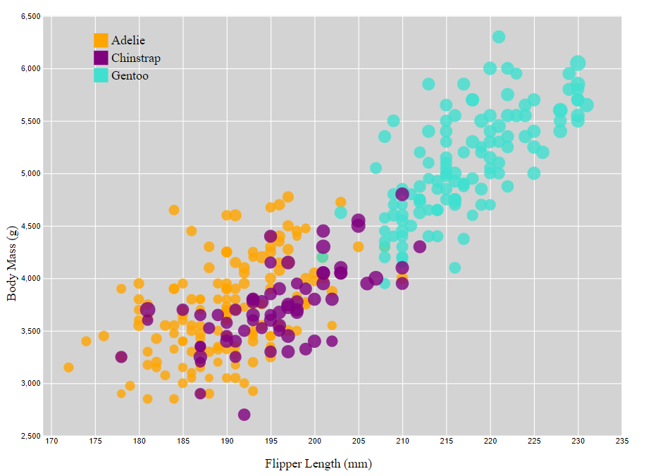
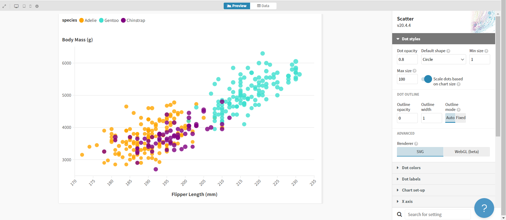
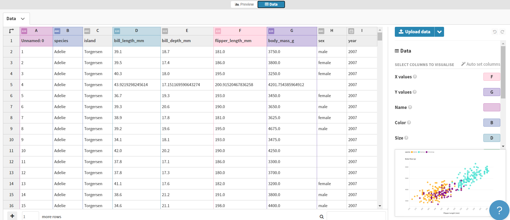
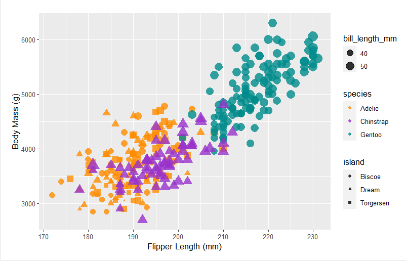

# 02-DataVis-5ways

Assignment 2 - Data Visualization, 5 Ways  
===

# Data Pre-Processing / Technical Achievment

Some of the records in the penguins data set contained missing values. There are many different ways one can handle missing values, some just as simple as disregarding these rows. I decided to research different imputation techniques and decided to implement KNN imputer with k = 3. This code can be found in the .ipynb file. KNN imputer calculates the distance between the points in a high dimensional space (as many dimensions as columns used), and assigns the average of the k closest points to the missing value. I standardized the data to ensure that one of the columns did not get overweighed. Once this finished, I un-standardized the data to get back to the original scales. I then wrote to a new csv and used this as my data source for my visuals.

I also believe I achieved the technical achievements for the small aspects I added to the graphs. For d3 I went further aesthetically and added a the shaded background, gridlines, adn key. Also for the graphs I went further with the size to make the size of the dots to stand out more. A very small but important detail I did with all my graphs was changing the axis names to make them appear how humans read, as opposed to the string with the underscores in them. 

# Tableau

Tableau is a data visualization software that is often used in businesses. From my knowledge, PowerBI and Tableau are very similar and are some of the most popular business intelligence tools used in industry. It is no code so it is very easy for existing employees of companies to pick up.

I have experience in this platform which made this visual straight forward to create. I connected to the csv, and then just dragged and dropped the columns onto the axes and features for color and size. For aspects I wished to change, for the most part it was just right click and edit.

Overall, I think Tableau is a good platform to create a variety of visuals and combine them onto a dashboard with interactive filters. I think it lacks the capabilities of animation and complex visuals.

# Altair

Altair is a python library. I had not used or heard of Altair before this assignment. The website has a lot of good resources to easily learn different aspects of the library. Definitely more technical than platforms like Tableau; however, more freedom and customization of the visual.

I created the visual in the python notebook in the cell after the altair visual markdown. To create the visual I created an alt.chart using my data and filled the points with an opacity of .8. From there I customized the x, y, color, and size. For x and y I inputted the desired columns then set a custom scale and title. For color I had to create two lists that contained the different species and a list containing the corresponding color, then in the alt.color I inputted the column and custom scale for the colors. This library I had the easiest time setting the size scale to make the lower values small and larger values big. I inputted the column and set the scale and min and max size. An aspect I liked was the legend automatically showing.

Overall, I think this library is very straight forwards and easy to learn. It has more customization than tableau.

# Matplotlib

Matplotlib is another python library. I have had past experience with this library to create simple visualizations. It is similar to Altair, but I think Altair is easier to use after learning a little about it.

I created the visual in the python notebook in the cell after the Matplotlib markdown. Customizing the color and size were more complicated in this library than Altair. I had to make a dictionary with the colors and then loop through my data to assign the colors. For sizing I normalized the data to try to emphasize the difference in size, but could not do so as successfully or easily as in Altair. Other than this it was similar to Altair where I create a plt.scatter and inputted my data. The legend for color is much more complicated to create than the auto generated one in Altair.

Overall, I would prefer to use Altair over Matplotlib as the Altair visual looks better with less customization by the user.

# D3

Link to my gh-pages site "http://BradyA25.github.io/a2-DataVis-5Ways/index.html".

D3 is a javascript library. This visual took me the longest to make as my only experience with javascript was from assignment 1. This method was the most technical out of all of the ways; however, this could mean that it is the most customizable. From the examples I have seen I think the capabilities of d3 with intractability and animations are top of the industry.

I created this visual in the index.html file. I first created a svg, then a background and filled it with a light grey to mimic the example. From here I used d3.csv to read in my data. I used this website for refence of my code: https://d3-graph-gallery.com/scatter.html. This helped me learn and took me step by step of what each line does to the visual. As mentioned this was the most technical visual I made. I had to explicitly declare the length and locations of everything. Adding the color to the visual was similar to python where I assigned the species to a color in a variable. After the graph aspects were all set I appended the points. It appends a lot of circles with the attributes derived from the data and other declarations I made, such as the opacity. The legend was complicated to make compared to Altair, but I was able to create one and put it where ever I wanted.

Overall, this was the most technical visual; however, this usually means that it gives more freedom to the user.

# Flourish

For my final method I created the visual using Flourish. I had never used this before. After using it I have learned that it is similar to Tableau, but has more features in regards to animation. In the time playing with the platform I was able to create a simple visualization/animation of the data over time.

This visual was created online so I included a screenshot of the visual, and the data inputs. Creating the visual was very simple. I hit create new visualization, selected scatter plot and then entered the columns in the side bar for visualization. I was surprised by how easy it was to create. I also like how you can import the visual to canva to allow for easy integration into presentations. There is also create a story option, so I think this platform would be very easy to use to combine visuals into a story telling. The most complicated aspect of this visual was to change the color pallete (all I had to do was explicity declare the colors). I did struggle with changing the size of the dots to be exagerated. I think if I wanted to accomplish this I would have to normalize the column and enter that into size.

Overall, I was surprised by how easy this platform was to use, and think it has a lot of potential on the animation side of visuals.

# R + ggplot2 + R Markdown

R is a language primarily focused on statistical computing.
ggplot2 is a popular library for charting in R.
R Markdown is a document format that compiles to HTML or PDF and allows you to include the output of R code directly in the document.

To visualized the penguins dataset, I made use of ggplot2's `geom_point()` layer, with aesthetics functions for the color and size.

While it takes time to find the correct documentation, these functions made the effort creating this chart minimal.

## My Additions

To add to this visual I added the island to the shape of the points. I also used my imputed data. Adding shape was straight forward.

