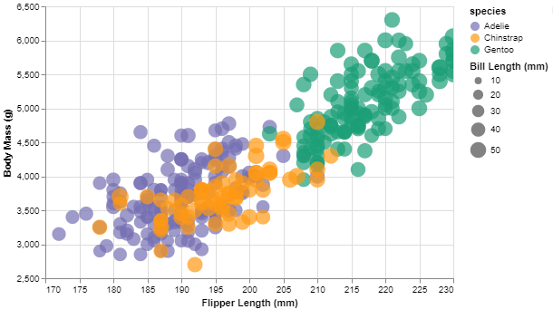
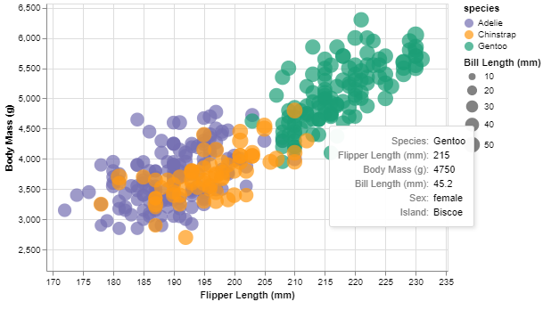
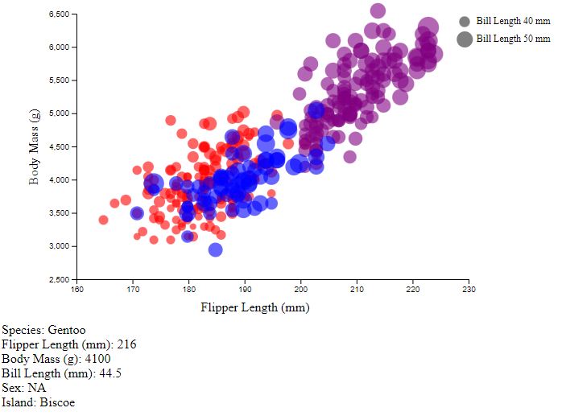
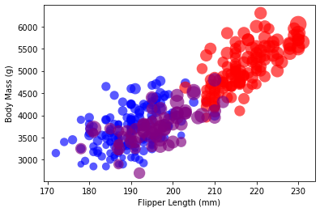
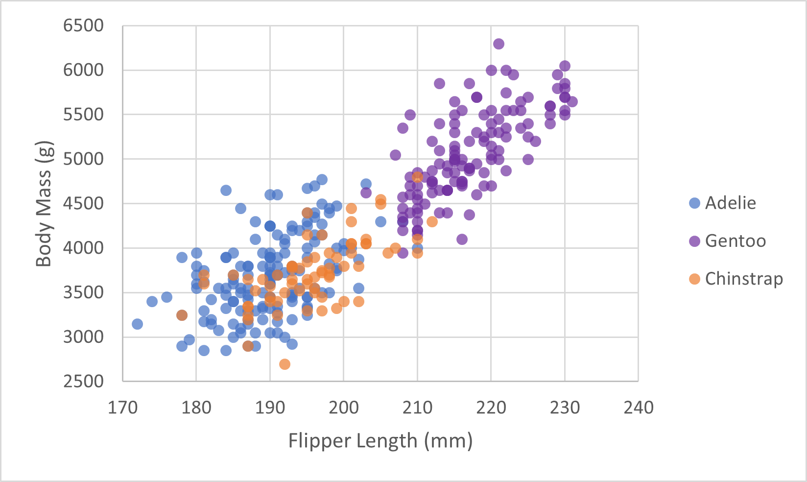

# 02-DataVis-5ways

Assignment 2 - Data Visualization, 5 Ways  
===

GitHub Details
---

- Fork the GitHub Repository. You now have a copy associated with your username.
- Make changes to fulfill the project requirements. 
- To submit, make a [Pull Request](https://help.github.com/articles/using-pull-requests/) on the original repository.

# Altair + Python (JupyterNotebook)

This visualization was easy to create. The only slightly annoying thing about it is that Altair is designed to work with notebook type IDEs, so it works well with JupyterNotebook, but not Spyder (which is my default preference). The package automatically added the tick marks, though I did have to scale the axis myself. I can see myself using this in the future due to the ease of use and my existing familiarity with python code. That being said I haven't explored the limitations of this yet. I suspect Altair may have trouble producing more bespoke visualizations, though I don't know that for certain. Adding additional features such as tooltips and specific colors was not too hard either.

Design Achievement
- Altered species colors to colors of my choice

Technical Achievements
- Renamed axis and legend titles so they aren't the data names
- Added tooltip that explains additional information about scatter points when they are moused over

# Igor 8

This visualization was not that hard to create. After loading the data it was just a matter of graphing the correct waves (columns) as a scatter plot. I manually added a column that mapped the species to numbers (0, 1, 2), then I added the species to color and bill length to circle size additions. This was easily enabled by the graphing program as it had mapping the color and size of points to various waves (columns) as an inbuilt option. I could not directly map each species to choose color this way, though it should still be possible to get specific colors by fixing the start and end point of the number-to-color scale and then changing the color values to the species map to the desired colors. The software also automatically scaled the axis and added the tick marks. Renaming the axis was easy as well. I'm not sure adding a legend for species color and bill size to point size is possible directly. That being said, having transparency did not appear to be an option. With more work it might be possible to add partial transparency, but that might involve making a 4th color channel to account for it. I use igor with the data from my chemistry lab. One of the reasons we use it is that it is scriptable, so it can be programmed to take data even from unusual file types and automatically create graphs or a number of graphs. It also easily produces high quality exports in whatever size we specify (in inch, pixels, or cm scale, with modifiable dpi). I suspect I will keep using it in the future for graphing scientific data due to ease of use and other features, such as being able to zoom in on an area of the data, have a cursor follow the data, and easy way to annotate data in the graph. 

# d3

This visualization was a bit trickier to create. I had to learn how to host a local server from the command line and how to properly load data into the .html from another source (which I think I am doing correctly). Ultimately I turned to ChatGPT 3.5 to give me a code framework to work from rather than spending an exhaustive amount of time trying to find the correct commands and syntax necessary. After that everything progressed fairly quickly, with writing a small function to handle the different colors, writing an equation to manipulate the circles' size, adding an opacity feature, and some other small changes to get the axis and axis titles looking better. Overall d3 took the most amount of code so far, but also seemed like the tool I had the most control over. If I was trying to make a visualization with a very specific feel, I would likely turn to it for the control that it gives. I do believe the data is misaligned on the x-axis, but I have no idea why that is the case.

Later Additions

Technical Achievements
- Added basic legend
- Got additional information to pop up as a tooltip beneath the graph when scatter plot points are moused over

# matplotlib + Python (Spyder)

This visualization was not too difficult to create, though it did take more code than the Altair version did. I had to extract the values from the data frame to effectively manipulate the scatter points sizes and colors. The circles by default plotted small and telling the size difference was difficult, so I went about exaggerating the difference so it could be observed by cubing the size then dividing by 500 to get the circles back down to a reasonable size. Mostly I was using plt.scatter for the first time, as directly creating the circles using plt.circle and plt.add_patch resulted in the circle flattening to horizontal lines when created due to the y axis scaling. I also think the matplotlib graph does not look as good as the Altair version. I do see myself using matplotlib in the future, but only due to ease of use and certainly not for professional or final product visualizations.

Design Achievement
- Managed to get the bill_length_mm scatter point size relationship to provide a reasonable visual scale

# Excel

This visualization was not that difficult to create, but surprisingly not that much easier to create either. This may have been due to the fact that Excel for some reason seemed to be sluggish with this data set. I separated the data into three different sets based on the species, then had to manually remove the two entries that had 'Na' data entries for the values I was trying to graph. I made a scatter plot, plotting each species as a different set. Adding axis titles and a legend was very simple, just using the attached graph modification options. Changing the color and transparency just required going into the graph options sidebar. Unfortunately, it does not appear that Excel gives you the option to link scatter point size to data, so the points remain the same size for this graph. I do see myself using Excel in the future, but mostly only for data exploration. This is due to the ease with which the data can be manipulated from within the program. Making graphs then is more about searching for trends than it is about nice readable and usable finished products.

## Technical Achievements
- **Proved P=NP**: Using a combination of...
- **Solved AI Forever**: ...

### Design Achievements
- **Re-vamped Apple's Design Philosophy**: As demonstrated in my colorscheme...
