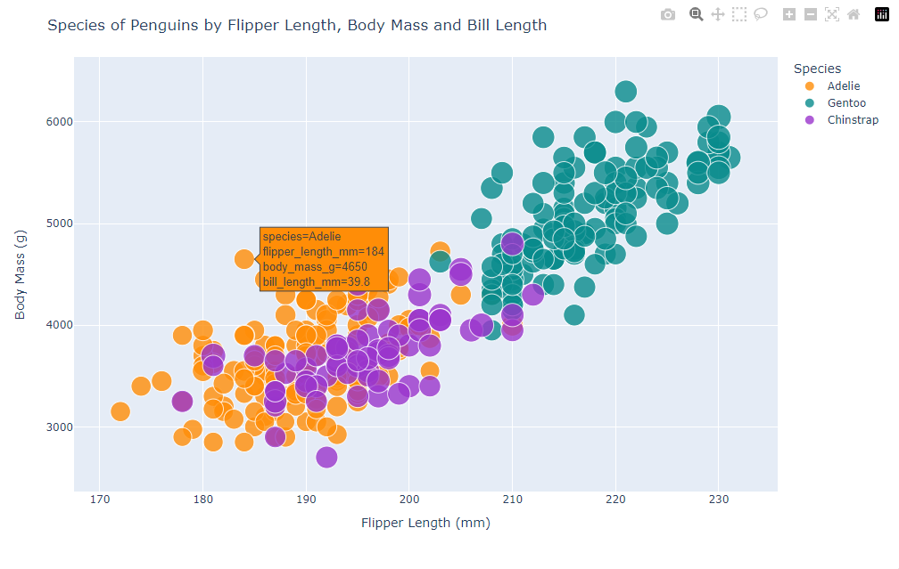
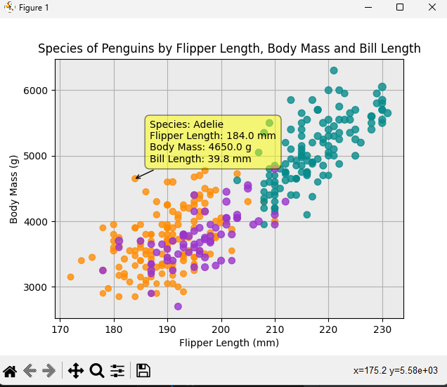
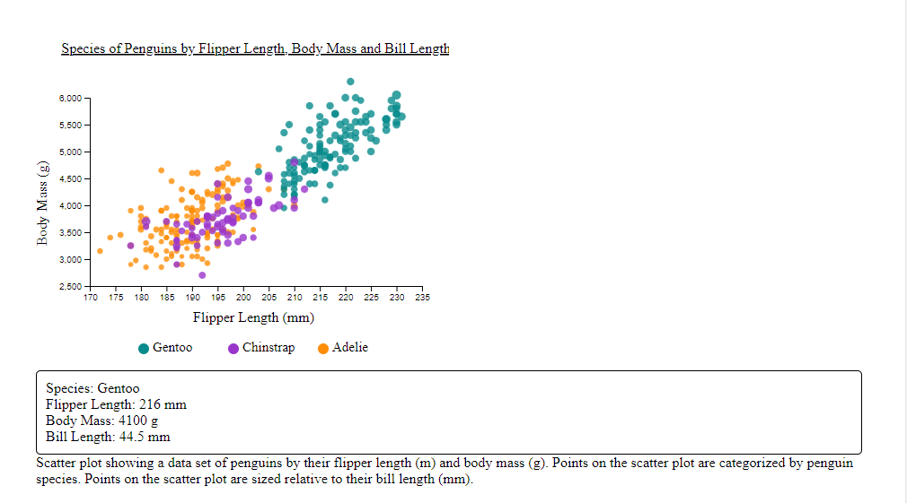
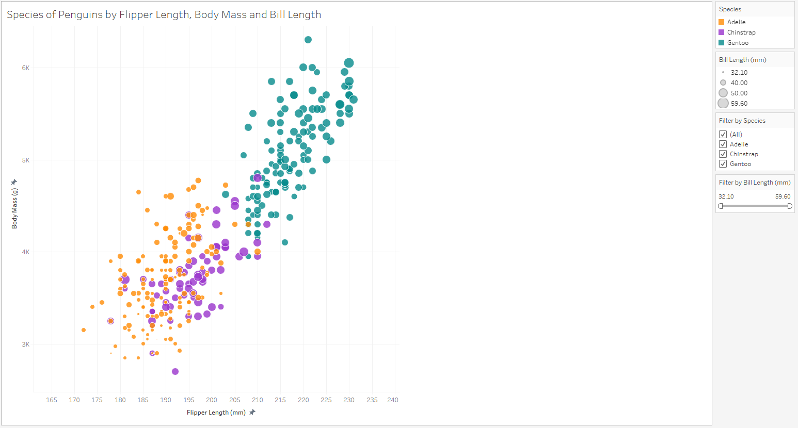
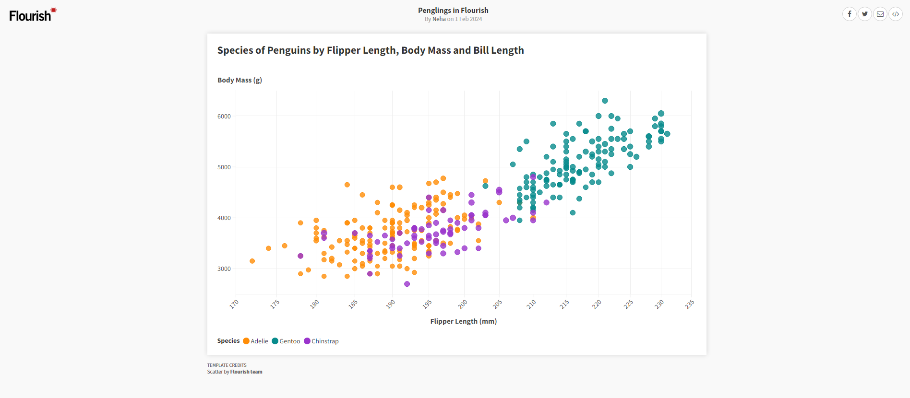

README
---

# Python + Plotly + Pandas

Python is a general-purpose programming language that can be used for data visualization. Plotly is a popular graphing library for Python. Pandas is a popular data analyzation libary. To use the data set, I used Pandas to read and extract the data from the CSV. I then used Plotly's scatter() function to feed in data columns from the CSV for the X, Y, radius and color. I made use of Plotly's update() funtions to customize the chart layouts and axes. There was a lot of documentation and examples for this library, making the length of the program and effort minimal. Plotly has a lot of things that are automatically built into their charts (tooltips, filtering, etc.) that is not automatically built into Matplotlib charts.

# Python + Matplotlib + Pandas + Mplcursors
Python is a general-purpose programming language that can be used for data visualization. Matplotlib is a popular graphing library for Python. Pandas is a popular data analyzation libary. To use the data set, I used Pandas to read and extract the data from the CSV. Unlike Plotly, Matplotlib doesn't have a parameter in their scatter() function that automatically maps a data column to a color. To achieve the species categorization, I had to assign a color for every species type manually. There are a lot more individual functions used to update and customize the layout/styling of the chart instead of a general update() function like in Plotly where you just feed in parameters. I definitely favored Plotly more than Matplotlib as it took less effort to achieve the same or more features.

# D3.js
D3.js is a Javascript library for data visualization. To read my data, I used the csv() function in the library. I then built my visualization using an SVG and appending elements to the SVG, this included appending all the data points. Creating a visualization in D3 definitely took more effort than the Python libraries. The Python libraries had charts with a lot of built in features, but with D3 you have to add all of that in manually. I will say that this definitely makes D3 more customizable though.

# Tableau
Tableau is a business intelligence and analytics software. To recreate this chart, I uploaded my CSV data file into Tableau and it created a workspace for me. I then created a sheet and created a scatter plot on the sheet to replicate the chart. Using Tableau was very easy, I could drag and drop data columns to set the axes, point sizes and point colors. There was minimal effort required to do so. I was able to easily add filters and extra features.

# Flourish
Flourish is an online data visualization software. To recreate this chart, I uploaded my CSV data file into Floruish. I then could pick which data columns I wanted for my scatter plot. From there, I could go into the scatter plot and customize various things to get my desired chart. I was unable to add a legend for the bill length sizes which was a little frustrating. Overall, it was easy to use but I prefer Tableau as it had more customization.

## Technical Achievements
- **Tooltip**: I added a tooltip for the D3.js, Python/Matplotlib, Python/Plotly, Tableau and Flourish charts that shows the data of a point. I had to manually add code in to create a tooltips for the D3.js and Python/Matplotlib. I used the Mplcursors library to do so for the Python/Matplotlib chart.

### Design Achievements
- **WCAG Complex Images Accessibility Guidelines**: I studied and utilized the WCAG guidelines on complex images to make my charts more accessible. I added alternative text to my Tableau, Flourish and D3.js charts to make them more accessible to those using screen readers (<figurecaptions> etc). The captions and alternative text explain the purpose of the charts.
- **Color**: I used a color picker to ensure that the colors were consistent across all my visualizations and were identical to the original reference graph.
- **Fonts**: I made sure to use legible fonts to ensure accessibility and usability.

