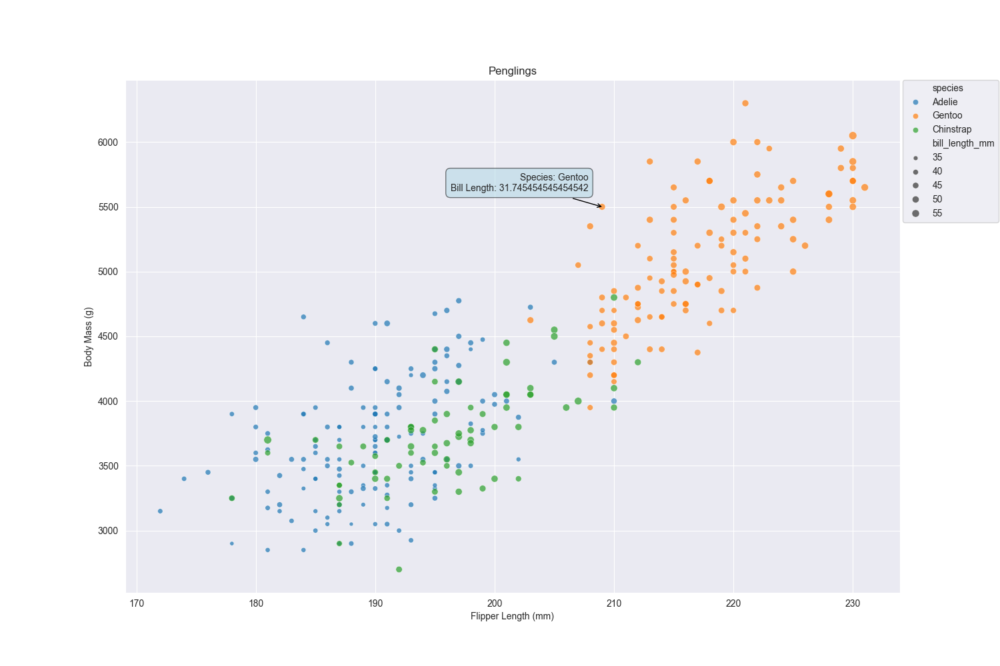
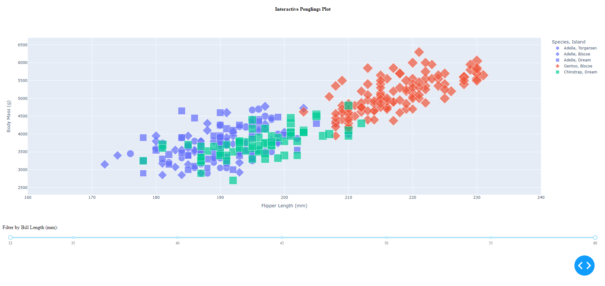
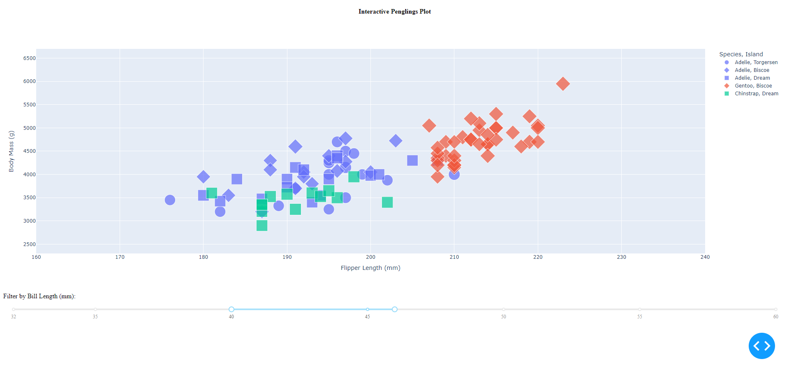

Assignment 2 - Data Visualization, 5 Ways  
2/2/24  
Eric Zhou

# 1. Matplotlib

Matplotlib is amongst one of the most popular Python libraries out there, being a comprehensive library for creating visualizations.

**Note:** Most likely have to `pip install mplcursors` for everything to fully work!

For some reason, matplotlib by itself doesn't have a straightforward way of mapping a DataFrame column to colors, as you need to create a color dictionary mapping then integrate it into the plot, so I just opted to use **seaborn**'s `scatterplot()` function; **seaborn** is essentially a wrapper library around matplotlib with some added functionality.

To additionally some interactivity to the figure, I used another library built for matplotlib called **mplcursor**, which allows for interactive data selection cursors. Here, I just used it to display the species and bill length of a pengling when you hover over the data point.

With how wildly known matplotlib is, it makes it relatively easy to quickly code up a visualization. While it took a bit more time, more complex aspects can be added in thanks to the abundance of Python libraries.

# 2. Plotly + Dash Python

Plotly.express is a library developed by Plotly that provides numerous data analytic and visualization tools, similar to matplotlib, but additionally has interactive feature support.

**Note:** Check out the `README.md` file in the `plotly` folder for how to run the Dash application!

To visualize the dataset, a simple `px.scatter()` figure object was created with the provided dataset, with all features included thanks to an extensive list of function parameters. Then, using some simple example apps from their site (https://dash.plotly.com/minimal-app), a simple application gets hosted on a local port. 

A technical achievement included in this method of visualizing the data is a slider bar that has the ability to filter entries based off of their Bill Length; the following example below has filtered the entries to only include penglings that have a bill length of between 40mm and 46mm.

Being famiiar with Python, the two new libraries used weren't too hard to figure out, and made it quite easy to create a detailed chart. The `dash` library makes it pretty easy to develop and make an interactive application (though the enterprise version appears to have more functionality). 

# 3. 

# 4. 

# 5. 

# Technical Achievements
- mplcursor interactivity in matplotlib graph
- Making a working app with Dash, having a slider to filter entries by bill length

# Design Achievements
- Having a slider to filter entries to get new insights