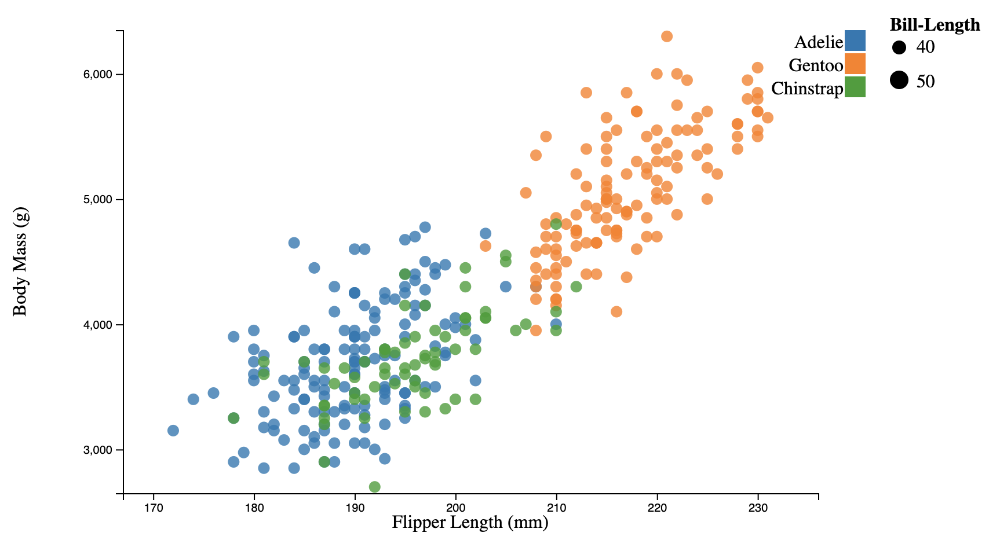
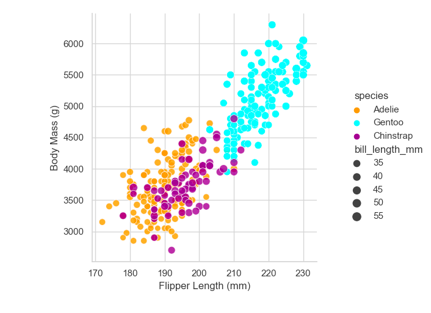
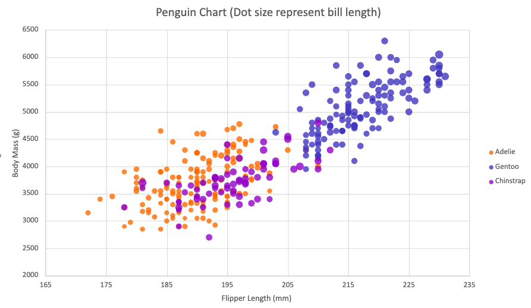
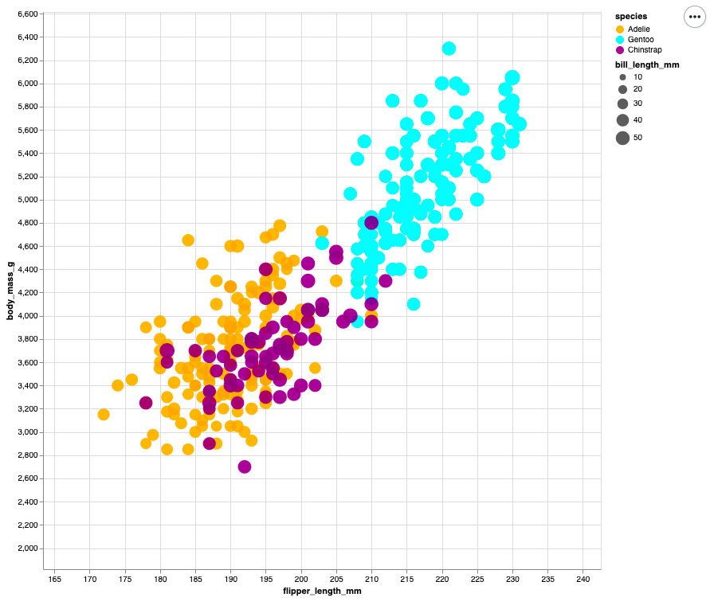
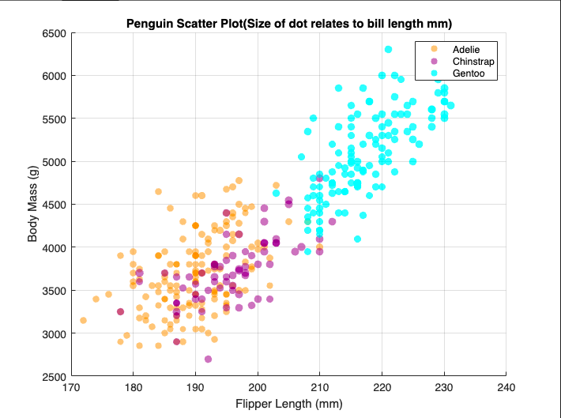

# d3

HTML and JavaScript are mainly used in web development and with libraries like d3 it
can be useful for data visualizations

To visualized the penguins dataset, I made used d3 scale functions along with svg functions and more to accuratley display the data. Learning how to do this took time however in the future it would be much simpler.

The following sources helped accomplish the task
https://d3-graph-gallery.com/graph/scatter_grouped.html Referenced this tutorial. Then looked into
min function:https://www.geeksforgeeks.org/d3-js-d3-min-function/
d3 domain : https://www.d3indepth.com/scales/ 
data munipulation: https://d3-graph-gallery.com/graph/basic_datamanipulation.html 
for text: https://developer.mozilla.org/en-US/docs/Web/SVG/Attribute/text-anchor 
for legend: https://d3-graph-gallery.com/graph/custom_legend.html
for grid :https://observablehq.com/@jeantimex/simple-line-chart-with-grid-lines

# python matpltlib with seaborn and pandas

python is popular with data scientest and computer scientest who work alot with data
and may train machine learning models. Python has various libraires like matpltlib which can be useful for data visualizations. Seaborn act as an extension to matpltlibe and is
useful as it can often be easier and has more featres. I have more a lot of experience with python so this visualization was qick to make. 

To visualized the penguins dataset, I used seaborns relplot which was easy to learn and apply.

The following sources helped accomplish the task by understanding replot

https://seaborn.pydata.org/examples/scatter_bubbles.html
https://seaborn.pydata.org/generated/seaborn.relplot.html#seaborn.relplot 

# excel 

For excel I used a bubble chart so I could have a scatter plot with different sized dots and then from there it was about corret formating and data series configuration.

# python with altair and pandas

python is popular with data scientest and computer scientest who work alot with data and may train machine learning models. Python has various libraires like altair which can be useful for data visualizations. In adition along with the last python example I used pandas to help use the data. Specificaly I could read in the data and then in this example I could use python min and max to help with the domain of graph.

To visualized the penguins dataset, I used Altair .Chart function along with .properties and .save to make a visualization and apply it to an html file. Also domain and range_ where helpful for the Colors.

The following sources helped accomplish the task by understanding .Chart and coloring data 

I read throught the two tutorials: 
- https://www.datacamp.com/tutorial/altair-in-python 
- https://altair-viz.github.io/altair-tutorial/notebooks/02-Simple-Charts.html 
for :Q and :N https://altair-viz.github.io/user_guide/data.html 
for colors https://altair-viz.github.io/user_guide/customization.html#customizing-colors

# matlab

MATLAB can often be used for math problems related to data amond data visualization. This one took awhile as I had to look at different way to see what was best for what I needed.
I then saw it was best to use MATLABS scatter function three seperate times and plot on the same figure and filter the data using strcmp.

Following references helped:
https://www.mathworks.com/help/matlab/ref/scatter.html#btrli6o-1_1
https://www.mathworks.com/help/matlab/ref/strcmp.html

https://www.mathworks.com/help/matlab/matlab_prog/find-array-elements-that-meet-a-condition.html

# Technical Achievements
- Added a form and a rescale option to the D3 graph for a user to be able to update the graph if they want to
- I used selectAll() and .remove() in order to get rid of the elements before replacing
- Used html elements like checkboxes and https://developer.mozilla.org/en-US/docs/Web/JavaScript/Reference/Operators/Conditional_operator to get the selected species data
- Had to keep track of orignal data and individual species data, the original data still was need to caluclate the cirlce sizes which needed all the species. This was so the circle sizes where standard no matter the graph. 
- The indicidual species data was used in order to know what points needed to be put on the graph.
- Also there was a speciesData variable which was used for rescaling purposes and could be different from the original data if needed.
- Added a rescale option if the user wants to rescale the graph based on the species inputs.
-tool tips on altair graph

# Design Achievements
- use CSS to style the checkboxes I made for the technical achievement in order for it to look more visually appealing
- I referenced this to do it https://www.w3schools.com/howto/howto_css_custom_checkbox.asp 
- I then changed fields and made the update button blue in order to understand what was happening more

