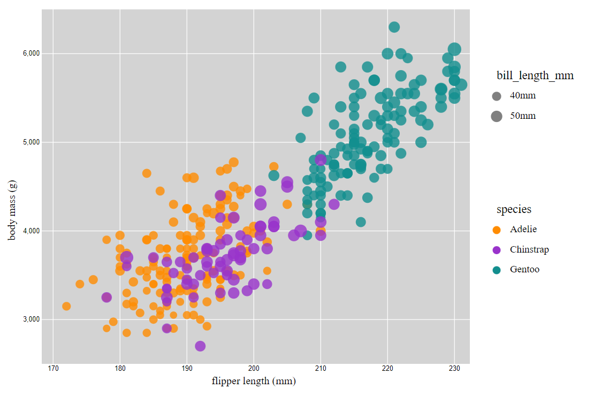

# Matplotlib
Matplotlib is the library that, as of beginning this assignment, I have the most experience with through my machine learning / AI classes.

I was able to create one legend that maps species to colors, but I was unable to get the size legend to be consistent with the dots.

I did my best to match the given scatterplot's colors by augmenting the axis labels, ticks, and title:
```python
plt.xlabel("Flipper Length (mm)", color="#5B5B5B")
plt.ylabel("Body Mass (g)", color="#5B5B5B")
plt.tick_params(axis='x', colors="#5B5B5B")
plt.tick_params(axis='y', colors="#5B5B5B")
```

I also added background grid:
```python
plt.grid(True, linestyle='--', linewidth=0.5, color='#DEDEDE')
```

And I scaled up the entire figure:
```python
plt.figure(figsize=(12, 8))
```

[!Matplotlib](./img/matplotlib.png)

# d3
I actually had a lot of trouble with d3. I'm sure I'll figure it out soon enough, but I felt like I had too many options. The first thing I tried to do was plot the points, but I ended up not framing my scatterplot well and then everything else just feels like an overlay.

Everything got so busy, so I abstracted all of my drawing to functions and passed in the svg.

```javascript
appendLabels(svg)
appendGrid(svg)
appendTicks(svg)
mapDots(svg, data)
appendLegend(svg)
```

If I were to make this in d3 again, I would start by creating the grid, labels, and legend. That way I can frame my data and then, hopefully, create an SVG inside the frame where I place my points according to a slightly smaller scale.

Hypothetically, I could make a wrapper around this plot and move the labels, but I'd like to move on to another library.



# Vega-Lite
I really liked Vega-Lite! It took me a little while to get used to encoding, but I think I understand it now. My experience here was certainly better than that which I had with d3: most of the work was done for me.

I found that the difference in marker size wasn't enough to communicate much, so I applied a range and disabled zeroing to amplify the differences.

```json
size: {
  field: "bill_length_mm",
  type: "quantitative",
  axis: {title: 'Bill Length (mm)'},
  scale: {zero: false, range: [10, 500]},
},
```

I also love that there's a menu in the top right. If I need to make any graphs for personal projects in the near future, I'll likely be using Vega-Lite.

[!Vega-Lite](./img/vega-lite.png)

# R
R gave me a lot of trouble with installing packages! I was able to resolve them, but I had to make a new library folder to do so.

I didn't realize that ggplot would export a PDF instead of pulling up a window. I concluded that it wasn't working and made the plot in R. I regret not looking into it further.

My R code is very simple, and my output is just the same. I filled in the markers by setting `pch = 19`. I feel like there has to be a better way to do this. Maybe there's some other type of plot that I could be using?

Overall, I'm glad that R was able to make a grid & legend without too much trouble, but I'm not satisfied with the final product. I think it looks a little too... stiff? It's unfriendly and unflattering. The ggplot example you gave is charming. So is my Vega-Lite plot.

[!R](./img/r.png)

# 