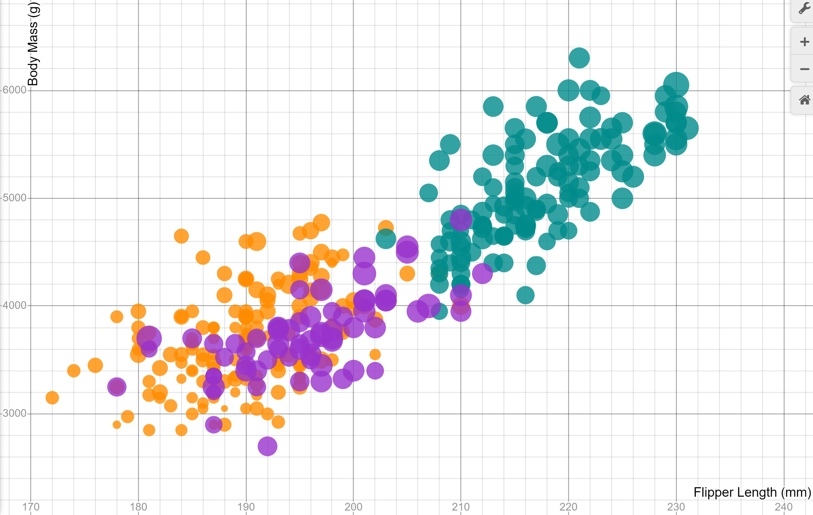
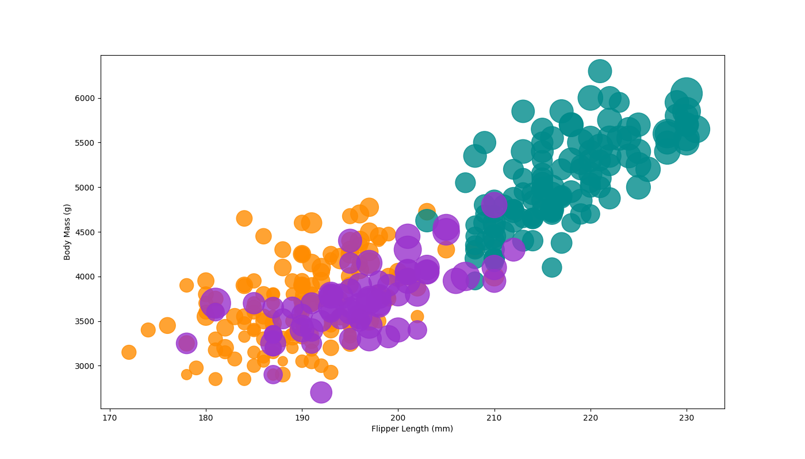
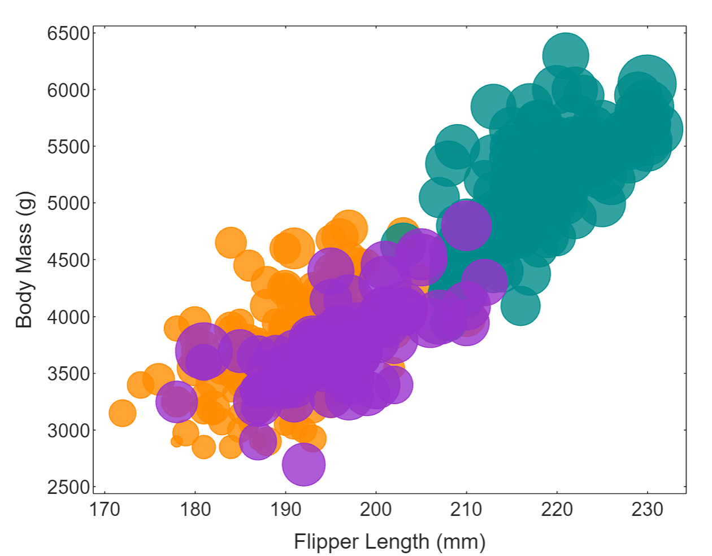
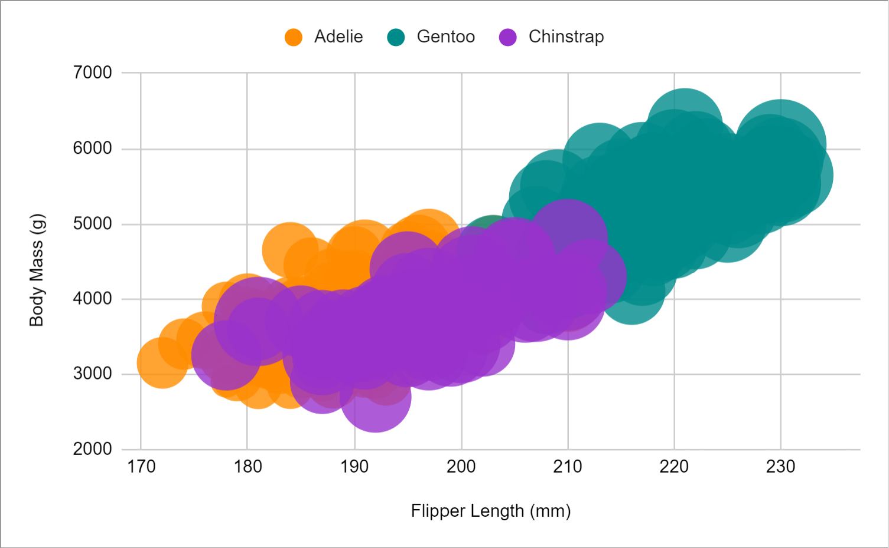
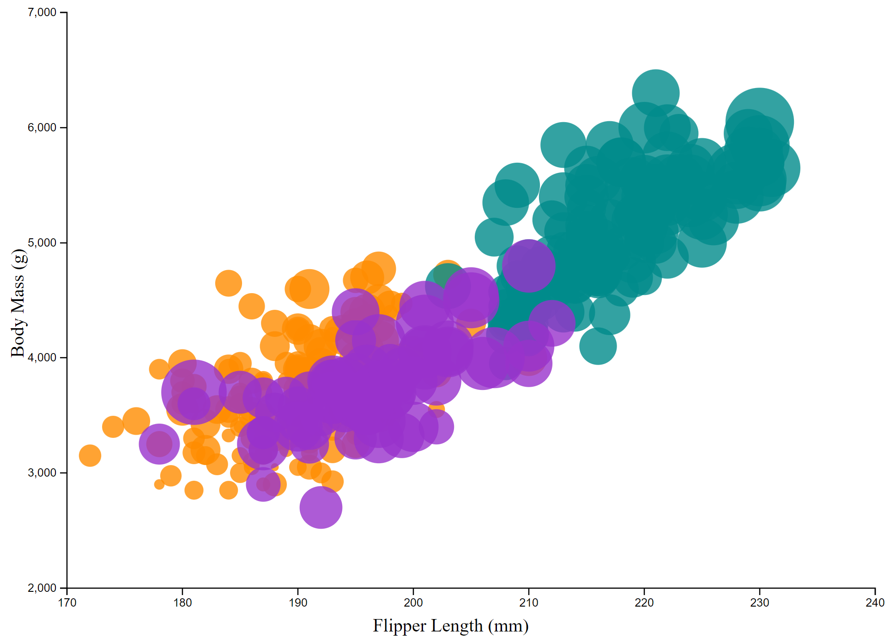

# Desmos (JSON)

Desmos is currently one of the best and most popular graphing calculators on the internet. It comes with a wide array of built-in
tools and functions with which any user can plot virtually any single-variable function to their heart's content.

Hence, creating a visualization in Desmos is typically not a very challenging task, provided said visualization is 2D. However,
for this visualization, the circumstances were slightly different, as over 340 different data points had to be included. I'd
initially planned on ditching this visualization until I learned of Desmos' hidden console feature, which allows the user to push
JSON tags to the state of the calculator in order to change its properties remotely. This is great for instances in which the
calculator does not give the user any visible option with which they could apply those properties naturally, such as the default
color scheme or click effects. For the sake of simplicity, I created three separate tables and pushed data points for each of
them via the console and, as a bonus, altered the colors of the plots to match those provided in the R demonstration.

In order to both get and set the state of the graph, I entered `state = Calc.getState()` and `Calc.setState(state)` in the
console, respectively. The console itself can be accessed via the menu that appears when one right clicks and chooses the
'Inspect Element' option. For this reason, though initially thought to be difficult, this visualization was relatively easy, aside
from having to scale the bubbles, which was still simple enough.

# Python 3 + Matplotlib

For the Python visualization, I used the latest version of Python along with the Matplotlib library's PyPlot module in order to
create a scatterplot of the provided data. In addition, I also used Python's built-in CSV parsing library in order to read the CSV
file and copy its contents to a dictionary to be accessed later. Like the previous visualization, this one was fairly
straightforward, as PyPlot's `scatter` function includes optional parameters (`s`, `c`, and `alpha`) that allow one to adjust the size, color, and opacity of the dots/bubbles respectively).

# Matlab

Matlab is an online math programming tool used to calculate and plot a variety of different functions. Unlike the Python
visualization, no external libraries were needed to run the required functions, which were `readtable` and `bubblechart`. Hence,
considering that there was already a built-in method provided by which one could easily create bubble charts without having to
find a workaround with scatterplots, this visualization, like the last, was very easy to create, given the tools necessary were
conveniently available without the need to resolve dependencies.

# Excel

Of all visualizations, this one was by far the easiest, as I (1) was not required to resolve any dependencies in order to create
the graph I wanted and (2) did not have to parse the CSV file provided in any way and instead opened it using Spreadsheets. This,
in comparison to the other visualization methods listed so far, distinguished it as the most viable alternative to traditional
graphing methods such as R markdown or Matlab, as virtually no prior knowledge of the software was required.

# D3.js (HTML Javascript)

This visualization was by far the most challenging, as it both required and assumed the greatest amount of prior knowledge
beforehand in order to create it in the first place. As it stands, D3.js has associated with it a steep learning curve that
seemingly cannot be surmounted without a lot of time and effort being expended, in conjunction with a knowledge of its many
idiosyncracies and paradigms. It was functionally impossible for a beginner like me to create a decent graph without a sufficient
understanding of the program. I eventually turned to an existing online D3.js [bubble chart example](https://d3-graph-gallery.com
graph/bubble_template.html) provided in a web demonstration. Said demonstration at least helped me both test my D3.js code as well
as gain a sense of familiarity with its numerous functionalities, but even so, it was by no means easy, given a lack of intuition
motivating the programming style associated with the software.

## Technical Achievements
- **Bypassed Desmos' Restrictive Interface**: Using the console, I circumvented Desmos' lack of a convenient way to enter data by simply navigating the console instead of entering expressions via the typical graph interface.

### Design Achievements
- **Matched Colorscheme of All Visualizations**: Though it sounds easy, this actually proved to be a slight challenge, as I had to (1) find the hex values of the default colorscheme provided in the example and (2) set the plots in the [Desmos graph](https://www.desmos.com/calculator/p1r5dk1qau) to said colorscheme, which was impossible to achieve normally.