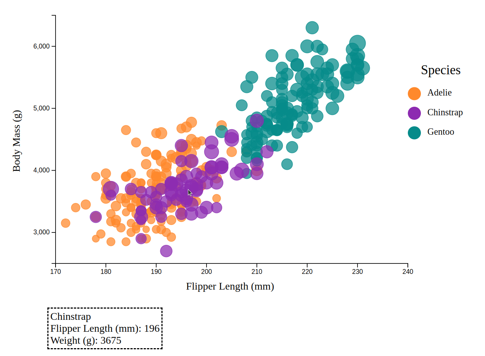
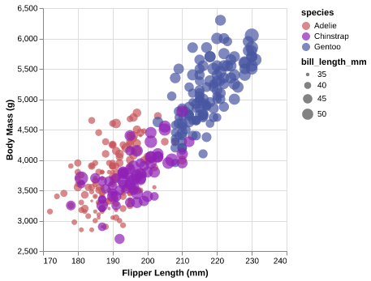
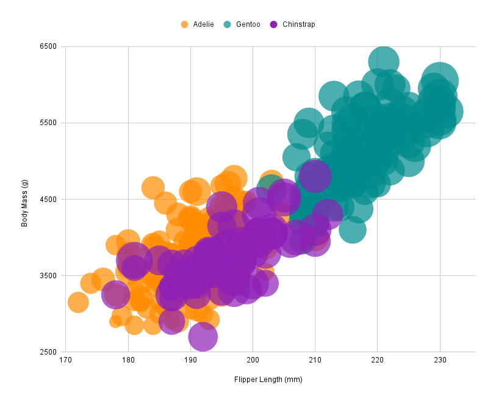

Assignment 2 Patrick Salisbury - Data Visualization, 5 Ways  
===

# d3

D3 is a JavaScript visualization library that is somewhat low-level, meaning that you can often make more "custom" visualizations in d3 than other visualization/charting libraries. Of course, having this level of customizability comes with the tradeoff of more code to write and additional considerations compared to a higher-level graphing library.

To make this graph, I started by looking at some basic d3 scatterplot examples (https://d3-graph-gallery.com/graph/scatter_basic.html) to understand the basic workflow of making a scatterplot in d3. After this, I added a function to the "r" attribute of the d3 circles to make the size of each circle vary according to bill length. To match the color scheme of the example, I used d3.scaleordinal() to map each species to a color (even though the species isn't really ordinal, the order in relation to the order of the colors I define does matter). Finally, I adjusted the x and y scales manually, added axis labels (a pain in d3!), and added a legend and tooltips as technical and design achievements.

To me, d3 felt hard to use for setting up basic graphs, but once you get into more advanced and custom visualizations I think it gets easier to use than some of the other more fleshed out graphing libraries. Some of the other libraries I used tended to force me into specific layouts, where in d3 this does not really happen since there is no predefined layout in the first place. The most hacky part of the entire experience for me was getting the y-axis label correct, since most of the ways to do this end up flipping the x and y axes during the transform when you rotate the text in the correct direction. This makes aligning the text here quite difficult if you do not use a method that applies the transform before the rotation.

# seaborn / matplotlib

Seaborn is a high-level visualization library for Python built on top of matplotlib. The default theme of the library makes plots that are R/ggplot2-like in style, as can be seen in the visualization I made above. Overall, I found working with this library to be very simple, and I was able to do most of the chart configuration in a single line of code with only a couple other lines required for chart setup. The drawback of this library is that configuration is somewhat limited without going in a fully custom route like d3. As an example, the circle outlines in my visualization are black, and I could not find an easy way to make the outline color match the circle's fill color like I was able to do easily in d3.

# vega-altair

Altair is a very popular Python visualization library. As opposed to Seaborn, which is built on matplotlib, Altair is built on top of Vega-lite, which is a high-level grammar for visualization based on using JSON objects. Overall, I think Altair is probably my favorite viz library (for charts like this) out of the three I used in this assignment, as I felt like it provided a good balance between ease of use and capabilites. One thing I did not like about the library however is what it does to colors. As you can see in the image above, the color palette is slightly different from every other graph that I generated even though I used the exact same hex color codes as every other visualization library / tool. I assume that this is because there is something going on under the hood that slightly changes the colors, but I was unable to figure it out and thought that it might be good to leave it as-is anyways and point out that this library might not be a good choice for color accuracy.

# DataWrapper

DataWrapper is a popular online tool for creating visualizations out of data that you supply. For this visualization, I chose the "scatter plot" template and then customized the chart to meet the requirements of the assignment. Due to the limitations of this being an online tool, I took screenshots of the chart setup I used for this tool and included them in the "datawrapper" named folder. I was quite impressed by the capabilites of this tool given how easy it was to use, but I did find that the legend was somewhat just decided for you and there wasn't a lot you could do to change the legend layout. Additionally, I didn't really like how the tool decided to scale circle size (not enough variation), and I struggled for a bit trying to fix this but could not figure it out. Overall, I think this is a nice tool, but I would personally pretty much always use something else (Google Sheets for something super simple or dive into a code library). I do see the appeal of this library for someone without any coding experience, but if you are comfortable with code I feel like there is not much this tool offers compared to using something like altair or seaborn.

# Google Sheets

Instead of excel, I chose to use Google Sheets because I use a Linux machine, and additionally I think the Google Sheets charting has came a long way and wanted to see if it could make a good intermediate-level visualization for this assignment. I found that it was surprisingly effective for this type of scatter plot, and it actually did some things even better than some of the coding libraries that I used. The biggest drawback to Google Sheets is that when exporting to an excel format (.xlsx), the chart styling is lost, so when you open my .xlsx that I provided all of the styling is lost. The other huge drawback is that the circle size is defined exactly from the field found in the sheets, so to make the circle sizing look better here I would have had to derive another column where I normalized the bill length to something that looked better for circle size in the chart. Besides these drawbacks, I think this chart looks decent for just being Google Sheets, and I think for the average user making a quick chart with a small to medium dataset Google Sheets is hard to beat nowadays.

## Technical Achievements

- As mentioned in the d3 section (and seen in the screenshot), I added a tooltip functionality where the circle that is currently being hovered over displays more information about that data point. I chose to put this tooltip in the bottom left instead of overlaid with the graph like a traditional tooltip so that the entire graph would stay visible while viewing specific pieces of data. Although this tooltip is functional, it does have the drawback of not being able to view circles in very cluttered areas of the graph due to the circles stacking on top of each other. This could potentially be fixed by adding a click to cycle through different layers of circles or just displaying all the circles being currently hovered over at once. You can test my d3 tooltips at the github page https://pjsalisbury.github.io/a2-DataVis-5Ways/d3/index.html

### Design Achievements

- Throughout all my visualizations, I consistently used the exact color scheme used in the R + ggplot2 example visualization. To do this, I first found a listing of all the R colors at http://www.stat.columbia.edu/~tzheng/files/Rcolor.pdf, and then I used a color picker tool to grab the hex codes for the colors used in the original R visualization. Note that Altair does mess up this color consistency across all charts.

- In my d3 visualization, I created a custom legend by creating and positioning the svg elements accordingly. Although this is somewhat annoying to do, I do like how this allows you to make a completely custom legend without having to worry about templating that the library does for you. In fact, a lot of the libraries I used did not provide any design choices at all regarding the legend and I had to essentially use whatever they gave me as a result.

