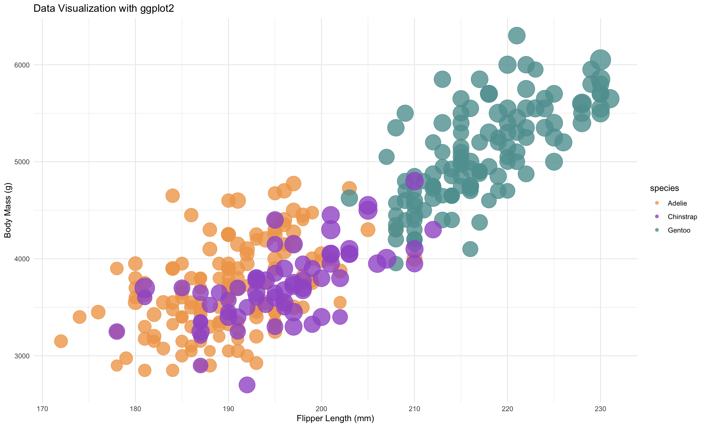
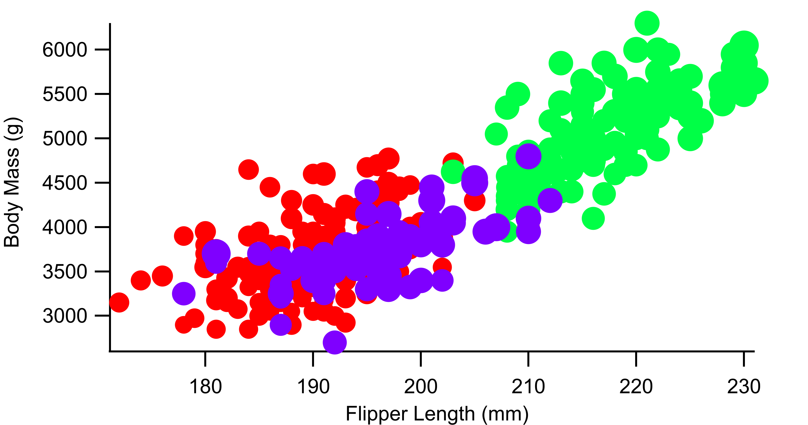
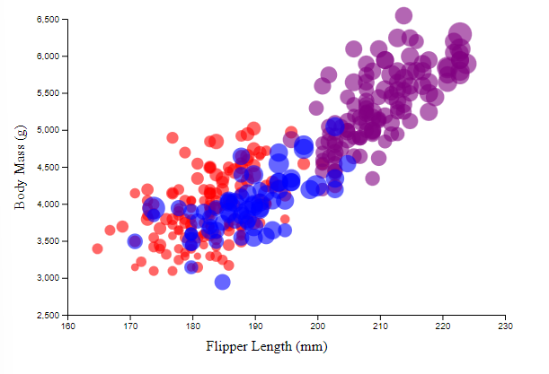

# 02-DataVis-5ways

Assignment 2 - Data Visualization, 5 Ways  
===

Now that you have successfully made a "visualization" of shapes and lines using d3, your next assignment is to successfully make a *actual visualization*... 5 times. 

The goal of this project is to gain experience with as many data visualization libraries, languages, and tools as possible.

I have provided a small dataset about penguins, `penglings.csv`.
Each row contains a penguin observation and several variables about it, including bill length, flipper length, and more.

Your goal is to use 5 different tools to make the following chart:

These features should be preserved as much as possible in your replication:

- Data positioning: it should be a upward-trending scatterplot as shown.  Flipper Length should be on the x-axis and Body Mass on the y-axis.
- Scales: Note the scales do not start at 0.
- Axis ticks and labels: both axes are labeled and there are tick marks at a reasonable interval, e.g 10, 20, 30, etc.
- Color mapping to species.
- Size mapping to Bill Length.
- Opacity of circles set to 0.8 or similar for a semi-transparent effect.

Other features are not required. This includes:

- The background grid.
- The legends.

Note that some software packages will make it **impossible** to perfectly preserve the above requirements. 
Be sure to note where these deviate as you reflect on what a tool is good for.

Improvements are also welcome as part of Technical and Design achievements.

Libraries, Tools, Languages
---

You are required to use 5 different tools or libraries.
Of the 5 tools, you must use at least 3 libraries (libraries require code of some kind).
This could be `Python, R, Javascript`, or `Java, Javascript, Matlab` or any other combination.
Dedicated tools (i.e. Excel) do not count towards the language requirement.

Otherwise, you should seek tools and libraries to fill out your 5.

Below are a few ideas. Do not limit yourself to this list!
There are new tools coming out every year and we may not have an exhaustive list of the latest and greatest.

Some may be difficult choices, like Matlab or SPSS, which require large installations, licenses, and occasionally difficult UIs.

I have marked a few that are strongly suggested.

- R + ggplot2 `<- definitely worth trying`
- Excel
- d3 `<- since the rest of the class uses this, we're requiring it`
- Altair `<- hugely popular python library. highly recommended `
- three.js `<- well, it's a 3d library. not really recommended, but could be interesting and fun`
- p5js `<- good for playing around. not really a chart lib`
- Tableau
- PowerBI
- Vega-lite <- `<- very interesting formal visualization model; might be the future of the field`
- Flourish <- `<- popular in recent years`
- DataWrapper <- `<- popular in recent years`
- GNUplot `<- the former CS department head uses this all the time :)`
- SAS/SPSS/Matlab

You may write everything from scratch, or start with demo programs from books or the web. 
If you do start with code that you found, please identify the source of the code in your README and, most importantly, make non-trivial changes to the code to make it your own so you really learn what you're doing. 

Tips
---

- If you're using d3, key to this assignment is knowing how to load data.
You will likely use the [`d3.json` or `d3.csv` functions](https://d3js.org/d3-dsv) to load the data you found.

**Beware that these functions are *asynchronous*, meaning it's possible to "build" an empty visualization before the data actually loads. Figuring out how to do this properly can be a major hiccup if you haven't used async functions before. If this means you, start part of this project early so you don't end up in a rush!**

- *For web languages like d3* Don't forget to run a local webserver when you're debugging.
See my a1 video or online tutorials for how to do this.
Being able to host a local webserver is an essential web development skill and very common in visualization design as well.

Readme Requirements
---

A good readme with screenshots and structured documentation is required for this project. 
It should be possible to scroll through your readme to get an overview of all the tools and visualizations you produced.

- Each visualization should start with a top-level heading (e.g. `# d3`)
- Each visualization should include a screenshot. Put these in an `img` folder and link through the readme (markdown command: ``.
- Write a paragraph for each visualization tool you use. What was easy? Difficult? Where could you see the tool being useful in the future? Did you have to use any hacks or data manipulation to get the right chart?

Other Requirements
---

0. Your code should be forked from the GitHub repo.
1. Place all code, Excel sheets, etcetera in a named folder. For example, `r-ggplot, matlab, mathematica, excel` and so on.
2. Your writeup (readme.md in the repo) should also contain the following:

- Description of the Technical achievements you attempted with this visualization.
  - Some ideas include interaction, such as mousing over to see more detail about the point selected.
- Description of the Design achievements you attempted with this visualization.
  - Some ideas include consistent color choice, font choice, element size (e.g. the size of the circles).

GitHub Details
---

- Fork the GitHub Repository. You now have a copy associated with your username.
- Make changes to fulfill the project requirements. 
- To submit, make a [Pull Request](https://help.github.com/articles/using-pull-requests/) on the original repository.

Grading
---

Grades on a 120 point scale. 
24 points will be based on your Technical and Design achievements, as explained in your readme. 

Make sure you include the files necessary to reproduce your plots.
You should structure these in folders if helpful.
We will choose some at random to run and test.

**NOTE: THE BELOW IS A SAMPLE ENTRY TO GET YOU STARTED ON YOUR README. YOU MAY DELETE THE ABOVE.**

# R + ggplot2 + R Markdown

R is a language primarily focused on statistical computing.
ggplot2 is a popular library for charting in R.
R Markdown is a document format that compiles to HTML or PDF and allows you to include the output of R code directly in the document.

To visualized the cars dataset, I made use of ggplot2's `geom_point()` layer, with aesthetics functions for the color and size.

While it takes time to find the correct documentation, these functions made the effort creating this chart minimal.

# Altair + Python (JupyterNotebook)

From here on out it is my work

This visualization was easy to create. The only slightly annoying thing about it is that Altair is designed to work with notebook type IDEs, so it works well with JupyterNotebook, but not Spyder (which is my default preference). The package automatically added the tick marks, though I did have to scale the axis myself. I can see myself using this in the future due to the ease of use and my existing familiarity with python code. That being said I haven't explored the limitations of this yet. I suspect Altair may have trouble producing more bespoke visualizations, though I don't know that for certain.

Technical Achievements
- Renamed axis and legend titles so they aren't the data names

Come back to this design if I have time, shouldnt be too hard to add modifications to bump my design and technical grade (shape --> island; choose my own colors; limit bill length circles to just 40 and 50; maybe get fancy and do shade change based on year; internal shapes based on gender; or split the graph based on gender, island, etc.) Maybe split based on speices --> bee swarm graph, and so on; Interaction!)

REMEMBER TO UPLOAD CODE BEFORE SUBMITTING PROJECT

# Igor 8

This visualization was not that hard to create. After loading the data it was just a matter of graphing the correct waves (columns) as a scatter plot. I manually added a column that mapped the species to numbers (0, 1, 2), then I added the species to color and bill length to circle size additions. This was easily enabled by the graphing program as it had mapping the color and size of points to various waves (columns) as an inbuilt option. I could not directly map each species to choose color this way, though it should still be possible to get specific colors by fixing the start and end point of the number-to-color scale and then changing the color values to the species map to the desired colors. The software also automatically scaled the axis and added the tick marks. Renaming the axis was easy as well. I'm not sure adding a legend for species color and bill size to point size is possible directly. That being said, having transparency did not appear to be an option. With more work it might be possible to add partial transparency, but that might involve making a 4th color channel to account for it. I use igor with the data from my chemistry lab. One of the reasons we use it is that it is scriptable, so it can be programmed to take data even from unusual file types and automatically create graphs or a number of graphs. It also easily produces high quality exports in whatever size we specify (in inch, pixels, or cm scale, with modifiable dpi). I suspect I will keep using it in the future for graphing scientific data due to ease of use and other features, such as being able to zoom in on an area of the data, have a cursor follow the data, and easy way to annotate data in the graph. 

Do technical / design stuff later? Make colors colors I want, standardize graph size? Make speciies different waves so I can get a color legend. Update graph to make smallest points a littel smaller (3,7)

# d3

This visualization was a bit trickier to create. I had to learn how to host a local server from the command line and how to properly load data into the .html from another source (which I think I am doing correctly). Ultimately I turned to ChatGPT 3.5 to give me a code framework to work from rather than spending an exhaustive amount of time trying to find the correct commands and syntax necessary. After that everything progressed fairly quickly, with writing a small function to handle the different colors, writing an equation to manipulate the circles' size, adding an opacity feature, and some other small changes to get the axis and axis titles looking better. Overall d3 took the most amount of code so far, but also seemed like the tool I had the most control over. If I was trying to make a visualization with a very specific feel, I would likely turn to it for the control that it gives.

Add legend and make colors better later. Maybe add interactivity later for gender/island. Maybe choose different fonts as well.

(And so on...)

## Technical Achievements
- **Proved P=NP**: Using a combination of...
- **Solved AI Forever**: ...

### Design Achievements
- **Re-vamped Apple's Design Philosophy**: As demonstrated in my colorscheme...
