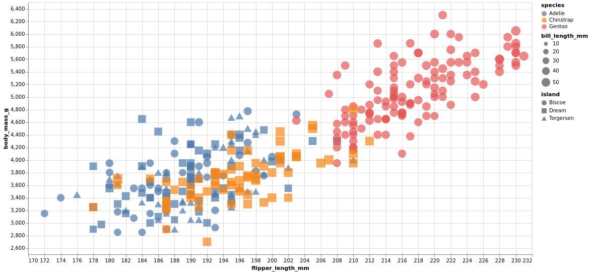
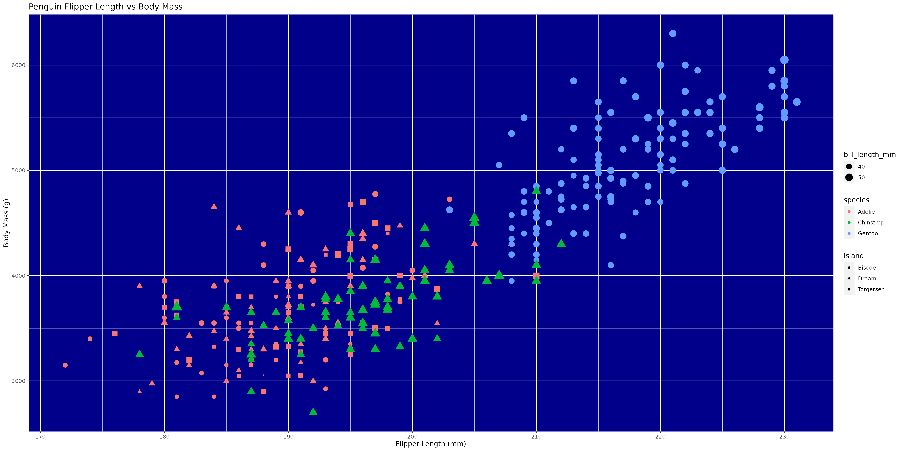
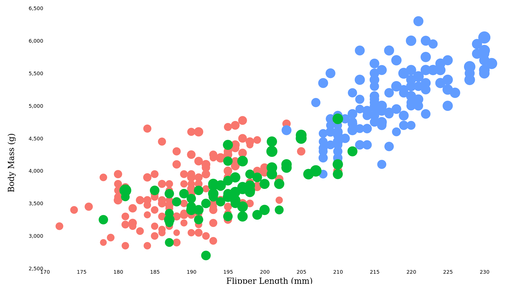

Assignment 2 - Data Visualization, 5 ways</n></n>

Altair Graph:</n>
</n>
Technical Achievements:</n>
Used Pandas to get a runtime of O(n) for processing the data from the csv. Additionally created a tooltip showing all relevent information for every penguin data point the user clicks on.
Lastly, made the shapes, colors, and sizes of the dots change depending on the island, species, and bill length.</n>

Design Achievements:</n>
Changed the transparency to be low enough that datapoints can be seen through one another so that overlapping datapoints can be noticed. Changed the size of the graph to better fit on the screen. Changed the default x and y ranges for the graph to make the data more visible.</n>

Summary of Usage:</n>
Altair seems to be one of the best tools that can be used to make an interactive scatter plot. There is a wide variety of tools used to generate the html file for the graph in addition to the fact that the data collection can likely be augmented by other software such as Pandas. In theory it would be possible to program an AI for data scrapping or import a large dataset and just plug it into Altair to get an interactive chart. It can be used for making nearly any kind of graph.

Resources Used:</n>
https://altair-viz.github.io/gallery/scatter_tooltips.html</n>

DataWrapper Graph</n>
</n>

Technical Achievements:</n>
Learned how to use the DataWrapper website and used it to change the color and size of the datapoints on the graph depending on the penguin species and the bill size. Additionally added a title and a legend to the graph.</n>

Design Achievements:</n>
Made the size of the circles linked to the bill length and the color of the points linked to the species of penguin. Additionally created a title and enabled the legend to allow for easier data analysis.

Summary of Usage:</n>
DataWrapper seems to be one of the best tools for making a quick and dirty scatter plot. It is a web based software that is super easy to learn, in fact I could replicate the initial graph within half an hour. However, it isn't the best at customization or legend creation. From my expereince with the software, it is limited in what it can do. I would say it is best for making simple graphs.

ggplot2 Graph</n>
</n>

Technical Achievements:</n>
Used R to read and process the csv file from the folder. Made the graph represent the flipper length and body mass data in the x and y direction. Additionally each data point also displays the island the penguin is from, the size of its bill, and its species.</n>

Design Achievements:</n>
Made the background a dark blue to represent the sea in the background. This made the data points "pop" allowing them to be more easily seen than on the white graph due to the varying intensity. Additionally, the differing shapes for the island the penguin in a datapoint is from also allows for an easy distinction of the islands. Additionally added a title and x and y labels to show what the datapoints mean.</n>

Summary of Usage</n>
It seems to be about equivalent to Altair, being one of the best tools that can be used to make a sccatter plot. However, it doesn't generate an interactive scatterplot and it is not in as widespread programming language. It seems to be best at making customized static graphs for uses such as usage in research papers. While it is very useful, I believe that Altair is simply a more accessible and versatile language for creating grpahs.</n>

Resources Used:</n>
https://www.youtube.com/watch?v=Dh7P5ExsYCg&t=339s </n>

d3 Graph</n>
</n>

Technical Achievements:</n>
Used d3 and javascript to read and analyze the csv data from the pengling.csv file. Made the graph represent the flipper lengths and body mass data in the x and y directions. Additionally each data point's size represents the size of the penguin's bill and the color represents the species. Additionally made custom line graphs and labels to show what the x and y represent. Lastly limited the size of the graph to better show the data. </n>

Design Achievements:</n>
Showed the species, bill size, flipper length, and body mass in the graph. These were represented by the color, size, x position, and y position of every data point. Additionally the size of the graph was changed to better represent the data and make it easier to digest.</n>

Summary of Usage</n>
d3 seems to be the most customizable graphing script, however it is also the hardest to learn and is unintuitive. While unlike any of the other languages used you can represent the datapoints as small penguins rather than just a dot, it is also much harder to use. As seen by the length of code whiel ggplot and altair needed less than 40 lines of code, while DataWrapper and Flourish needed none, d3 required 94 lines of code to create an inferior graph. The best comparison to this difficulty spike would be while the web based graphing software are like using a smartphone, altair and ggplot are like using Windows, and d3 is like using Linux. While d3 offers more freedom, it is also much harder to use.

Resources Used:</n>
https://d3-graph-gallery.com/graph/scatter_basic.html

<!-- 

# 02-DataVis-5ways

Assignment 2 - Data Visualization, 5 Ways  
===

Now that you have successfully made a "visualization" of shapes and lines using d3, your next assignment is to successfully make a *actual visualization*... 5 times. 

The goal of this project is to gain experience with as many data visualization libraries, languages, and tools as possible.

I have provided a small dataset about penguins, `penglings.csv`.
Each row contains a penguin observation and several variables about it, including bill length, flipper length, and more.

Your goal is to use 5 different tools to make the following chart:

These features should be preserved as much as possible in your replication:

- Data positioning: it should be a upward-trending scatterplot as shown.  Flipper Length should be on the x-axis and Body Mass on the y-axis.
- Scales: Note the scales do not start at 0.
- Axis ticks and labels: both axes are labeled and there are tick marks at a reasonable interval, e.g 10, 20, 30, etc.
- Color mapping to species.
- Size mapping to Bill Length.
- Opacity of circles set to 0.8 or similar for a semi-transparent effect.

Other features are not required. This includes:

- The background grid.
- The legends.

Note that some software packages will make it **impossible** to perfectly preserve the above requirements. 
Be sure to note where these deviate as you reflect on what a tool is good for.

Improvements are also welcome as part of Technical and Design achievements.

Libraries, Tools, Languages
---

You are required to use 5 different tools or libraries.
Of the 5 tools, you must use at least 3 libraries (libraries require code of some kind).
This could be `Python, R, Javascript`, or `Java, Javascript, Matlab` or any other combination.
Dedicated tools (i.e. Excel) do not count towards the language requirement.

Otherwise, you should seek tools and libraries to fill out your 5.

Below are a few ideas. Do not limit yourself to this list!
There are new tools coming out every year and we may not have an exhaustive list of the latest and greatest.

Some may be difficult choices, like Matlab or SPSS, which require large installations, licenses, and occasionally difficult UIs.

I have marked a few that are strongly suggested.

- R + ggplot2 `<- definitely worth trying`
- Excel
- d3 `<- since the rest of the class uses this, we're requiring it`
- Altair `<- hugely popular python library. highly recommended `
- three.js `<- well, it's a 3d library. not really recommended, but could be interesting and fun`
- p5js `<- good for playing around. not really a chart lib`
- Tableau
- PowerBI
- Vega-lite <- `<- very interesting formal visualization model; might be the future of the field`
- Flourish <- `<- popular in recent years`
- DataWrapper <- `<- popular in recent years`
- GNUplot `<- the former CS department head uses this all the time :)`
- SAS/SPSS/Matlab

You may write everything from scratch, or start with demo programs from books or the web. 
If you do start with code that you found, please identify the source of the code in your README and, most importantly, make non-trivial changes to the code to make it your own so you really learn what you're doing. 

Tips
---

- If you're using d3, key to this assignment is knowing how to load data.
You will likely use the [`d3.json` or `d3.csv` functions](https://d3js.org/d3-dsv) to load the data you found.

**Beware that these functions are *asynchronous*, meaning it's possible to "build" an empty visualization before the data actually loads. Figuring out how to do this properly can be a major hiccup if you haven't used async functions before. If this means you, start part of this project early so you don't end up in a rush!**

- *For web languages like d3* Don't forget to run a local webserver when you're debugging.
See my a1 video or online tutorials for how to do this.
Being able to host a local webserver is an essential web development skill and very common in visualization design as well.

Readme Requirements
---

A good readme with screenshots and structured documentation is required for this project. 
It should be possible to scroll through your readme to get an overview of all the tools and visualizations you produced.

- Each visualization should start with a top-level heading (e.g. `# d3`)
- Each visualization should include a screenshot. Put these in an `img` folder and link through the readme (markdown command: ``.
- Write a paragraph for each visualization tool you use. What was easy? Difficult? Where could you see the tool being useful in the future? Did you have to use any hacks or data manipulation to get the right chart?

Other Requirements
---

0. Your code should be forked from the GitHub repo.
1. Place all code, Excel sheets, etcetera in a named folder. For example, `r-ggplot, matlab, mathematica, excel` and so on.
2. Your writeup (readme.md in the repo) should also contain the following:

- Description of the Technical achievements you attempted with this visualization.
  - Some ideas include interaction, such as mousing over to see more detail about the point selected.
- Description of the Design achievements you attempted with this visualization.
  - Some ideas include consistent color choice, font choice, element size (e.g. the size of the circles).

GitHub Details
---

- Fork the GitHub Repository. You now have a copy associated with your username.
- Make changes to fulfill the project requirements. 
- To submit, make a [Pull Request](https://help.github.com/articles/using-pull-requests/) on the original repository.

Grading
---

Grades on a 120 point scale. 
24 points will be based on your Technical and Design achievements, as explained in your readme. 

Make sure you include the files necessary to reproduce your plots.
You should structure these in folders if helpful.
We will choose some at random to run and test.

**NOTE: THE BELOW IS A SAMPLE ENTRY TO GET YOU STARTED ON YOUR README. YOU MAY DELETE THE ABOVE.**

# R + ggplot2 + R Markdown

R is a language primarily focused on statistical computing.
ggplot2 is a popular library for charting in R.
R Markdown is a document format that compiles to HTML or PDF and allows you to include the output of R code directly in the document.

To visualized the cars dataset, I made use of ggplot2's `geom_point()` layer, with aesthetics functions for the color and size.

While it takes time to find the correct documentation, these functions made the effort creating this chart minimal.

# d3...

(And so on...)

## Technical Achievements
- **Proved P=NP**: Using a combination of...
- **Solved AI Forever**: ...

### Design Achievements
- **Re-vamped Apple's Design Philosophy**: As demonstrated in my colorscheme... -->
