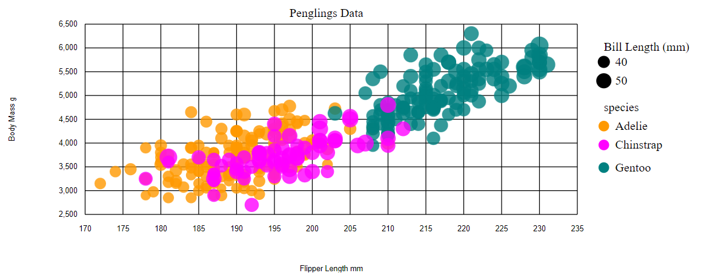
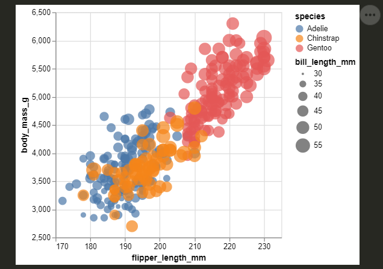
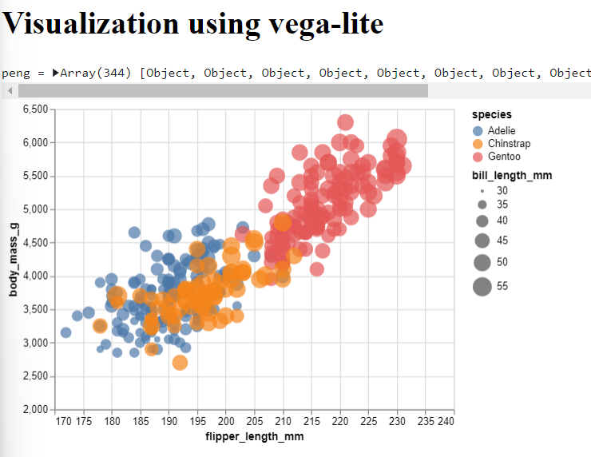
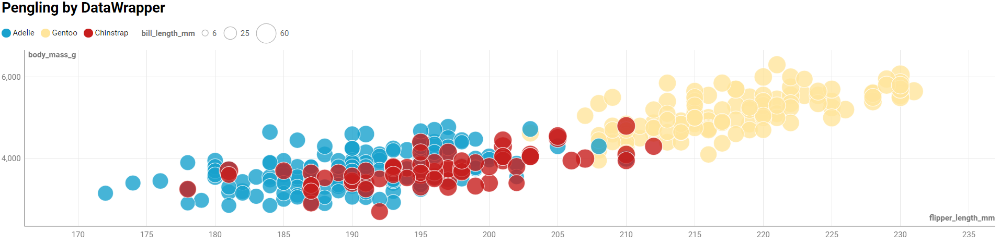

# 02-DataVis-5ways

Assignment 2 - Data Visualization, 5 Ways  
===

Now that you have successfully made a "visualization" of shapes and lines using d3, your next assignment is to successfully make a *actual visualization*... 5 times. 

The goal of this project is to gain experience with as many data visualization libraries, languages, and tools as possible.

I have provided a small dataset about penguins, `penglings.csv`.
Each row contains a penguin observation and several variables about it, including bill length, flipper length, and more.

Your goal is to use 5 different tools to make the following chart:

These features should be preserved as much as possible in your replication:

- Data positioning: it should be a upward-trending scatterplot as shown.  Flipper Length should be on the x-axis and Body Mass on the y-axis.
- Scales: Note the scales do not start at 0.
- Axis ticks and labels: both axes are labeled and there are tick marks at a reasonable interval, e.g 10, 20, 30, etc.
- Color mapping to species.
- Size mapping to Bill Length.
- Opacity of circles set to 0.8 or similar for a semi-transparent effect.

Other features are not required. This includes:

- The background grid.
- The legends.

Note that some software packages will make it **impossible** to perfectly preserve the above requirements. 
Be sure to note where these deviate as you reflect on what a tool is good for.

Improvements are also welcome as part of Technical and Design achievements.

Readme Requirements
---

A good readme with screenshots and structured documentation is required for this project. 
It should be possible to scroll through your readme to get an overview of all the tools and visualizations you produced.

- Each visualization should start with a top-level heading (e.g. `# d3`)
- Each visualization should include a screenshot. Put these in an `img` folder and link through the readme (markdown command: ``.
- Write a paragraph for each visualization tool you use. What was easy? Difficult? Where could you see the tool being useful in the future? Did you have to use any hacks or data manipulation to get the right chart?

Other Requirements
---

0. Your code should be forked from the GitHub repo.
1. Place all code, Excel sheets, etcetera in a named folder. For example, `r-ggplot, matlab, mathematica, excel` and so on.
2. Your writeup (readme.md in the repo) should also contain the following:

- Description of the Technical achievements you attempted with this visualization.
  - Some ideas include interaction, such as mousing over to see more detail about the point selected.
- Description of the Design achievements you attempted with this visualization.
  - Some ideas include consistent color choice, font choice, element size (e.g. the size of the circles).

GitHub Details
---

- Fork the GitHub Repository. You now have a copy associated with your username.
- Make changes to fulfill the project requirements. 
- To submit, make a [Pull Request](https://help.github.com/articles/using-pull-requests/) on the original repository.

# d3

Used [this](https://www.youtube.com/watch?v=X2_apg4CIRA) video to host site/parse csv

Used [this](https://www.youtube.com/watch?v=M2s2jowLkUo) to start the plot

This was the most involved visualization because certain parts like the legend was hard coded. The customization is both its benefit and limitation. On one hand I could do exactly what I wanted so long as I knew how to. On the other, it took much longer than other visualizations where I can simply append a premade legend similar (but not exact) to how I wanted.
## Technical Achievements
- **Grid and Legend Implementation**: I was able to both add a grid and hard coded a legend. The legend was more involved, as I had to position a title for the legend, and create the circles in a way that matched the key
-**Bill length sizing** It was difficult to create sizing that was noticable because making the size=bill length was too big. Dividing the circles by a constant helped preserve the ratio of sizes.

# Altair

Used [this](https://altair-viz.github.io/gallery/scatter_tooltips.html) to create a scatter plot

This was similar to R in the sense that you can create a chart type instead of line objects with circle objects in d3. It was simpler than d3 but that was because many parts could be automated. Customization included scaling the domain of the axis values to be greater than 0 and modifying the size domai to [30,55] so a greater difference would show between dots.
# Vega-Lite

Vega-lite was very similar to  Altair, and as a result looks very similar. I used [this](https://observablehq.com/@uwdata/introduction-to-vega-lite) to learn more about how to set up a plot and luckily I found that you could write the code in javascript (which I am more comfortable with) and it will turn it into json. However, this made it difficult to trouble shoot because often times help was answered in regards to json code and I'd struggle to translate it back to my own problems.
# Flourish

Flourish was very easy in some ways because the main appeal (like Data Wrapper which I mention later) is that you do not actually need to know code. This would be one of the best options if you want a simple visualization that looks professional quickly. However, there is limited customizability. For example, I wanted the legend to be to the right of the graph but I could only position it above/below. There are many choices the software gives you but it also limits you to those choices. For example, I could not find a way to make a legend for sizing. Sizing itself was frustrating because there was no way to scale it through code to be able to see the differences. To fix this I'd have to scale the dataset itself. Another disadvantage (like with Data Wrapper) is that you cannot directly download the code.

# Data Wrapper

The process to making this was very similar to flourish, except this time I was able to find a way to make a legend according to size. I prefer this over data wrapper simply because it was more accessible (no need for a login). However, like flourish, the scale of sizing was 0-60 which means 30-55 does not actually have much of a noticable difference. 

