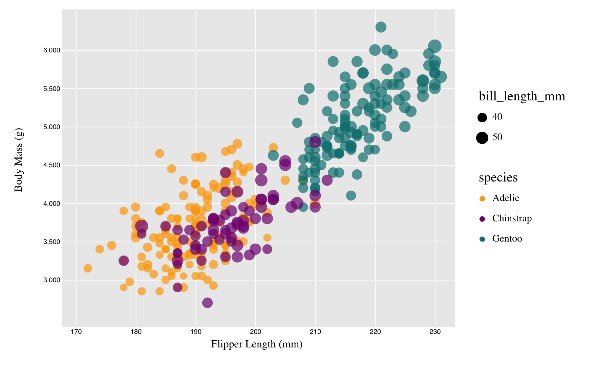

# 02-DataVis-5ways

Assignment 2 - Data Visualization, 5 Ways  

# R + ggplot2

# d3

Starting code source: 
* https://d3-graph-gallery.com/graph/custom_theme.html
* https://medium.com/@kj_schmidt/show-data-on-mouse-over-with-d3-js-3bf598ff8fc2

# Altair

# Tableau

# MATLAB

## Technical Achievements
- **d3**: filter out the nan value point 
- **Added mouse over action**: make the plot interactive

### Design Achievements
- **Re-vamped Apple's Design Philosophy**: 
