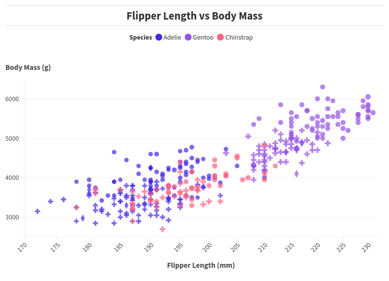

Assignment 2 - Data Visualization, 5 ways</n></n>

Altair Graph:</n>
</n>
Technical Achievements:</n>
Used Pandas to get a runtime of O(n) for processing the data from the csv. Additionally created a tooltip showing all relevent information for every penguin data point the user clicks on.
Lastly, made the shapes, colors, and sizes of the dots change depending on the island, species, and bill length.</n>

Design Achievements:</n>
Changed the transparency to be low enough that datapoints can be seen through one another so that overlapping datapoints can be noticed. Changed the size of the graph to better fit on the screen. Changed the default x and y ranges for the graph to make the data more visible.</n>

Summary of Usage:</n>
Altair seems to be one of the best tools that can be used to make an interactive scatter plot. There is a wide variety of tools used to generate the html file for the graph in addition to the fact that the data collection can likely be augmented by other software such as Pandas. In theory it would be possible to program an AI for data scrapping or import a large dataset and just plug it into Altair to get an interactive chart. It can be used for making nearly any kind of graph.

Resources Used:</n>
https://altair-viz.github.io/gallery/scatter_tooltips.html</n>

DataWrapper Graph</n>
</n>

Technical Achievements:</n>
Learned how to use the DataWrapper website and used it to change the color and size of the datapoints on the graph depending on the penguin species and the bill size. Additionally added a title and a legend to the graph.</n>

Design Achievements:</n>
Made the size of the circles linked to the bill length and the color of the points linked to the species of penguin. Additionally created a title and enabled the legend to allow for easier data analysis.

Summary of Usage:</n>
DataWrapper seems to be one of the best tools for making a quick and dirty scatter plot. It is a web based software that is super easy to learn, in fact I could replicate the initial graph within half an hour. However, it isn't the best at customization or legend creation. From my expereince with the software, it is limited in what it can do. I would say it is best for making simple graphs.

ggplot2 Graph</n>
</n>

Technical Achievements:</n>
Used R to read and process the csv file from the folder. Made the graph represent the flipper length and body mass data in the x and y direction. Additionally each data point also displays the island the penguin is from, the size of its bill, and its species.</n>

Design Achievements:</n>
Made the background a dark blue to represent the sea in the background. This made the data points "pop" allowing them to be more easily seen than on the white graph due to the varying intensity. Additionally, the differing shapes for the island the penguin in a datapoint is from also allows for an easy distinction of the islands. Additionally added a title and x and y labels to show what the datapoints mean.</n>

Summary of Usage</n>
It seems to be about equivalent to Altair, being one of the best tools that can be used to make a sccatter plot. However, it doesn't generate an interactive scatterplot and it is not in as widespread programming language. It seems to be best at making customized static graphs for uses such as usage in research papers. While it is very useful, I believe that Altair is simply a more accessible and versatile language for creating grpahs.</n>

Resources Used:</n>
https://www.youtube.com/watch?v=Dh7P5ExsYCg&t=339s </n>

d3 Graph</n>
</n>

Technical Achievements:</n>
Used d3 and javascript to read and analyze the csv data from the pengling.csv file. Made the graph represent the flipper lengths and body mass data in the x and y directions. Additionally each data point's size represents the size of the penguin's bill and the color represents the species. Additionally made custom line graphs and labels to show what the x and y represent. Lastly limited the size of the graph to better show the data. </n>

Design Achievements:</n>
Showed the species, bill size, flipper length, and body mass in the graph. These were represented by the color, size, x position, and y position of every data point. Additionally the size of the graph was changed to better represent the data and make it easier to digest.</n>

Summary of Usage</n>
d3 seems to be the most customizable graphing script, however it is also the hardest to learn and is unintuitive. While unlike any of the other languages used you can represent the datapoints as small penguins rather than just a dot, it is also much harder to use. As seen by the length of code whiel ggplot and altair needed less than 40 lines of code, while DataWrapper and Flourish needed none, d3 required 94 lines of code to create an inferior graph. The best comparison to this difficulty spike would be while the web based graphing software are like using a smartphone, altair and ggplot are like using Windows, and d3 is like using Linux. While d3 offers more freedom, it is also much harder to use.

Resources Used:</n>
https://d3-graph-gallery.com/graph/scatter_basic.html </n>

Flourish Graph</n>
</n>

Technical Achievements:</n>
Learned how to use the Flourish website and used it to change the color, shape, size of each data point based on the species, island, and bill size of the penguin in the datapoint. Additionally added a legend and title to the graph.</n>

Design Achievements:</n>
Showed the species, island, bill size, flipper length, and body mass in the graph. By representing these in the color, shape, size, x position, and y position, it allowed for each data point to be visually distinct for easier data analysis.</n>

Summary of Usage:</n>
Similarly to Datawrapper, Flourish seems to be best for making quick and dirty simple graphs for data. It's web based design makes it very simple to create a nice looking graph for data representation. I would use it for making research paper graphs, since they often times have lots of data and if I needed to finish a graph quickly to represent the datapoints this would be the tool I would use. However, it is slightly more customizable than Datawrapper.

