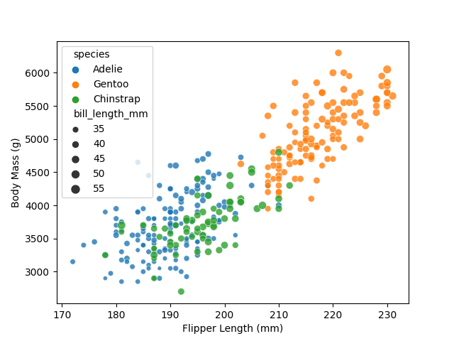
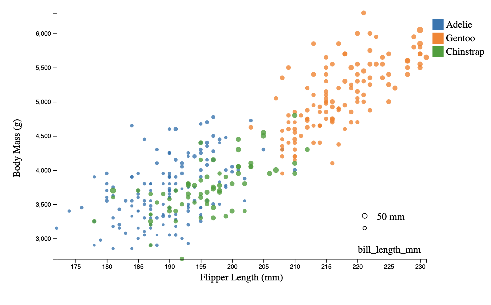
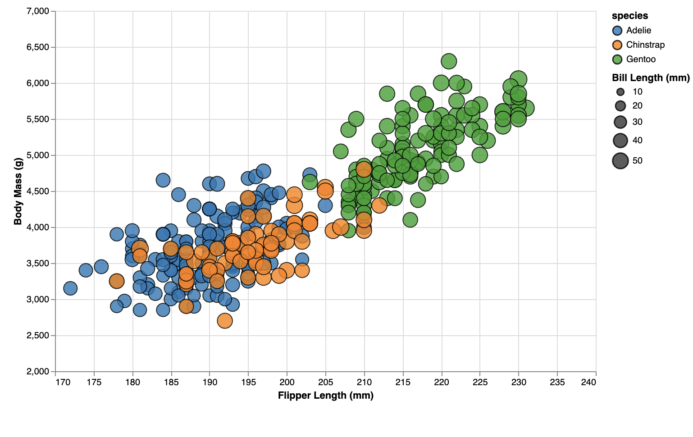
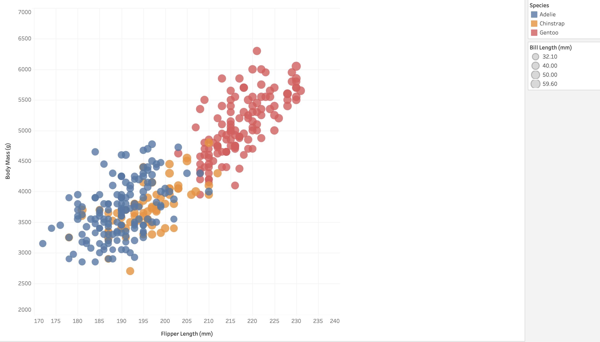
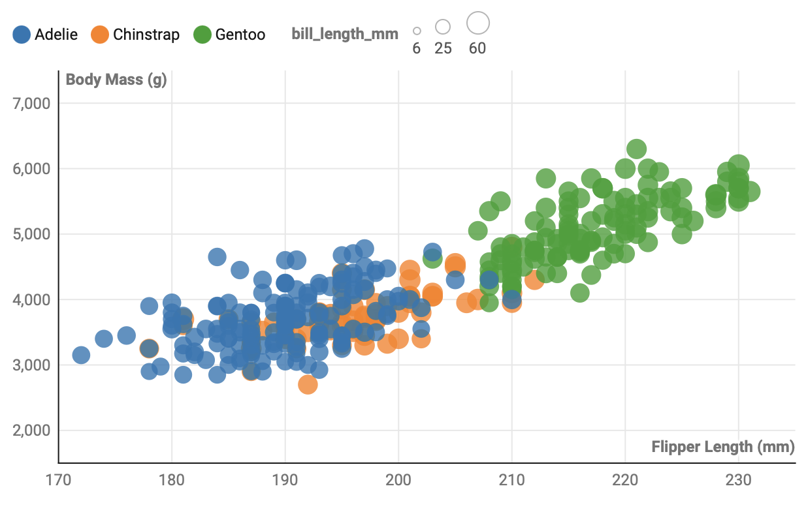

**NOTE: THE BELOW IS A SAMPLE ENTRY TO GET YOU STARTED ON YOUR README. YOU MAY DELETE THE ABOVE.**

# Starting Code and AI

I used ChatGPT to help me get started with using some coding libraries, as well as asking it specific questions about some of the 
visualization tools that weren't easy to find on google. I found that it provided excellent starting code, and was very helpful, telling me 
how to implement certain features and troubleshoot my issues. This especially helped me with d3, as the pure amount of code I needed to write 
was overwhelming, especially with HTML and JavaScript not being my strongest languages. My chat log can be found here: https://chat.openai.com/share/e56b26d0-e88f-499e-86af-4c5c3873e1ae

# R + ggplot2 + R Markdown

R is a language primarily focused on statistical computing.
ggplot2 is a popular library for charting in R.
R Markdown is a document format that compiles to HTML or PDF and allows you to include the output of R code directly in the document.

To visualized the cars dataset, I made use of ggplot2's `geom_point()` layer, with aesthetics functions for the color and size.

While it takes time to find the correct documentation, these functions made the effort creating this chart minimal.

# Python Seaborn, Pandas, and Matplotlib
  These libraries were very straightforward and easy to use. I am familiar with Pandas Data Frames, so the only thing I had to learn was Seaborn, and I liked using it. 
Seaborn is very simple because everything I wanted to do was as easy as adding a parameter to the scatterplot function. The only things I didn't use that one function for were axis labels, as well as showing and saving my plot. 
The Function I used to create this visualization was as follows: sns.scatterplot(x = 'flipper_length_mm', y = 'body_mass_g', hue = 'species', size = 'bill_length_mm', alpha = 0.8, data = df). Because it was so straightforward and quick,
this will likely be my go-to method for quick data visualization. 

# d3

  Of all the libraries and tools I used, I felt d3 had the steepest learning curve. It required the most setup and effort to get it going, and I am not sure if this would be my go-to data visualization tool, unless I really needed some of its features.
It definitely had the most customization of all the tools I used, but I ended up having to hard code some values in for axis positioning, and although I don't think that's the best way to do it, it ended up being the best solution I found to get what I wanted.
I think d3 is probably best suited for high-hi visualizations, at least for me, as I am not completely fluent in the language, as well as javascript or html. When I want to make a lo-fi visualization, (or even medium-fi) I would probably use one of the other tools
that I used during this assignment. TO helo me with learning d3, I used a combination of looking at the documentation, stackoverflow, as well ChatGPT to ask it specific questions about d3 syntax and styling. 

# Python Altair

Altair proved to be the second quickest of the three coding libraries I used, and it seemed to be a good middleground between the high-level MatPlotLib+Seaborn and the (relatively) low-level d3.
However, I felt that in this particular case, it did not provide enough of an advantage of the extremely simple MatPlotLib and Seaborn combination for me to consider it worth it. 

# Tableu

Tableu (Public) was the first non-library tool I used, and It was relatively smooth. It was fairly intuitive, except for one really strange quirk, being that the default display of data in a scatterplot is the sum of a column of numerical data. This resulted in my 
scatter plot starting off with just 3 points. It was very bizarre, and the way to disable this was not very straightforward. Once I got past that hurdle, the rest of the process was extremely smooth and easy. I felt that out of all the tools I used, Tableu was the 
quickest and easiest way to get what I had in my head onto the computer screen. If I need to make a quick visualization in the future, I think Tableu will be my go-to method of doing so.

# DataWrapper

DataWrapper was by far the most intuitive tool to use, and I got my visualization done the quickest by using DataWrapper. The only thing that I felt held it back was the way it scaled the size of points to the penguins bill length. I felt that I could not find a good 
middle ground of point size to make the points easily discernible. Tableu and d3 did a much better job at this. I felt that DataWrapper was the most basic of all the tools I tried, and although I am only really scratching the surface with all of these tools, I felt that
DataWrapper's ease of use did not outweigh the similar easy but higher potential Tableu.

# Excel

Excel was by far the most difficult and frustrating visulization tool, so much so that I ended up giving up and will not be going back to it ever again, if I can. 

## Technical Achievements
- **I created clean and correct data visualizations**: Throughout all 5 of my tools used, every visualization looks a little different, but still cohesive to all of the rest. 

### Design Achievements
- **I kept the same scale for every visualization**: I had every x-axis start at 170, and every y-axis start at 2000. Sometimes the upper bounds were changed depending on point size.
