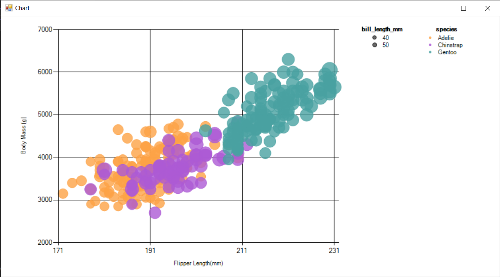
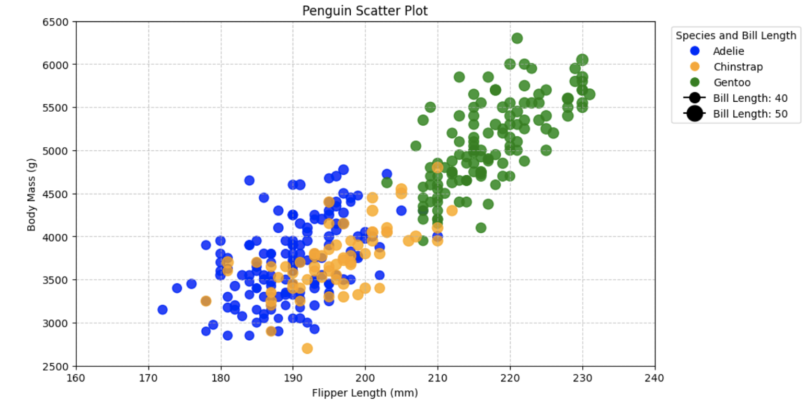
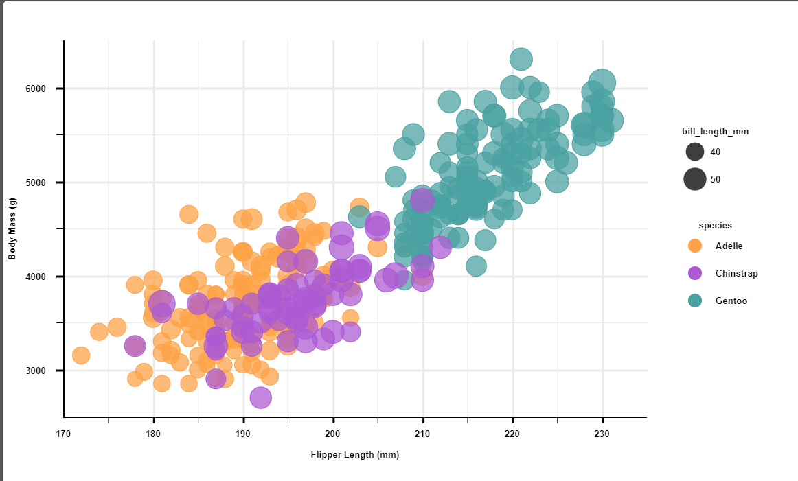

## Original image

## d3 ##

d3 was one of the more annoying libraries to use, mainly because it feels like all of the tools it gives to make things easier are half-finished. Why does it have an `axisBottom` and `axisLeft` function that don't draw axis labels? Why is there nothing built in for legends, when 90% of data visualizations are probably some form of chart with a generic legend? It could at least position legend elements for you and leave the actual component rendering to the user. My main complaint here is that without these tools to make rendering easier, d3 is pretty much just a wrapper library for jQuery that inserts svg elements for you.

I say a wrapper library for jQuery because they automatically import jQuery as part of d3, and the main thing I like about d3 `.attr` working with `.data` and function definitions of the attributes, but all of that is from jQuery, not d3. The only code actually unique to d3 in this graph is the code that generates the axes, everything else is just jQuery editing svg tags.

I would use d3 for more complex data visualizations online, where I want to do complex animations or diagrams that take advantage of the tools provided by the library.
## C# ##

C# was one of the easier languages to design in. Apparently Visual Basic has a built-in CSV reader, so getting data into the program was easy. C# also apparently has an entire charting library `System.Windows.Forms.DataVisualization`, so most of the graph setup was also easy. It doesn't seem like there's a way to set a number of gridlines, only specifying the gap between two gridlines. That isn't too difficult to work with, but I couldn't be bothered. The only other problem was that the legends limit the marker size to a maximum pixel size for some reason, so I couldn't scale the `bill_length_mm` legend to match the actual graph.

I would probably not use C# for data visualization, since it is better as a back-end language. The scatter plot here is easy to make, but trying to do anything more complex than a basic 2-3 axis chart requires manually writing the rendering. There are also very few libraries for C# for data-vis.
## Python ##

Python is probably the easiest of the languages here. Since it's used so often in data science, there are a lot of strong tools for visualization, and Python itself is a simpler language to code in. The only difficulty was modifying the legend to include the `bill_length_mm` sizes, but it was still the easiest of all of the languages and tools used.

I would use Python for visualizations that require large amounts of data, scientific data, or for data that is not being rendered online. Unlike C#, Python has many strong data visualization libraries (including `matplotlib` which I used). However, many of these libraries are more data science focused, and so focus more on functionality over visual customization.
## JS (not d3) ##

As proof that d3 adds very little when doing simple charts, I present virtually the same chart but without d3. Drawing the chart required a little bit more work to draw the axes, but otherwise was pretty much the same process. To differentiate the code, I drew on a `<canvas>` tag instead of creating an `<svg>` tag + subtags. The width of the gridlines and the scale of the points are slightly different, but you have to set those manually in d3, so it would just be tweaking the values to match. As was implied in the d3 section, the axes are the only thing I really used d3 for, and so they are the only major difference here. The main difficulty was actually with loading the csv, because I had the wrong link for the online `papaparse.min.js` and it took a while to realize that.

Realistically, I would be using Highcharts/Plotly/etc. for simple visualizations like this, and d3 for a more complex visualization. 
## Excel ##

Excel is probably the easiest tool to access the data with, since I currently have my computer set to open `.csv` directly in Excel. However, actually plotting is kind of a pain. They have a bubble chart, which I used to plot the data. However, in order to color by species, I had to create a copy of the data filtered by species, since there's no way to filter directly in the graph. Also, unlike the other graphs, where I created the `bill_length_mm` legend programatically, here I had to add circle shapes and scale them based on the existing data by hand. Basically, that part of the legend is a complete hack and also is slightly inaccurate to the actual sizes.

I would use Excel when I want to do heavy data manipulation quickly or when I am working with people who don't know how to code, since I can email someone an Excel file but shouldn't be emailing people raw code files.
## Addendum ##
Overall, none of these tools supported directly adding the scale of the datapoints to the legend. Also, they all required data manipulation to remove the two datapoints with "NA" for most of their values, or at the very least replacing "NA" with the equivalent null value.

d3 and regular js both require being run in a server (I used VSCode's LiveShare extension, but any server should work)

# Technical Achievements #
I wrote a graphics renderer for a graph in Javascript that looks better then most of the other graphs shown.

# Design Achievements #
All of the tools use the same color & transparency (except for Excel, since it looked bad to use 80% opacity), have the same axis ranges, and have all of the features from the original graph. The color used for each species is directly sampled from the original graph, and the border of the points is opaque like the original graph.

I had the number of gridlines match when possible, and used light gray gridlines (again, where possible) on a white background because that looks better.

All of the points are very similar sizes, although they all used applied the radius of a point differently, so it wasn't possible to make them the exact same.