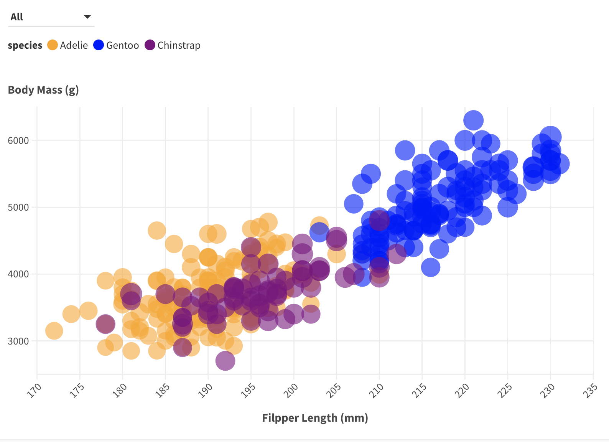

# Python + Seaborn
I have experience working with python and seabon specifically, so working with this specific package was simple for me. But I also did learn how to use specific features like the interactions that can be done through python
(Found in Python folder)

# Python + Altair
I have experience with python but not altair. It was not too difficult to understand the mechanics of it but it was still something new that I learned.
(found in Python folder) 

# DataWrapper
This was my first time using it and it was very simple to interact with however the customability use was a bit difficult. Trying to incorporate all the custom features too some time but there is a spot for experiementaion. That requires a seperate level of skill. This platform would be useful for work that is static and does not need complex queries otherwise this tool may not be sufficient to fulfill all data visualization need. I personally did not have any trouble with would through this platform, especially for data manipulation. When I loaded the data all I had to do was to ignore the NA's in the data. I would use this in the future to work through simple visualizations. (need premium for access to customization --> image in image folder)

# Flourish
This was my first time using this and it was similar to datawrapper, but if I had to choose it would be a more compatability platform than datawrapper since there were certain customability that I liked in this platoform. There is an interacive dropdown but it groups by species and not the kind of interactivity I was attemping. Also the filter is limited so for static view and simple interactions can be done. Major visual would be difficult to be used. I would use this in the future but not for major visualizations. 
(need premium for access to customization --> image in image folder)

# D3
Personally I had the most trouble with d3 since it is something I needed to work through the mechanics. I would personally not use d3 since there is too many manual features that I would have to add and not have the luxuary to autopoulate. But this is a good platform for specific feature manuplation. For the data manuiplation I wrote a single line of code so that it would ignore and not mess withe the graph. Of all the methods this was the most time consuming and it was difficult to understand was could be the errors. 
(found in the d3 folder)

## Technical Achievements
- **Python + Altair + Seaborn**: For both I added a feature that can turn on and off the color mapping and size maping. When the user wants to focus on a specific feature then it can be turn off to revert to a standard color or standard size this is included in the legend. 
- **D3**: I added a feature that can turn on and off the color mapping and size maping. When the user wants to focus on a specific feature then it can be turn off to revert to a standard color or standard size. Also a tooltip for interactions. the legend had to be added manually.

### Design Achievements
- **All**: I tried to maintain all the graphs to have the same color correlated to the same species name.