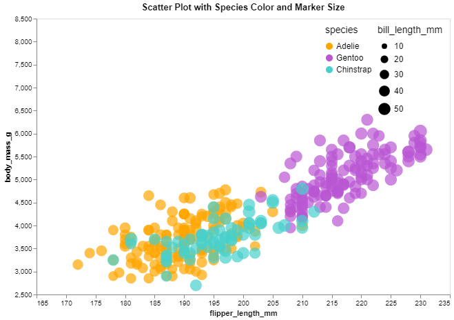

# 02-DataVis-5ways

Assignment 2 - Data Visualization, 5 Ways  
===
link:
https://github.com/pnarasimhan2021/a2-DataVis-5Ways

# Tableau

Tableau is a visual analytics platform that makes the act of visualizing and interpreting data far easier for the general public, thereby giving people the ability to problem solve better. 

Tableau allows you to import data and it preprocesses it for you. All you need to do then is to select the kind of plot you wish to make, select which column of the data/variable you want as the x axis, and which you want represented on the y axis, and then add other columns as attributes. Then you hit the publish button and you will be taken to a separate webpage where the plot appears.

It took me about an hour to figure out how to use Tableau to get the desired results with the Penglings dataset, but the overall effort that went into making the visualization was minimal.

# Data Wrapper

Data Wrapper is a data compilation and visualization software that simplifies the process of representing large amounts of data. Data Wrapper is similar to Tableau in that the software allows you to import data, and it preprocesses it for you so that you can choose a type of chart and adjust the variables in the chart accordingly. I found that it was hard to show the differences in bill length in this particular software, even when I'd used it as a marker scaling factor. 

Unlike Tableau, I took about half an hour to figure out how to get the desired results with the Penglings dataset, so it took very little effort for me. 

# Python + Matplotlib

In this method, I used the matplotlib package to create the desired visualization. It took me some time to figure out how to get the visualization to be close to what I wanted, but it was not impossible. Matplotlib allowed for me to have more free-range over what I could change about the plot, and therefore was more ideal in terms of accurately plotting the data. 

However, for whatever reason, I couldn't get the difference in Marker sizes show more obviously with this package. 

I used the following websites to help me:

- create a scatterplot
  https://www.geeksforgeeks.org/matplotlib-pyplot-scatter-in-python/
  https://stackoverflow.com/questions/55271471/plotting-some-third-variable-against-x-and-y-in-matplotlib-scatter
  
- determine marker color based on species
  https://matplotlib.org/stable/users/explain/colors/colormap-manipulation.html
  https://stackoverflow.com/questions/47684652/how-to-customize-marker-colors-and-shapes-in-scatter-plot

- determine marker size based on column data
  https://stackabuse.com/matplotlib-change-scatter-plot-marker-size/

# Python + Altair

In this method, I used the Altair package with python to create the desired visualization. This one took about he same amount of time as Matplotlib did, however I got stuck because of a misalignment in package versions. I had installed the most recent version of Altair, not realizing that doing so would dissallow me from using Altair-Viewer. I did tons of research, trying to figure out why my Altair-Viewer package simply wouldn't update, and eventually came to the realization that I'd have to download a earlier version of Altair for the program to be able to use Altair-Viewer. 

Just like Matplotlib, Altair allowed for me to have more free-range over what I could change about the plot, however after having used Matplotlib, I found it challenging and almost counter-intuitive how I had to write things with Altair for the program to replicate what I'd been able to do with Matplotlib. 

I also had the same problem as with Matplotlib, where I couldn't get the difference in Marker sizes show more obviously. 

I used the following websites to help me:

- create a scatterplot
  https://www.geeksforgeeks.org/python-altair-scatter-plot/
  https://towardsdatascience.com/creating-interactive-scatter-plots-with-python-altair-e4b47e0aa8eb
    
- determine marker color based on species
  https://matplotlib.org/stable/users/explain/colors/colormap-manipulation.html
  https://stackoverflow.com/questions/47684652/how-to-customize-marker-colors-and-shapes-in-scatter-plot

- determine marker size based on column data
  https://stackoverflow.com/questions/67692708/set-size-of-individual-point-markers-in-altair
  

# D3
I used the D3.csv function to read in the data and I used a variety of different websites to figure out how to create this same visualization in D3:

- color mapping:
  https://matplotlib.org/stable/users/explain/colors/colormaps.html

- scatter plot:
  https://d3-graph-gallery.com/graph/scatter_basic.html

  https://d3-graph-gallery.com/scatter

- marker size:
  https://stackoverflow.com/questions/18768236/marker-size-uniform-in-d3
  
  note: I really had to figure out based on how I set up the scatterplot itself how to make an attribute dependent on data.
  
  - legends:
  https://stackoverflow.com/questions/64914477/group-d3-legend-items

  https://stackoverflow.com/questions/13573771/adding-a-chart-legend-in-d3

- axes: 
  https://www.d3indepth.com/axes/#:~:text=To%20create%20an%20axis%3A%201%20make%20an%20axis,element%20and%20pass%20the%20axis%20generator%20into%20.call

  https://stackoverflow.com/questions/11189284/d3-axis-labeling

This particular one took me a very long time to get right. there were lots of little tweaks that had to be made, and in the beginning, I hadn't even set up an http server for the visualization so I was flying blind.

## Technical Achievements
- **Plotted Data Accurately in all Chosen Formats**: Using a multitude of websites to help me along, I successfully created all of the required visualizations.

### Design Achievements
- **Fairly Accurate Replication**: Managed to display the graph in a way such that the markers weren't overlapping one another and hiding data. 

- **Made All Visualizations Presentable**: Managed to make the visualizations decent to look at.
