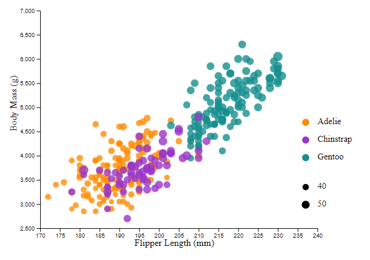

# 02-DataVis-5ways

Your goal is to use 5 different tools to make the following chart:

# Example Chart

# Altair

Using altair was easy because it is fairly simple to create sized dots mapped to data points and split points by color. These are the two most important features of the 
visualization. Altair and vega-lite were the libraries with the least amount of code necessary to create the charts. The trick to using altair to make simple visualizations
is to restrict the domains of the data to control the area of the plot as well as features of the plotted points. Altair and Vega-Lite are very similar in their results, but I
would say that Vega-Lite is simpler for beginners and those familiar with JSON. Both are good choices for making standard visualizations with simple data.

# Data Wrapper

Data Wrapper had the quickest time to create the plot overall, with the two chart axis data points being easy to select. Also, the color mapping and dot size mapping was
available under extra features. Of the two tools not requiring code, the other being Excel, this one was way more beginner friendly and feature-rich.

# Excel

Excel was very work intensive to set up with this chart. This ocurred mostly because of how data selection works in Excel. Even grouping data to created the different colored dots
required manually selection cell ranges to split the datasets. It also did not provide a legend for a multi-colored bubble chart, since it is not supported well by the data selection
and splitting process.

# Vega-Lite

Vega-Lite was one of the simplest and most straight-forward code based visualization libraries. It even contained its own verision of the penguins data set, although there were
some necessary plot features missing that I had to implement. It was very easy to get started and immediately apparent how the syntax affected the output of the plot.

# D3.js

This plot took the longest out of all of them, since D3 specifies incredibly customizable graphics. Also, it took me a while to create the axes, and even longer to get the data 
points to show up. However, as soon as I found the solution to this, I was able to adjust the plot features to be arranged properly and create consistently informative dots on the
plot. I also used this example to help create this chart:

https://d3-graph-gallery.com/graph/bubble_color.html

For extremely customized and specific types of plots, I would definitely use D3 because of the individually groupable and editable elements within the DOM. However, for simpler plots
like this one, I would go with another one as it is much easier.

## Technical Achievements
- **Exact Color Plots**: By using an image color picker, I was able to get the exact colors that were used in the original plot. I used a simple online tool to retrieve these values
and put them in the plot color mappings.

### Design Achievements
- **Plot Legends** With multiple tools (Altair, D3, Data Wrapper, Vega-Lite), I was able to create a legend with dot sizing sample. In excel I was not able to make the dot sizing
sample, but the specied mapping to colors is still present.