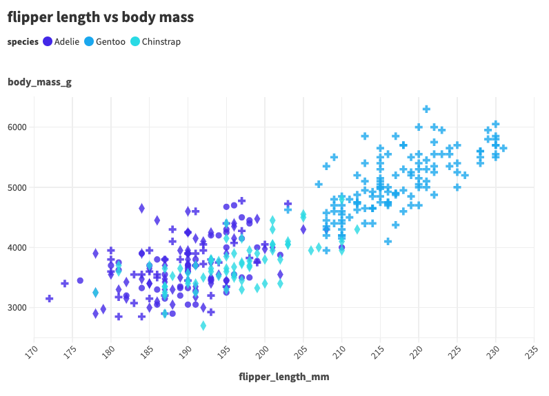

# RStudio + ggplot2

RStudio is an IDE that allows the user to write programs in R.

For this graph, I used the ggplot2 library to create a scatterplot using the penglings data. I also used pandas and plotly libraries to read the csv file and print out the graph respectively. The coding was short and easy but the IDE itself caused me some problems such as running each line of code individually. RStudio seems nice for data visualization graphs as it is very customizable and fast to 
understand the functions.

Graph Overview

.png)
Graph with hoverable data table

# Javascript/HTML + d3

d3 is a JavaScript library to create interactive data visualizations.

d3 was used extensively for this iteration of the graph as d3 required a lot more coding to get the final output. You can notice that the library is very powerful and has a lot of capability but creating the graph in javascript/html forces the user to take into account every detail to make the visualization compared to others. creating the various elements and abilities took a couple more lines of code for one line you might use in R but very customizable.

Graph with hoverable data table

# Python + Altair

Altair is a Python library that allows users to create statistical visualizations based on Vega and Vega-Lite.

Using Altair felt like using the simplicity of RStudio and ggplot2 code with the abilities of d3. I was able to customize a lot of the minor details but it wasn't required since the program automatically handled it such as graph and scale size. Actually displaying the scatterplot on my screen took a little while because I didn't know that the code to create the graph wasn't also printing it out so I needed to figure out a way to display it. I was able to make my Python code create an HTML file using the .save() function that allows the user to open the graph on a web browser or compatible IDE.

Graph with hoverable data table

# Flourish

Flourish is a web browser software that takes in a csv file and automatically creates any graph you want. It does not require any programming, just clicking.

Using Flourish was very easy and made me question why people use other languages to display data. All I had to do was upload the penglings csv file and the scatterplot was created. After that, I used the built-in features to create the axis titles and axis data I wanted to display along with the colors and shapes I wanted to use (based on species). Everything was accounted for and then some. I see this being used more often as it gets updates to its software to do even greater things.

Graph Overview

.png)
Graph with hoverable data table

# DataWrapper

DataWrapper is a web browser software that takes in a csv file and takes you step by step in creating your desired graph. It does not require any programming.

Similar to Flourish, it used the same concept of clicking and customizing your graph using built-in functionalities. It was easy to use and everything was laid out with the ability to create a basic data visualization. I am not sure if this was solely my computer, but when I uploaded the penglings csv to the software it began to go very slow. Every click and type made the program load very slowly which made this easy process long and frustrating.

Graph Overview

.png)
Graph with hoverable data table

## Technical Achievements
- I was able to utilize a function that allows the user to hover over a data point with their mouse and view information such as sex, species, bill length, etc. This was made using functions like tooltip to create these hoverable tables over each data point. This was applied to every graph for every tool.

### Design Achievements
- For all graphs from every tool, I was able to change the data points' colors and shapes according to their species. Some graphs have specific shapes such as squares, triangles, plus signs, etc. Colors were also changed to make the data points more visible between species.
