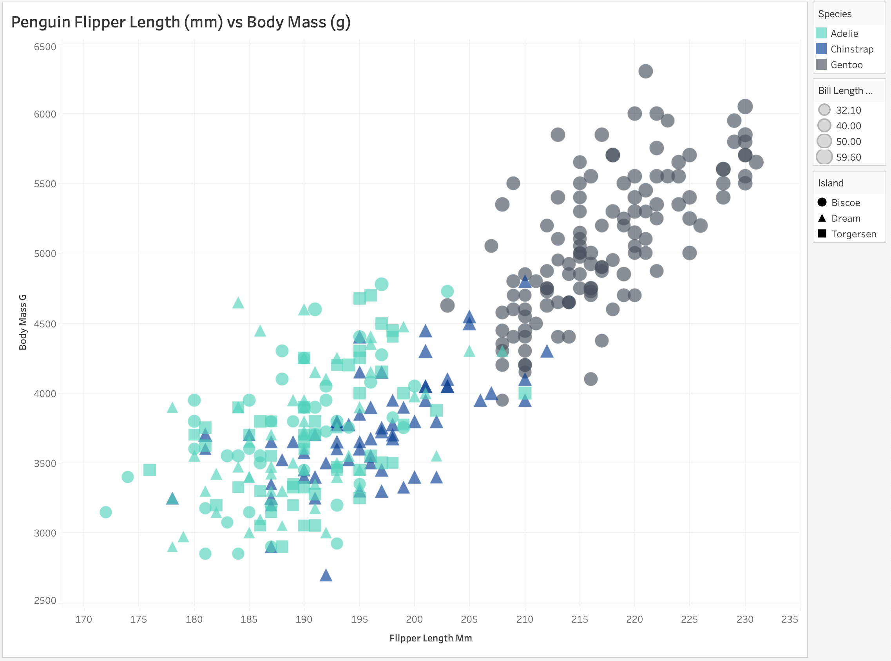

# Google Sheets

~

# d3

~

# altair

~

# tableau

~

# matlab

~

## Technical Achievements
- added mouse hover functionality for individual datapoints (altair, tableau)
- added interactive zoom in/out (altair)

### Design Achievements
- I decided to do some research into the 3 species of penguins included in this dataset. I found out that Jules Dumont d'Urville discovered the Adélie penguin. Also, both the Gentoo and the Chinstrap penguin were discovered by Johann Reinhold Forster. I decided to incorporate this information into my color scheme. Jules was French and Johann was German, but since Johann discovered two of these species, I gave the Chinstraps to Graham Turbott of New Zealand (who transferred the species to a different genus) and left the Gentoos to Johann. When considering the flags of each of these countries, only one viable color scheme emerged: blue for Chinstrap, red for Adélie, and yellow for Gentoo. I considered using the exact color values of the official flags, but that would have looked AWFUL. So I mellowed it out a bit. This process not only left me with a consistent color scheme for this dataset, it also left me with more knowledge about penguins and taxonomy than I ever knew I needed. I feel more connected to this dataset.
