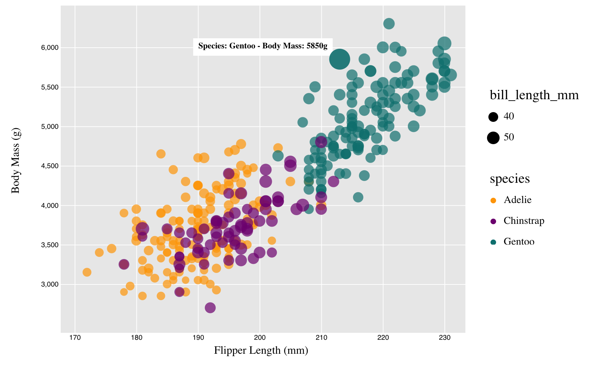

# 02-DataVis-5ways

Assignment 2 - Data Visualization, 5 Ways  

# R + ggplot2
ggplot2 is one of the easiest ways to visualize all the scatter plots. All the features like legend, colors, and size can be handled easily. Few lines of the code and it can do the job. The output is also clean and elegant. 

# d3
d3 is powerful, but in order to create a similar scatter plot to the ggplot2, many details need to be handled specifically, like the white grid over the grey background and the legend. However, d3 could be useful when any interaction and animation are required on top of the scatter plot. Here I made the scatter plot interactive so that when the mouse moves over the dot, the dot will enlarge and change its opacity accordingly. It will also display the related data of the selected dot. 

Starting code source: 
- https://d3-graph-gallery.com/graph/custom_theme.html
- https://medium.com/@kj_schmidt/show-data-on-mouse-over-with-d3-js-3bf598ff8fc2

# Altair
The experience with Altair is similar to the ggplot2. The default function handles the scatter plot pretty well and not much effort is needed. It also comes with tooltip so it's easy to make the plot interactive. 

# Tableau
As a data visualizing software, Tableau is absolutely powerful and easy to use, with so many visualizing options. The interface is intuitive and there are so many options and functions left to explore. 

# MATLAB
My experience with MATLAB is not very well. Even though it is easy and straightforward to generate a scatter plot with given data using MATLAB, it would take so much more effort to make it pretty. I spent lots of time figuring out how to generate a proper legend and still failed to create the legend for bill_length_mm. 

## Technical Achievements
- **Filtering Nan value**: For d3, I added a filter for Nan value inside the CSV file after the data loaded so that those points won't be displayed on the plot.  
- **Made d3 interactive**: I implemented mouseover for d3 so that it looks similar to the plot of Tableau, where the user could select a random dot on the graph and see the related data. 

### Design Achievements
- **Opacity**: For whichever tool I used, I adjusted the opacity to a proper value to make it easy to distinguish from overlapped dots.
- **Legend position**: For all the plots, I make sure the legend is outside the plot frame.  
