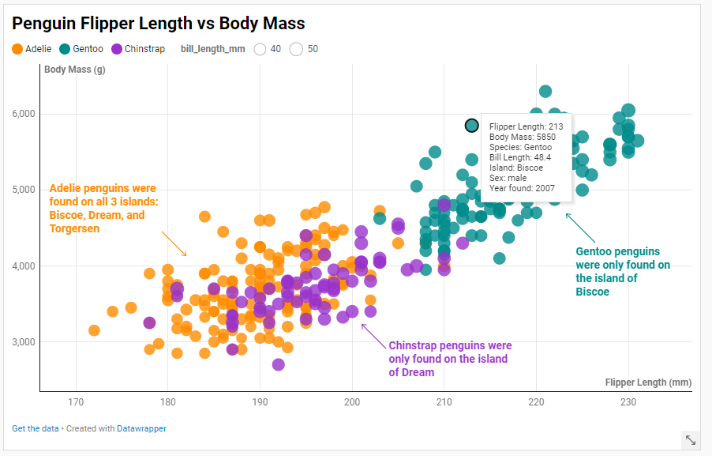

# d3

d3 is a JavaScript library that can be used to create dynamic data visualizations. The d3js.org websire notes that d3 "offers unparalleled flexibility in authoring dynamic, data-driven graphics." After completing this scatterplot in d3, I can agree that it really does allow you to customize your visualization in any way you would like, and it offeres much more flexibility than the other platforms I used. That being said, it also requires more time, work, and understanding of how to code in d3. In addition to the flexibility of d3, it was pretty straightforward to change the color and size of the dots depending on the value of variables. When I did change the size of the dots, the differences were obvious, which is a huge plus compared to the other tools I used. The tooltips can also be customized in a variety of ways (different colors, sizes, position on the screen), which is a bonus of d3. The fact that you cannot automatically input a legend or axis titles is a con for d3 if you are trying to create a visualization quickly. It can be tricky and take a few tries to actually add these details and put them exactly where you would like on the screen. I can see d3 being used by people who do data visualization often in their job. Once you understand how to write the code, there are very few limitations in d3, allowing you to really aciheve what you want in the visualization.

For design achievemnts, I kept the color of the dots consistent throughout all visualizations. In my d3 visualization, some design achievements include adding a bolded title, changing the background color and adding tick mark lines across the entire graoh, and adding a legend with the names "Species" and "bill_length_mm." A techical acheivement was adding a tooltip and formatting it to include many different features about the specific data point.

Sources:
https://d3-graph-gallery.com/graph/custom_theme.html. I used this course to learn the basics of creating scatterplots in d3.
https://d3-graph-gallery.com/graph/scatter_tooltip.html. I used this source to learn how to create tooltips.

# Excel + VBA

VBA (Visual Basic for Applications) is Microsoft's rogramming languages used in applications such as Excel. When I first started creating the graph in Excel, I realized that Excel's basic functionalities were not enough to accomplish everything I wanted to with the graph (such as changing the size of the dots based on the value of bill_length_mm. Creating macros and writing VBA code allowed me to create 2 processes: the first changes the color of the dots in the graph based on the value in the species column and the second changes the size of the dots based on the value in the bill_length_mm column. Since these are macros, I could easily apply them to other scatterplots I create with the data. Excel makes it very easy to create the scatterplot initially, as you only need to highlighth the data and choose the desired graph. Excel is very user freindly with graphs beacuse you can adjust the size of the graph, add axis titles, add a legend, and change the background color all just by clicking with your mouse. Although it requires a bit of code, VBA is also fairly simple to learn and apply to your graph. The pros of Excel are that tehre is not a steep learning curve when addng features to your graph. The con is that creating graphs in Excel is much more time consuming then using other applications or languages where you can just write a few lins of code and produce a similar graph. A con of VBA is that it currently does not support users changing the transparency of dots on a scatterplot after they have changed the color. This meant that because I changed the color of dots in the VBA code, I had to anually change the transparency of each dot in the graph rather than simply changing them all at once. This step was very time consuming. Another con of VBA is that it is very difficult to add legends through the code, and I was not able to add a legend for the size. I can see Excel being used in the future for being less comfortable with coding or for people doing other work in spreadsheets that would like to see a quick visualization (graphs can be any quick addition to spreadsheets you plan to share with colleagues).

As a design acheivement for this graoh, I divided the size variable within my code to ensur that the dots were not too large and that the use could see a difference between the size of each dot. I also added a title, changed the background color, and added a legend for color. As a techical achievement, I created Macros with the VBA code, which is a way of automating the procedures of changing color based on the species variable and the size based on the bill length. This can save time in the future if I wanted to create scatterplots comparing other variables.

Sources: 
https://www.youtube.com/watch?v=0kQ23byr71c. I used this source to learn how to create a Macro and write in VBA.

# Altair

Altair is a Python library used for statistical visualization. Altair's pro is that is is extremely quick to use. The alt.Chart function allows you to very easily create a scatterplot with a specific domain and axis titles. You can also edit the grah itself (the background, title, and fonts) when creating the chart, limiting the amount of code needed. A huge pro of altair is also how easy it is to make the visualization interacive. Just adding clamp=True when defining x and y allows the user to zoom in to specific data points and scroll through the visualization, and tooltips are also incredibly easy to add. Legends are also automatically added, which is a pro. Some cons of Altair are that when changing the size of the dots based on a variable, it is difficult to see the difference between the dot sizes when the variable values are very close. While the values could be scaled to create a bigger difference, this would effect the size legend, which would no longer be accurate. While the axes did not automatically adjust to fit the data like some other applications, it is very easy to adjust this domain. Another con is that while the tooltip is very easy to add, it is not as easy to understand how the tooltip could be customixed to add text such as "Flipper Length: ". I can see Altair being used by data scientists and others in industry who use python frequently are are looking for a very quick and easy way to visualize data and mkae it interactive. While my code is a little longer because of me customizing the grah, you can produce an acceptable graph in few lines.

Some design acheivements for this greaph were that I chaged the background color, added a title and changed the font size and font of the titles, and I kept the colors consistent with the other graphs. The technical achievements are that I added the clam to allow the user to zoom in and scroll around, and I adedd a tooltip, which contains the same infromation as the other tooltips in the other graphs.

Sources:
https://altair-viz.github.io/altair-tutorial/notebooks/08-Configuration.html. I used this source to understand Altair basics and clamps.
https://altair-viz.github.io/gallery/scatter_tooltips.html. I used this source to understand tooltips.

# Datawrapper

Datawrapper is an online visualization tool that allows users to create interactive visualizations with no code. I found Datawrapper to be very user freindly and fun to use. The website is customized in a way that you don't need any training or help in order to learn how to create visualizations. I was very impressed with the offerings of the site, which allowed users to change the color, size, and shape of dots based on variables. It is very easy to see your visualization change as you play around with the tool, making the website very engaging. I was able to play around with having the shape of the dots change based on the island. While I decided that this was too difficult to read, I did notice a trend in the data, which I explained in text entries that I added to the graph for the user to know. It is also extremely easy to customize tooltips in Datawrapper. The big con to Datawrapper is that you are extremely limited in your ability, which is part of the reason why the tool is so easy to learn. I was unable to make the difference in the sizes of the circles more obvious and the user is unable to add additional functionalities such as allowing the user to Zoom. I can see Datawrapper being a great tool for beginners in visualization who are not too picky about the interactivity of their visualizations. Another con of Datawrapper, which may just be my computer, was that it kept freezing when I tried to add text annotations, forcing me to create the visualization all over again. This tool wouldn't be great for professionals looking to create specific visualizations, as you cannot be too creative with this tool.

Some design achievements with this tool were keeping the colors consistent with the other graphs, adding a title, adding some text pointing out interesting trends in the data and making the colors of these correspond to the species they are discussing, changing the size legend to only have 40 and 50 to match the original grpah, and formatting the tooltip to state what each value indicates. The technical achievment for this visualization is adding the tooltip and figuring out how to format it (for example, I used   to create a new line and using FORMAT to extract the year from the year variable, which originally appeared as a timestamp).

No sources were used.

# Tableau

I am adding tableau as a sixth version of this visualization because I was really interested to try tableau and see how it compares to Excel and Datawrapper. Tableau is a visualization platform that can be accessed in a variety of ways. While there are paid plans for Tableau, I was able to get a 14-day free trial to use the web version of Tableau. While Tableau has a smaller learning curve than learning a new language in Python or R, I did find it to but more difficult to use than Datawrapper. When I first opened a workbook in Tableau, I was not sure what to do to create the scatterplot until watching an external video. That being said, Tableau definetely allows you to customize your visualizations more and can be better once you understand how to use it. Some pros of Tableau include automatic legends, automatic tooltips, ability to add filters very easily. I was able to add a scale for year and a search bar for island, which increases the transparency of irrelevant dots and allows the user to see which dots meet thier criteria. Some cons include the early learning curve and restrictions when customizing the graph (such as not being able to make the sizes of the graph more obvious). It is not possible in Tableau to achieve the same level of interactivity as you can with other tools, but I think this is a sacrifice that has to be made if someone deos not want to code aything themselves. I can see this tool being used by businesses and workers who have an understanding of the data that they are using, but do not have expereince coding or do ot wish to make extremely innovative or complex visualizations. 

Some design achievements for this visualization include using colors consistent with the rest of the graohsm changing the background color, and adjusting the number format on the legends so that bill length did not contain any decimals. Some techical achievements include adding filters for year and island and customizing the tooltip to include all information that is included in the tooltips of other grahs for this assignment.

Sources:
https://www.youtube.com/watch?v=qKxEhW6tPyA&t=19s. I used this video to understand how to create a scatterplot in Tableau initially.

## Technical Achievements
- **Proved P=NP**: Using a combination of...
- **Solved AI Forever**: ...

### Design Achievements
- **Re-vamped Apple's Design Philosophy**: As demonstrated in my colorscheme...
