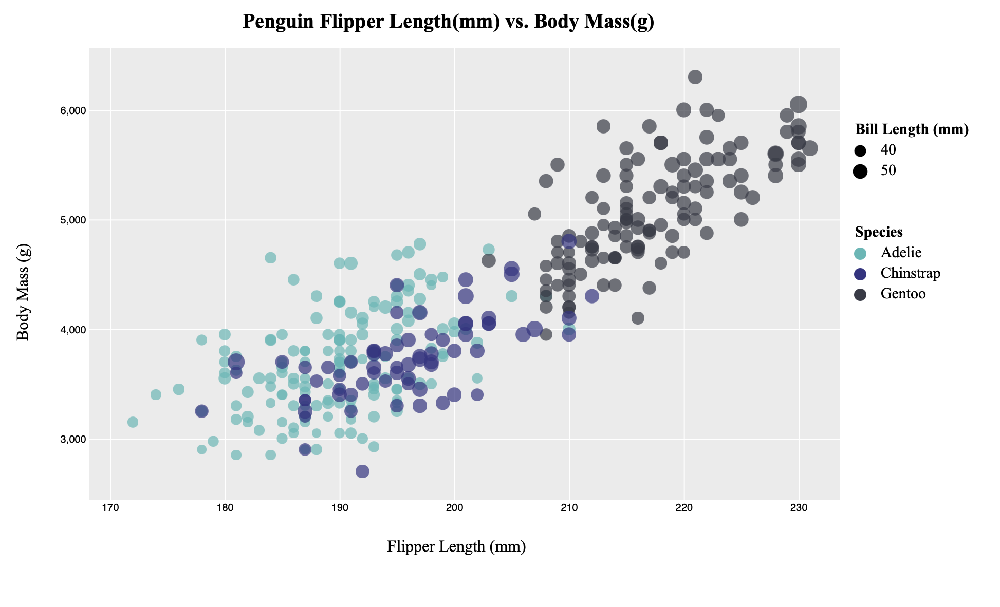

**NOTE: THE BELOW IS A SAMPLE ENTRY TO GET YOU STARTED ON YOUR README. YOU MAY DELETE THE ABOVE.**

# R + ggplot2

Using R and ggplot2 was definitely the easiest one to use soley because of the fact that the professor gave a walk through on it.
The part that was troublesome was installing R and the libraries.
I was getting a lot of issues getting it to work on vscode so I ended up just doing it on the R application and then transferring the file over.
Overall I think the R graph was the best, it didn't require a lot for it to look good.

# d3

d3 was my personal favorite.
I've had experience with d3 in the past and for me it just made the most sense when coding.
I did use this website (https://d3-graph-gallery.com/graph/scatter_basic.html) to quickly create a base scatterplot graph and then I editted it for the penguin data.
Overall d3 gave a lot of flexibility in making the graph how I wanted it to look.

# Excel

Using excel was probably thr trickiest out of the 5.
When creating the scatterplot, I had to manually select the range of each of the species because excel wouldnt recognize them seperatley. 
I also did change around the ordering of the data columns so excel had an easier time recognizing which column had to be the x,y, and bubble size.
Overall excel did not involve any coding so it was straightforward.

# Altair

I've never heard of altair before using it for this assignment.
It was pretty essy to make a scatterplot, however I was struggling to get the graph to actually display.
Doing research online, I tried using chart.show() but no matter what I tried it wouldn't work.
So I ended up saving the chart as an hmtl page and taking a picture of that.

# Vega-lite

Vega-lite was also something I've never heard of as well.
It was a bit more confusing as it was just a json file.
But since it was just a json file, it was really easy to read and code for it.
Surpringly, I really enjoyed using vega-lite, after learning how to set it up, it made the most sense in setting up the scatterplot.

## Design Achievements
- **Color**: To keep the graphs as consistent as possible, I used an online hex color picker to read the example graph's color scheme. I then applied that color scheme to all the following graph.s

### Refrences
Professor for R

https://d3-graph-gallery.com/graph/scatter_basic.html for d3

https://www.geeksforgeeks.org/python-altair-scatter-plot/ for altair

https://vega.github.io/vega/examples/scatter-plot/ for vega-lite