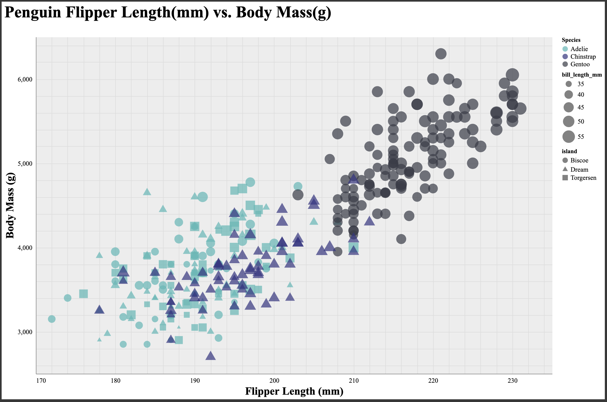
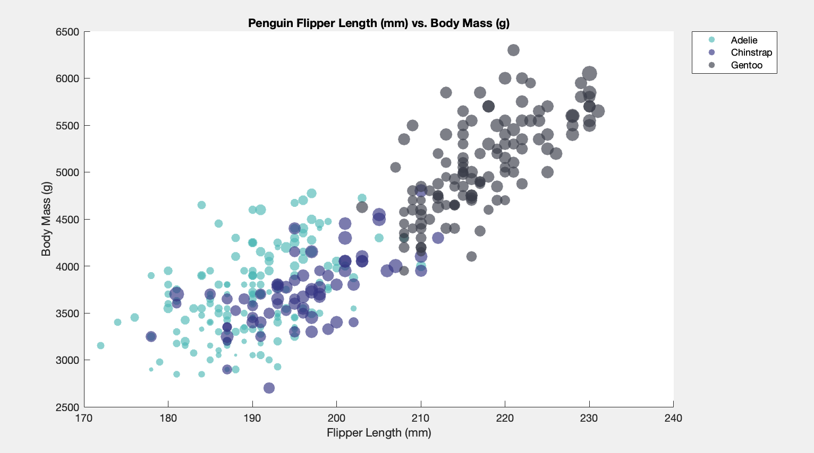

# Google Sheets

  I started off with Sheets just to get it out of the way. This is the pretty much the only way I've ever graphed anything, with the exception of some Python and Matlab over the past couple years. It's been my go-to tool since I was in middle school. I wanted to start off with a baseline, something I knew I was comfortable with and wouldn't have to teach myself. Creating this visualization in Sheets was a very simple process.
  I'm not sure if I can call any part of the process difficult, maybe more like frustrating. The limited features and the whole spreadsheet aspect of Sheets made it a pain to get some details right. The bubble size in particular was a bit of a pain, and with the lack of customization I was left with something I knew I could improve on.
  I think there's always going to be a place for Sheets for making quick and easy graphs. It got me through my IQP. I think it's a very efficient way to whip up a bunch of figures based off a spreadsheet. I'd say it's probably better suited for more casual applications or for the user to boost their own understanding of the data they're working with. But for making something perfect, with specific requirements, it's definitely not ideal.
  Fortunately, as part of this I was able to get the data set all nice and clean by removing the rows that had NA's for all the relevant fields. I used the same cleaned csv for all my other visualizations.

# d3

What was easy?

  This one wasn't what I would call easy. d3 is very, very new to me, as is the whole process of working in that language and dealing with async functions and webservers and such. I was glad to have a starting point from a1, but this task was obviously much more substantial. I spent a lot of time going back and forth between learning and working, but I will say I got into a rhythm towards the end, since there was a lot of repetition between x and y and a lot of the final tweaks were about perfecting the positions of certain elements.
   What I found most difficult was the sheer number of steps involved in doing something so simple. I'm sure the more I do it the easier it'll get, but it took a while to build up the visualization from a collection of circles on the page. I would reach points where I thought I was finished, but there was another thing I forgot to add or tweak that normally I'd expect the tool to take care of for me. There's a lot of attention to detail required for this kind of stuff, and it definitely makes me appreciate the more complex things people are able to create using d3.
  I think this was a good one to do right after using Sheets. The two are so incredibly different, and both of them frustrated me in different ways, but they definitely both have their place. The level of control is both a blessing and a curse. I spent a while just tinkering around with where I thought the axis labels looked best, and little things like that, when in another tool I might not even think about the labels since they're done for me and they're "good enough". They definitely have it right on their site, this is perfect for bespoke data visualization.

# altair

  This one was definitely my favorite, because I still had to write code for it to work. I like Python. I'm not as used to it as other languages, but I enjoy its forgiving simplicity. Altair made it super straightforward to create what took hours longer in d3. After I completed the basic requirements, I felt compelled to explore a bit more before moving on, knowing that I'll definitely come back to this library at some point. I poked around some more tutorials and found the tooltip thing, which was neat, as well as the interactive zoom in/out feature. I was surprised at how achievable these things were, and how much was built in to just a simple chart. It did a lot of the work for me, which I can always appreciate. 
  I'm not exactly sure why, but for me the hardest bit, or at least the part that took the most time was actually importing my data. I'm not a pro at Jupyter notebooks yet, but even past that I got stuck on trying to import my csv using only Altair. I ended up going with pandas to help me out there, since that's what I remember from my previous experiences, and the rest of the Altair stuff went smoothly. 
  I think this would be incredibly useful for a whole lot of different visualization applications. And there's still so much more for me to learn about it. It was as simple and fast as I needed it to be, and it also left room for me to customize things and play around with different aspects without too much headache. I can see why it's so popular.

# tableau

~

# matlab

~

## Technical Achievements
- added mouse hover functionality for individual datapoints (altair, tableau)
- added interactive zoom in/out (altair)

### Design Achievements
- I decided to do some research into the 3 species of penguins included in this dataset. I found out that Jules Dumont d'Urville discovered the Adélie penguin. Also, both the Gentoo and the Chinstrap penguin were discovered by Johann Reinhold Forster. I decided to incorporate this information into my color scheme. Jules was French and Johann was German, but since Johann discovered two of these species, I gave the Chinstraps to Graham Turbott of New Zealand (who transferred the species to a different genus) and left the Gentoos to Johann. When considering the flags of each of these countries, only one viable color scheme emerged: blue for Chinstrap, red for Adélie, and yellow for Gentoo. I considered using the exact color values of the official flags, but that would have looked AWFUL. So I mellowed it out a bit. This process not only left me with a consistent color scheme for this dataset, it also left me with more knowledge about penguins and taxonomy than I ever knew I needed. I feel more connected to this dataset.
