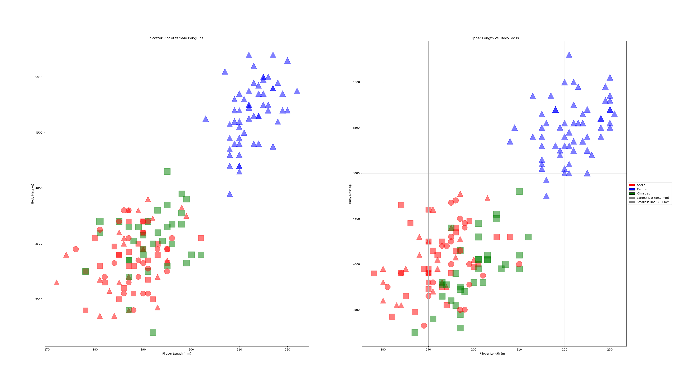

Ryan Dillon (rjdillon) - CS4804 A2

# d3

I used this resource to get started with making the scatter plot (including the svg and the axes): https://d3-graph-gallery.com/graph/custom_theme.html

However I modified it in the following ways: Ensure the axes were on the correct scale, edit text and colors to make sure that everything corresponded to the assignment's details, and overhauled the csv parsing to first convert the strings in each of the rows to numbers, and use a promise to ensure the csv file would be loaded before beginning to add the points on the plot. I also added the variation in point size according to bill length and added the style for 80% opacity. Additionally, I added a legend to show the meaning of the point size and point color.

I liked this tool because it was easy to get started after the first assignment that we completed. Additionally, it was easy to implement each element because they
just had to be appended to the svg. I did not like that to add the legend, I had to manually create the shapes/text and place them all by myself, rather than having a built in legend functionality like some of the python libraries.

# matplotlib.pyplot

I have used matplotlib.pyplot in the past to create graphs, which is which I chose it as my second library to use. This library is very straightforward to use and implement, especially when using pandas to convert the .csv file into a dataframe. The trickiest things I had to handle with this library were attempting to move the axes/tick mark lines below the data points, which is why I ended up using the .subplots() function. I also used a color mapping to get the correct colors for each of the species.

# plotnine

I chose the plotnine library as my next visualization tool because I had used R+ggplot2 in the past, and wanted to try something a little different. plotnine mimcs the R+ggplot2 syntax in the python language, which I though was really interesting. Overall, most of the syntax was the same as the example we were given, except for invoking the p9 library for each of the functions. It was incredibly straightforward and easy to use, and I would recommend this library for users who do not want to deal with the R + RStudio installations. 

# altair

I used this resource to get started with making a scatter plot in altair: https://altair-viz.github.io/gallery/scatter_tooltips.html
altair was the library that gave me the most trouble learning, as it was the one that I was most unfamiliar with. Using the examples on the altair website helped me to get started, and I really liked how simple the syntax was to understand at a first glance. The built in tooltips function was something that I really liked, and required little effort after spending the time to research it. I had to do some extra research in order to figure out how to make the chart larger, change the background, and configure the color range, but all of them were simple to implement after learning. 

# tableau

There was also a little bit of a learning curve to using tableau, as I was slightly confused how to initially create the graph. I had to do some extra research to figure out how to get the proper data to show up inside the chart, but once I had done that, it was smooth sailing. Tableau makes it very easy to change things such as color, point size, and legends. I can see this being an incredibly useful tool for people who are not as comfortable manually coding visualizations. 

## Technical Achievements
- I implemented tooltips for the altair and tableau visualizations, allowing the user to see additional data when mousing over each data point.
- In d3, I created a function to convert the data in each row from strings to numbers before attempting to create a visualization of the data.
- Instead of using R+ggplot, I used the python library plotnine that imitates the R syntax in the python language

## Design Achievements
- In each visualization, I implemented the same color scheme from the original r+ggplot2 graph that we were provided (I did this using a color picker on a screenshot of the graph to get the hex codes).
- Additionally, I made sure that in each graph, the background was gray (as it is in ggplot) and the tick mark lines were white and beneath the data points. Specifically when using matplotlib I had to do some research to make sure I moved the tick mark lines below the data points.
- All of the plots have legends except for the matplotlib vis. In d3, I added a legend manually to mimic the legend in the original ggplot legend. I did not add a legend to the matplotlib vis, because the legend implementation in this library puts the legend inside the graph canvas, not outside and adjacent like in the other visualizations.
