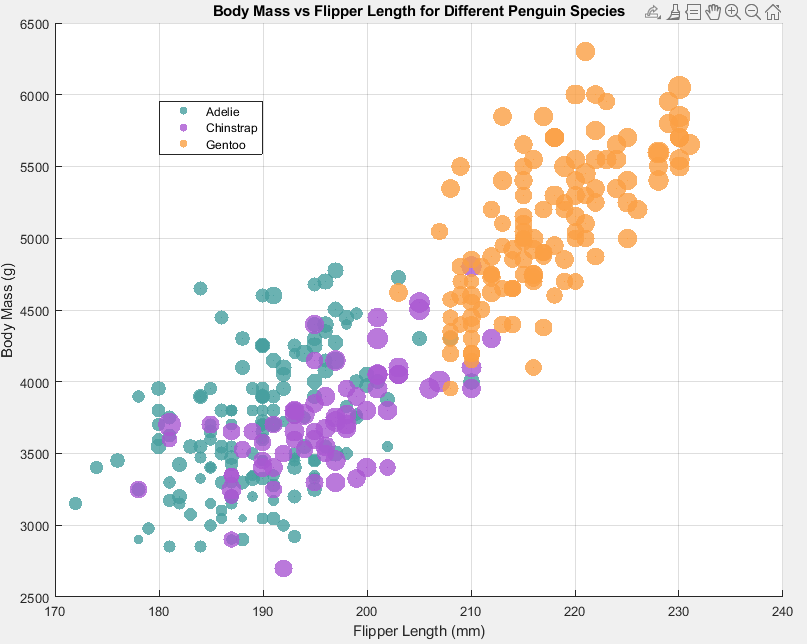
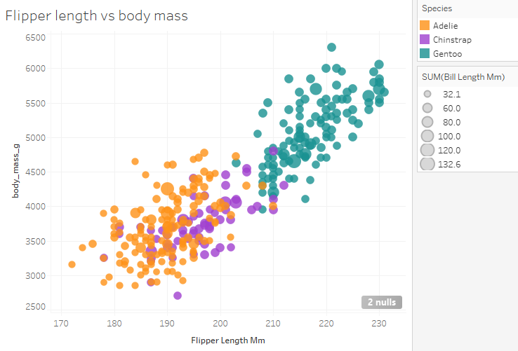
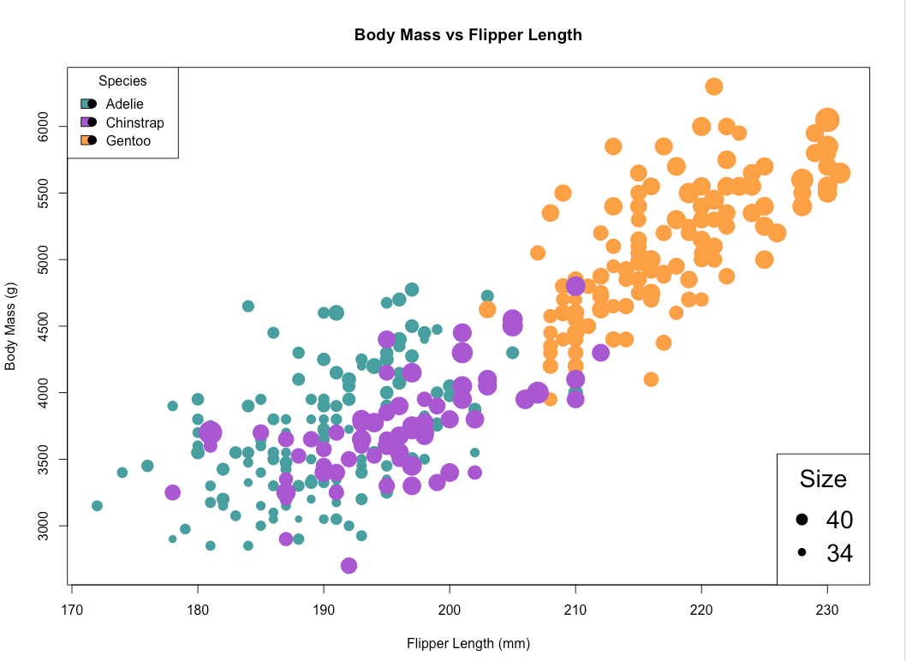
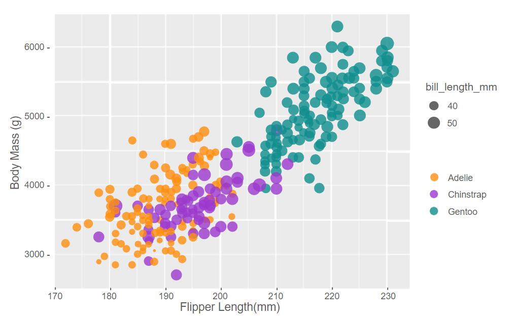

This was a fun, but super long, project to complete. 

My 5 methods for created the plot are as follows. 
- Matlab
- Tablou
- D3
- R
- google slides

# Matlab

This one was interesting. While the simple plot function could loop over the csv and plot the data on it's own, I ended up finding it easier to make my own for loop to "scatter" the points onto a figure. This seemed easier to build and maintain as I went on designing it. 

Reading CSV data isn't hard as long as you don't use CSVread(). That only accepts numerical values and readTable() was the function that ended up working for my purposes. 

Biggest issue was second legend is said to be impossible without generating a second graph. 

# Tablou

I really dislike that the program is behind a paywall, but the results speak for themselves. It was the fastes and easiest plot to scatter, and I could intuitively plot everything without documentation (although it did take a few tries). 

Changing colours was much more cumbersum than it should have been, but after such a smooth experience setting the rest of it up, I didn't mind as much. 

# D3

This was my least favorite experience. While I created the graph and legend very quickly, importing any of the csv data was a long string of guesswork. I eventually got something working, but I feel like I understand that aspect the least. 

Creating extra elements like two legends and whatnot is easy as you can just draw anything you want in if there's not already of function for it. 

This framework also doesn't seem to scale as easily as other frameworks have. There's probably ways to configure it to scale easily, but I never ran into them like most the other methods here. 

# R

I decided to design the graph in vanilla R. I don't have any good reasons for doing so, but everything still seemed very straightforward and reletively simple to put together. 

I still don't understand why there's a 'c' in front of every array thing, but I put it there nonetheless. 

# google slides (not sheets)

I decided to put Slides to the ultimate test adn see if it could reach the same level as the example graph. In my humble opinion, this plot is probably the best. 

Although there's not much automated in this process, There's something about placing every data point yourself. You get to decide how accurate the plot should be in every moment. You don't need to tell it how to do something as you just add the shapes in yourself. It's dumb logic, but there's no debugging to be done. Please take some time to flip through the slides to compare with the original. 
